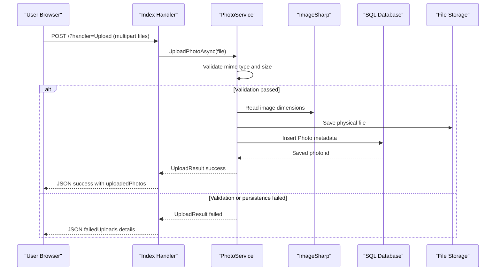

# API & Service Communication Contracts

The application exposes a small server-rendered web/API surface through Razor Pages handlers, with synchronous in-process service calls and no inter-service network communication.

## Service Catalog

| Service | Port | Category | Purpose |
|---|---:|---|---|
| PhotoAlbum Web | 5000/5001 (launch profiles) | API Layer | Hosts Razor Pages and page-handler endpoints for listing, upload, detail view, delete, and file retrieval |

## API Endpoints Inventory

| Service | Method | Path | Request Type | Response Type |
|---|---|---|---|---|
| PhotoAlbum Web | GET | `/` | none | HTML page (`Index`) |
| PhotoAlbum Web | POST | `/?handler=Upload` | multipart form (`List<IFormFile> files`) | JSON `{ success, uploadedPhotos, failedUploads }` |
| PhotoAlbum Web | GET | `/Detail?id={id}` | query `id:int?` | HTML page (`Detail`) or 404 |
| PhotoAlbum Web | POST | `/Detail?handler=Delete&id={id}` | route/query `id:int` | Redirect to `/` or error temp data |
| PhotoAlbum Web | GET | `/PhotoFile?id={id}` | query `id:int?` | binary file response (`image/*`) or 404/500 |

## Management & Observability Endpoints

| Service | Endpoint | Custom Metrics (if any) |
|---|---|---|
| PhotoAlbum Web | Not explicitly configured (`/health`, `/swagger` absent) | None detected |

## DTOs & Contracts

Gateway-level DTOs are not present because this is a single service application. Service-level contract types include `UploadResult` (upload outcome response), `Photo` (domain entity reused as response model for UI/API handlers), and anonymous JSON response objects in `OnPostUploadAsync`. DTOs are mutable C# classes (not records). OpenAPI/Swagger, GraphQL schemas, and protobuf contracts were not detected. Serialization uses ASP.NET Core default JSON serialization (System.Text.Json) for `JsonResult` responses.

## Communication Patterns

All communication is synchronous and in-process: Razor Page handlers call `IPhotoService`, which calls EF Core and local file system operations. No async messaging infrastructure, service discovery, API gateway, or client-side load balancing is used. Retry, timeout, and circuit-breaker policies are not configured. Startup dependency is limited to database migration and upload-folder creation during app boot before endpoint handling. Security posture: HTTPS redirection is enabled and HSTS is used outside development; explicit authentication/authorization policies are not configured, so application endpoints are publicly accessible.

## Service Technology Matrix

| Service | Web | Data Access | Discovery | Gateway | Actuator | Cache | Metrics |
|---|---|---|---|---|---|---|---|
| PhotoAlbum Web | Razor Pages | EF Core SQL Server | None | None | None | HTTP/static cache headers only | None |

## Service Communication Sequence

