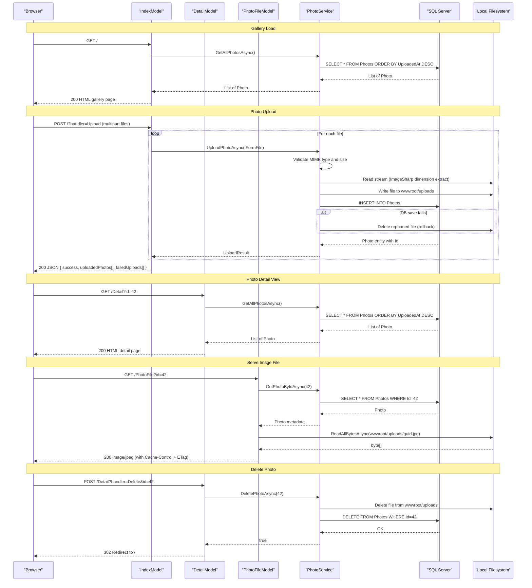

# API & Service Communication Contracts

PhotoAlbum exposes a small set of Razor Pages endpoints (gallery view, upload, photo detail, delete, and file serving) with no external service dependencies or inter-service communication.

## Service Catalog

| Service | Port | Category | Purpose |
|---------|------|----------|---------|
| PhotoAlbum Web | 5000 (HTTP) / 5001 (HTTPS) | Business | Single deployable ASP.NET Core Razor Pages app handling gallery UI, photo upload, and file serving |

## API Endpoints Inventory

| Service | Method | Path | Request Type | Response Type |
|---------|--------|------|-------------|--------------|
| IndexModel | GET | `/` | — | HTML gallery page (list of Photo entities) |
| IndexModel | POST | `/?handler=Upload` | `multipart/form-data` (List of IFormFile) | JSON `{ success, uploadedPhotos[], failedUploads[] }` |
| DetailModel | GET | `/Detail?id={id}` | Query param `id` (int) | HTML detail page (Photo entity + prev/next IDs), 404 if not found |
| DetailModel | POST | `/Detail?handler=Delete&id={id}` | Query param `id` (int) | Redirect to `/` on success, redirect back with TempData error on failure |
| PhotoFileModel | GET | `/PhotoFile?id={id}` | Query param `id` (int) | Binary image file (content-type per MIME), 404 if not found, 500 on error |

> Note: Razor Pages use the `?handler=` convention instead of separate URL paths for POST handlers on the same page.

## Management & Observability Endpoints

| Service | Endpoint | Custom Metrics |
|---------|----------|---------------|
| PhotoAlbum Web | None configured | None |

No health check endpoints, Swagger/OpenAPI UI, or metrics export endpoints are configured. The application uses only the built-in ASP.NET Core logging abstractions (no Application Insights, Prometheus, or structured logging sink).

## DTOs & Contracts

**Photo** (service-level entity): Used as the primary response model across all pages. Carries photo metadata — see `data-architecture.md` for field details. Read-only from the UI perspective (no update endpoint exists).

**UploadResult** (internal service DTO): Returned by `IPhotoService.UploadPhotoAsync`. Carries `Success` (bool), `PhotoId` (int?), `FileName` (string), and `ErrorMessage` (string?). Not serialized directly to clients — the Index page maps it to an anonymous JSON projection.

**Anonymous upload response** (ad-hoc JSON): The `OnPostUploadAsync` handler returns an anonymous object `{ success, uploadedPhotos[], failedUploads[] }`. There is no formal OpenAPI/Swagger definition, no `.proto` schema, and no GraphQL schema. Serialization uses the default `System.Text.Json` serializer provided by ASP.NET Core.

## Communication Patterns

**Synchronous only.** All communication is in-process: the Razor Page handlers call `IPhotoService` directly via constructor-injected dependency, which in turn calls EF Core and local filesystem APIs. There are no HTTP client calls to external services, no message queues, no event publishing, and no gRPC channels.

**Resilience:** No circuit breaker, retry, timeout, or bulkhead policies are configured (no Polly or equivalent). Failures in the service layer propagate as unhandled exceptions caught by the ASP.NET Core exception handler or by try/catch blocks in the page models.

**Service discovery:** Not applicable — single deployable unit with no inter-service calls.

**Security posture:** No authentication or authorization is configured. All endpoints are publicly accessible with no login requirement and no authorization checks. HTTPS redirection is enabled in production via `app.UseHttpsRedirection()`, and HSTS is configured for non-development environments. There is no JWT, OAuth2, API key, or session-based authentication implemented.

## Service Technology Matrix

| Service | Web Framework | Data Access | Discovery | Gateway | Health Checks | Cache | Metrics |
|---------|--------------|-------------|-----------|---------|--------------|-------|---------|
| PhotoAlbum Web | ASP.NET Core 9.0 Razor Pages | EF Core 9.0 (SQL Server) | None | None | None | None | None |

## Service Communication Sequence

