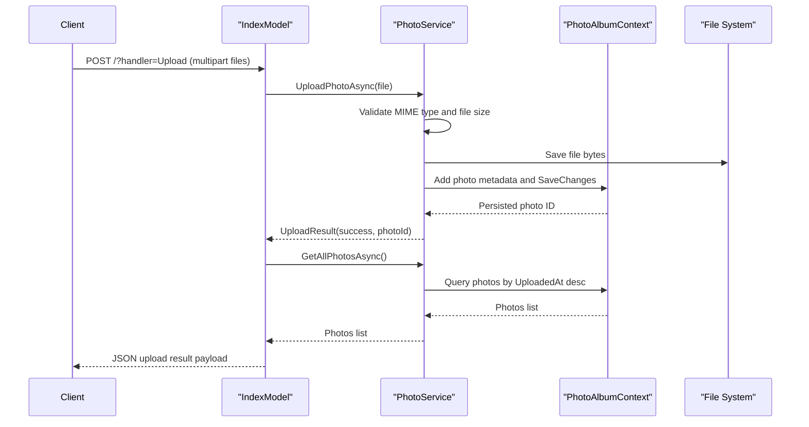

# API & Service Communication Contracts

The application exposes a small server-rendered endpoint surface via Razor Pages handlers with synchronous request processing and no inter-service network calls.

## Service Catalog

| Service | Port | Category | Purpose |
|---|---|---|---|
| PhotoAlbum (Razor Pages app) | 5134 (HTTP), 7055 (HTTPS) | API Layer + Business | Handles gallery UI, uploads, file serving, and delete operations |

## API Endpoints Inventory

| Service | Method | Path | Request Type | Response Type |
|---|---|---|---|---|
| PhotoAlbum | GET | `/` | None | HTML page with photo list |
| PhotoAlbum | POST | `/?handler=Upload` | Multipart form (`List<IFormFile>`) | JSON payload with upload results |
| PhotoAlbum | GET | `/Detail?id={id}` | Query parameter `id` | HTML detail page / 404 |
| PhotoAlbum | POST | `/Detail?handler=Delete&id={id}` | Query/form `id` | Redirect to index / error temp data |
| PhotoAlbum | GET | `/PhotoFile?id={id}` | Query parameter `id` | Image file bytes with MIME type / 404 |

## Management & Observability Endpoints

| Service | Endpoint | Custom Metrics (if any) |
|---|---|---|
| PhotoAlbum | `/Error` | None identified |
| PhotoAlbum | No explicit health or metrics endpoint configured | None identified |

## DTOs & Contracts

Request and response contracts are primarily implicit through Razor Page handlers and lightweight response objects. `UploadResult` is used as the internal upload operation response model. `Photo` acts as the service-level domain entity returned to page models and used to construct JSON response objects for uploads. No dedicated gateway-level aggregation DTOs, OpenAPI contracts, protobuf, or GraphQL schemas were found. Serialization relies on default ASP.NET Core JSON handling for `JsonResult`.

## Communication Patterns

All interactions are synchronous in-process calls: browser to Razor Pages handler, then handler to `IPhotoService`, then service to EF Core and file system. No asynchronous messaging infrastructure is present. No circuit breaker, retry framework, or service discovery mechanism is configured. API-level security posture is minimal: HTTPS redirection is enabled, but no authentication or authorization policy is configured for endpoint access.

## Service Technology Matrix

| Service | Web | Data Access | Discovery | Gateway | Actuator | Cache | Metrics |
|---|---|---|---|---|---|---|---|
| PhotoAlbum | Razor Pages | EF Core + SQL Server | None | None | None | Static file/browser cache headers | Logging only |

## Service Communication Sequence

