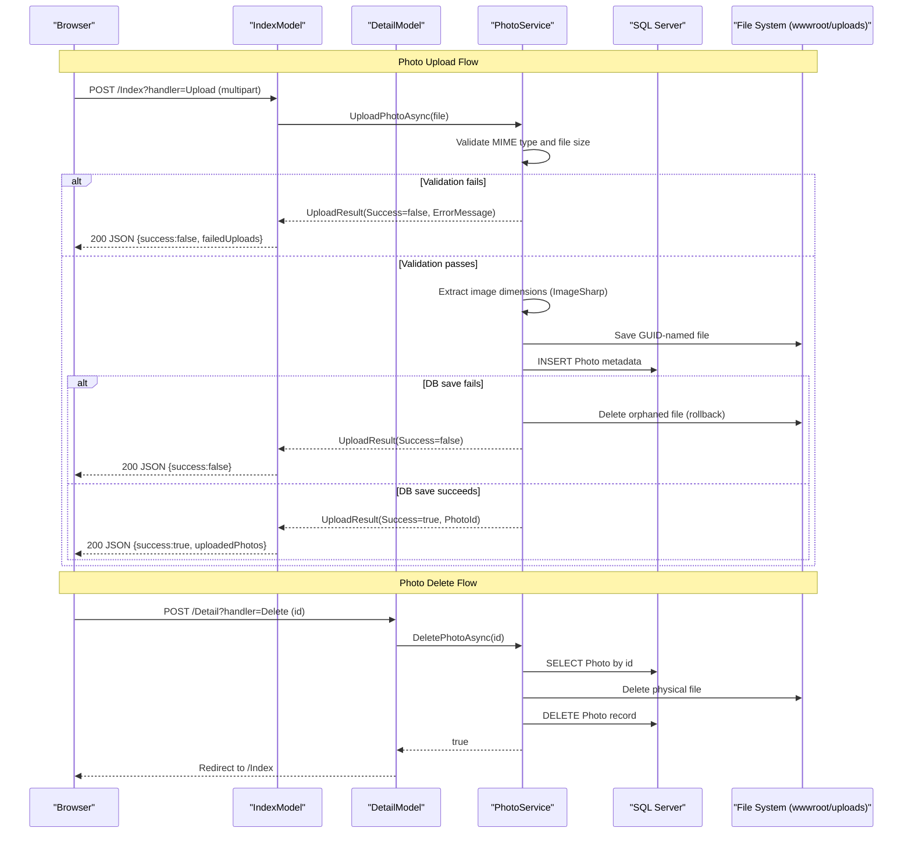

# API & Service Communication Contracts

PhotoAlbum exposes 5 Razor Page endpoints covering photo gallery browsing, upload, deletion, and file serving. All communication is synchronous HTTP within a single-process application; there are no inter-service calls.

## Service Catalog

| Service | Port | Category | Purpose |
|---|---|---|---|
| PhotoAlbum (HTTP) | 5134 | Business | Main web application serving photo gallery UI and upload API |
| PhotoAlbum (HTTPS) | 7055 | Business | HTTPS binding for the same web application |

## API Endpoints Inventory

| Page / Handler | Method | Path | Request Type | Response Type |
|---|---|---|---|---|
| IndexModel.OnGetAsync | GET | `/` or `/Index` | — | Razor Page (photo grid) |
| IndexModel.OnPostUploadAsync | POST | `/Index?handler=Upload` | `List<IFormFile>` (multipart form) | JSON `{ success, uploadedPhotos[], failedUploads[] }` |
| DetailModel.OnGetAsync | GET | `/Detail?id={id}` | `int id` (query param) | Razor Page (single photo) or 404 |
| DetailModel.OnPostDeleteAsync | POST | `/Detail?handler=Delete` | `int id` (form field) | Redirect to `/Index` or `/Detail` |
| PhotoFileModel.OnGetAsync | GET | `/PhotoFile?id={id}` | `int id` (query param) | Binary file response or 404 |

## Management & Observability Endpoints

| Service | Endpoint | Notes |
|---|---|---|
| PhotoAlbum | `/Error` | Default ASP.NET Core error handler page |
| PhotoAlbum | `/Privacy` | Static privacy policy page |

No health-check, metrics, or Swagger endpoints are configured.

## DTOs & Contracts

**Service-level models:**

- **`Photo`** (entity + response model): Used as the response object for photo retrieval. Fields are read directly from EF Core. See `data-architecture.md` for full field definitions.
- **`UploadResult`** (response DTO): Returned by `PhotoService.UploadPhotoAsync`. Carries `Success` (bool), `PhotoId` (int?), `FileName` (string), and `ErrorMessage` (string?). Mutable class, not a record.

No OpenAPI/Swagger specification is present. No protobuf or GraphQL schema is defined. Serialization uses the ASP.NET Core default `System.Text.Json` serializer for the JSON upload response.

## Communication Patterns

**Synchronous only**: All communication is direct method calls within a single process. The Razor Pages invoke `IPhotoService` via constructor-injected dependency. No REST clients, gRPC, or message queues are used.

**No inter-service communication**: The application is a monolith; there is no API gateway, service mesh, or service discovery.

**No resilience patterns**: No circuit breakers, retry policies, or timeout configurations (Polly or similar) are present.

**Security posture**: No authentication or authorization is configured. `app.UseAuthorization()` is registered in the pipeline but no `[Authorize]` attributes or policy requirements are applied, meaning all endpoints (including upload and delete) are publicly accessible. HTTPS redirection is enabled via `app.UseHttpsRedirection()`, but there is no TLS certificate management in the configuration files. No JWT, OAuth2, or cookie authentication is configured.

## Service Technology Matrix

| Service | Web Framework | Data Access | Discovery | Gateway | Health Checks | Cache | Metrics |
|---|---|---|---|---|---|---|---|
| PhotoAlbum | ASP.NET Core Razor Pages 9.0 | EF Core 9.0 (SQL Server) | None | None | None | None | None |

## Service Communication Sequence

