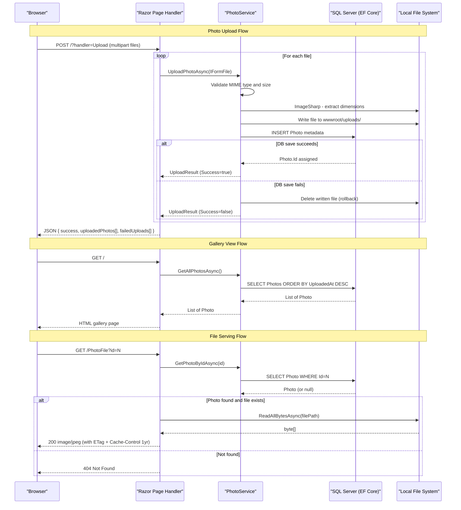

# API & Service Communication Contracts

PhotoAlbum exposes 5 HTTP endpoints through ASP.NET Core Razor Pages, all using synchronous server-side rendering or JSON responses with no inter-service communication.

## Service Catalog

| Service | Port | Category | Purpose |
|---|---|---|---|
| PhotoAlbum Web | 5000/5001 (HTTP/HTTPS, dev) | Business | Single-process Razor Pages app — gallery display, photo upload, and file serving |

## API Endpoints Inventory

| Service | Method | Path | Request Type | Response Type |
|---|---|---|---|---|
| IndexModel | GET | `/` | — | HTML (gallery grid with all photos) |
| IndexModel | POST | `/?handler=Upload` | `List<IFormFile>` (multipart form) | JSON `{ success, uploadedPhotos[], failedUploads[] }` |
| DetailModel | GET | `/Detail?id={id}` | `id` (int, query param) | HTML (full-size photo + navigation) or 404 |
| DetailModel | POST | `/Detail?handler=Delete&id={id}` | `id` (int, form field) | Redirect to `/` or redirect back on error |
| PhotoFileModel | GET | `/PhotoFile?id={id}` | `id` (int, query param) | Binary image file (content-type from MIME) or 404/500 |

## Management & Observability Endpoints

| Service | Endpoint | Custom Metrics |
|---|---|---|
| PhotoAlbum Web | None configured | None — no health checks, Swagger UI, or metrics endpoints |

> Note: No `/health`, `/swagger`, or metrics endpoints are configured in the application.

## DTOs & Contracts

**`Photo`** (service-level entity): Used as the page model's response type on Index and Detail pages. Carries all photo metadata fields. See `data-architecture.md` for full field list.

**`UploadResult`** (service-level DTO): Returned internally by `IPhotoService.UploadPhotoAsync`; its fields are projected into an anonymous JSON object in the upload POST handler (`success`, `PhotoId`, `FileName`, `ErrorMessage`). Not a formal API contract — no OpenAPI/Swagger annotation.

**Upload POST response** (anonymous object): The JSON returned by `OnPostUploadAsync` is shaped as `{ success: bool, uploadedPhotos: [...], failedUploads: [...] }` — an inline projection with no formal DTO class.

No OpenAPI/Swagger specifications, protobuf schemas, or GraphQL schemas are present. JSON serialization uses ASP.NET Core's default `System.Text.Json` serializer.

## Communication Patterns

**Synchronous only**: All communication is in-process. Razor Pages handlers call `IPhotoService` via constructor-injected DI; `PhotoService` calls `PhotoAlbumContext` (EF Core) and local filesystem I/O directly. There is no inter-service HTTP communication, gRPC, message queue, or event-driven pattern.

**Resilience**: No circuit breaker, retry policy, or timeout configuration is implemented (no Polly or similar library). File write failures are handled with an inline try/catch rollback (deletes the written file if the database save fails).

**Service discovery**: Not applicable — single-process application with no external service dependencies.

**API gateway**: None — the application is directly accessed by the browser.

**Security posture**: No authentication, authorization, or TLS is configured at the application level. All endpoints are publicly accessible with no role checks or token validation. HTTPS redirection is enabled via `app.UseHttpsRedirection()` for transport security in production, but no authentication middleware is registered.

## Service Technology Matrix

| Service | Web Framework | Data Access | Discovery | Gateway | Health Checks | Cache | Metrics |
|---|---|---|---|---|---|---|---|
| PhotoAlbum Web | ASP.NET Core Razor Pages 9.0 | EF Core 9.0 (SQL Server) | None | None | None | None | None |

## Service Communication Sequence

