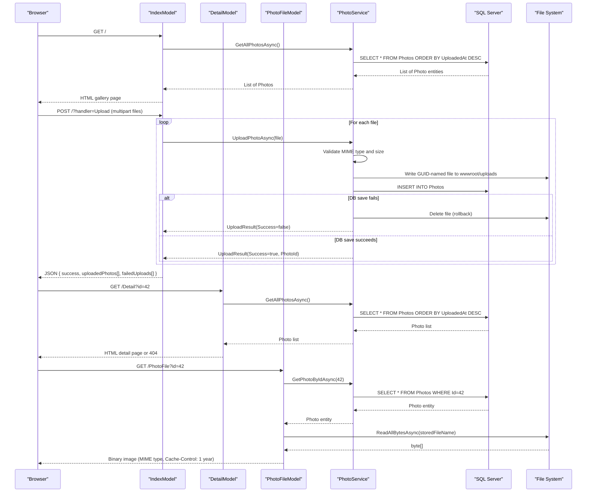

# API & Service Communication Contracts

PhotoAlbum exposes 5 HTTP endpoints through ASP.NET Core Razor Pages handlers, all served from a single deployable web application with no inter-service communication.

## Service Catalog

| Service | Port | Category | Purpose |
|---|---|---|---|
| PhotoAlbum Web | 5000 (HTTP) / 5001 (HTTPS) | Business | Razor Pages gallery application — hosts all UI, upload, and file-serving endpoints |

## API Endpoints Inventory

| Page Model | Method | Path | Request Type | Response Type |
|---|---|---|---|---|
| IndexModel | GET | `/` | — | HTML page (gallery grid) |
| IndexModel | POST | `/?handler=Upload` | `multipart/form-data` (files) | JSON `{ success, uploadedPhotos[], failedUploads[] }` |
| DetailModel | GET | `/Detail?id={id}` | Query param `id` (int) | HTML page (full-size photo + metadata) or 404 |
| DetailModel | POST | `/Detail?handler=Delete&id={id}` | Query param `id` (int) | Redirect to `/` or redirect to `/Detail?id={id}` on failure |
| PhotoFileModel | GET | `/PhotoFile?id={id}` | Query param `id` (int) | Binary image file (MIME-typed) or 404/500 |

## Management & Observability Endpoints

| Service | Endpoint | Notes |
|---|---|---|
| PhotoAlbum Web | `/Error` | Built-in ASP.NET Core error handler page |
| PhotoAlbum Web | `/Privacy` | Static privacy policy page |

No health check endpoints (`/health`, `/healthz`), Swagger UI, or metrics endpoints are configured.

## DTOs & Contracts

Two model classes participate in the API contracts:

- **`Photo`** (domain entity / response model): Returned as part of the GET gallery and detail responses. The JSON upload response projects a subset of its fields (id, originalFileName, filePath, uploadedAt, fileSize, width, height). See `data-architecture.md` for full field definitions.
- **`UploadResult`** (service-level DTO): Internal DTO produced by `PhotoService.UploadPhotoAsync()`. Carries `Success` (bool), `PhotoId` (int), `FileName` (string), and `ErrorMessage` (string) back to the page handler. Not serialized directly to the client — the page handler builds its own anonymous JSON response.

There is no OpenAPI/Swagger specification, no `.proto` file, and no GraphQL schema. Serialization uses ASP.NET Core's default `System.Text.Json` serializer with default settings.

## Communication Patterns

**Synchronous only**: All communication is in-process synchronous HTTP request/response. The Razor Pages page handlers call `IPhotoService` methods directly via ASP.NET Core's built-in dependency injection. There are no remote service calls, message queues, event buses, or external HTTP clients.

**Resilience**: No circuit breakers, retry policies, or timeout configuration (beyond ASP.NET Core's default 30-second request timeout). File I/O failures during upload trigger an immediate in-handler rollback (file deletion) rather than a retry.

**Service discovery**: Not applicable — single-process application with no service registry.

**Security posture**: No authentication or authorization is configured. All endpoints are publicly accessible with no login requirement, no JWT/OAuth2 validation, and no RBAC checks. HTTPS redirection is enabled via `app.UseHttpsRedirection()`, and HSTS headers are added in non-development environments. The anti-forgery token is not explicitly validated on POST handlers (Razor Pages validates it by default for form POSTs but not for the AJAX upload path which uses `multipart/form-data` without the token header).

## Service Technology Matrix

| Service | Web Framework | Data Access | Discovery | Gateway | Health Checks | Cache | Metrics |
|---|---|---|---|---|---|---|---|
| PhotoAlbum Web | ASP.NET Core 9.0 Razor Pages | EF Core 9.0 (SQL Server) | None | None | None | None (HTTP cache headers only) | None |

## Service Communication Sequence

