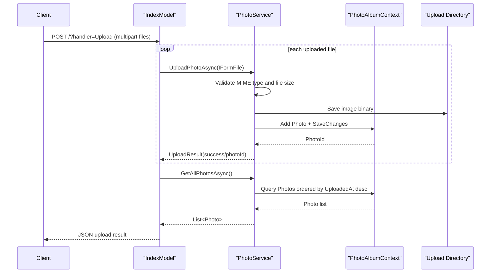

# API & Service Communication Contracts

The application exposes a small Razor Pages handler surface for gallery browsing, upload, detail, delete, and file serving. Communication is synchronous in-process service calls plus synchronous database/file-system operations.

## Service Catalog

| Service | Port | Category | Purpose |
|---|---|---|---|
| PhotoAlbum (Razor Pages web app) | 5134 (HTTP), 7055 (HTTPS) | API Layer + Business | Hosts UI handlers and orchestrates photo upload, retrieval, and deletion |

## API Endpoints Inventory

| Service | Method | Path | Request Type | Response Type |
|---|---|---|---|---|
| PhotoAlbum | GET | `/` (Index page) | Query/page request | Razor page with gallery model |
| PhotoAlbum | POST | `/?handler=Upload` | Multipart form (`List<IFormFile>`) | JSON payload with `uploadedPhotos` and `failedUploads` |
| PhotoAlbum | GET | `/Detail?id={id}` | Query parameter `id` | Razor page with selected `Photo` |
| PhotoAlbum | POST | `/Detail?handler=Delete&id={id}` | Form/query parameter `id` | Redirect to index/detail |
| PhotoAlbum | GET | `/PhotoFile?id={id}` | Query parameter `id` | Binary file content with photo MIME type |

## Management & Observability Endpoints

| Service | Endpoint | Custom Metrics (if any) |
|---|---|---|
| PhotoAlbum | None explicitly configured | None detected |

## DTOs & Contracts

The API contracts are centered on `Photo` (response model used in page rendering and JSON upload response projection) and `UploadResult` (service-layer upload outcome model). Request contracts for uploads rely on ASP.NET Core `IFormFile` and `List<IFormFile>`. No OpenAPI, protobuf, or GraphQL schema files were found.

## Communication Patterns

All communication is synchronous. Razor Page handlers call `IPhotoService`/`PhotoService`, which performs EF Core calls to SQL Server LocalDB and file IO to local storage. No async messaging, service discovery, circuit breaker, or retry framework is configured. Security posture at API-contract level: HTTPS redirection is enabled, but no authentication or authorization policies are configured for page handlers.

## Service Technology Matrix

| Service | Web | Data Access | Discovery | Gateway | Actuator | Cache | Metrics |
|---|---|---|---|---|---|---|---|
| PhotoAlbum | Razor Pages | EF Core SqlServer | none | none | none | browser/static file caching headers | none |

## Service Communication Sequence

