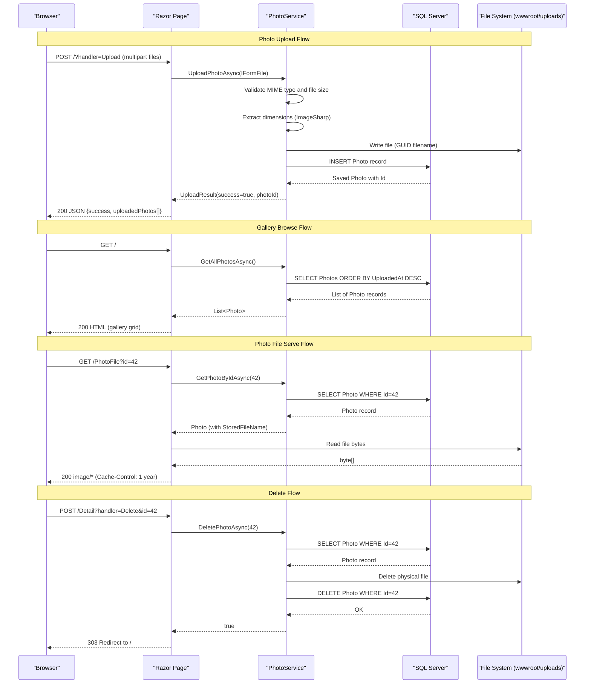

# API & Service Communication Contracts

PhotoAlbum exposes 6 HTTP endpoints via ASP.NET Core 9 Razor Pages (no REST API controllers), all using synchronous HTTP with no inter-service communication.

## Service Catalog

| Service | Port | Category | Purpose |
|---------|------|----------|---------|
| PhotoAlbum (web) | 5000/5001 (HTTP/HTTPS, dev) | Business | Single deployable web app serving the photo gallery UI and handling upload/delete operations |

## API Endpoints Inventory

| Service | Method | Path | Request Type | Response Type |
|---------|--------|------|-------------|---------------|
| IndexModel | GET | `/` | — | Razor Page (photo gallery HTML) |
| IndexModel | POST | `/?handler=Upload` | `multipart/form-data` (`List<IFormFile>`) | JSON: `{ success, uploadedPhotos[], failedUploads[] }` |
| DetailModel | GET | `/Detail?id={id}` | Path/query `int id` | Razor Page (single photo view HTML) |
| DetailModel | POST | `/Detail?handler=Delete&id={id}` | Query `int id` (AntiForgery token) | Redirect to `/` (303) |
| PhotoFileModel | GET | `/PhotoFile?id={id}` | Query `int id` | Raw binary file (`image/*`) with `Cache-Control: public, max-age=31536000` |
| PrivacyModel | GET | `/Privacy` | — | Razor Page (static HTML) |
| ErrorModel | GET | `/Error` | — | Razor Page (error HTML with request ID) |

## Management & Observability Endpoints

| Service | Endpoint | Notes |
|---------|----------|-------|
| PhotoAlbum | None configured | No health check, Swagger/OpenAPI, or metrics endpoints are registered. ASP.NET Core built-in request logging is active via `Microsoft.Extensions.Logging`. |

No custom metrics, `/health`, `/healthz`, or Swagger UI endpoints are present in the current codebase.

## DTOs & Contracts

Two contract types are used at the API boundary:

- **`UploadResult`** (service-level DTO): Returned by `IPhotoService.UploadPhotoAsync`. Carries `Success` (bool), `PhotoId` (int?), `FileName` (string), and `ErrorMessage` (string?). It is serialized to JSON inline inside `IndexModel.OnPostUploadAsync` as an anonymous object rather than emitting `UploadResult` directly — the JSON shape is `{ success, uploadedPhotos[], failedUploads[] }`.
- **`Photo`** (domain entity as response): Photo metadata is projected into an anonymous object for the upload response. For GET pages, `Photo` records are passed as Razor Page model properties. Full field definitions are documented in `data-architecture.md`.

No OpenAPI/Swagger spec, `.proto` files, or GraphQL schemas are present. Serialization uses the default `System.Text.Json` provider via ASP.NET Core's `JsonResult`.

## Communication Patterns

**Synchronous only.** The application is a single-process monolith with no inter-service HTTP calls, message queues, or event-driven patterns. All communication is direct in-process method calls from Razor Pages → `IPhotoService` → `PhotoAlbumContext` (EF Core) and the local file system.

**Resilience policies:** No circuit breaker (Polly), retry, timeout, or bulkhead patterns are configured. EF Core uses the default SQL Server connection with no retry-on-transient-failure policy.

**Service discovery:** Not applicable — single deployable unit with no downstream service dependencies.

**Security posture:** HTTPS redirection is enforced via `app.UseHttpsRedirection()`. HSTS is enabled in non-development environments. No authentication or authorization middleware is configured — all endpoints are publicly accessible without credentials or tokens. AntiForgery tokens protect the POST handlers (Razor Pages enables this by default). No JWT, OAuth2, API keys, or RBAC are present.

## Service Technology Matrix

| Service | Web Framework | Data Access | Discovery | Gateway | Health Checks | Cache | Metrics |
|---------|--------------|-------------|-----------|---------|--------------|-------|---------|
| PhotoAlbum | ASP.NET Core 9 Razor Pages | EF Core 9 / SQL Server | None | None | None | None | None |

## Service Communication Sequence

