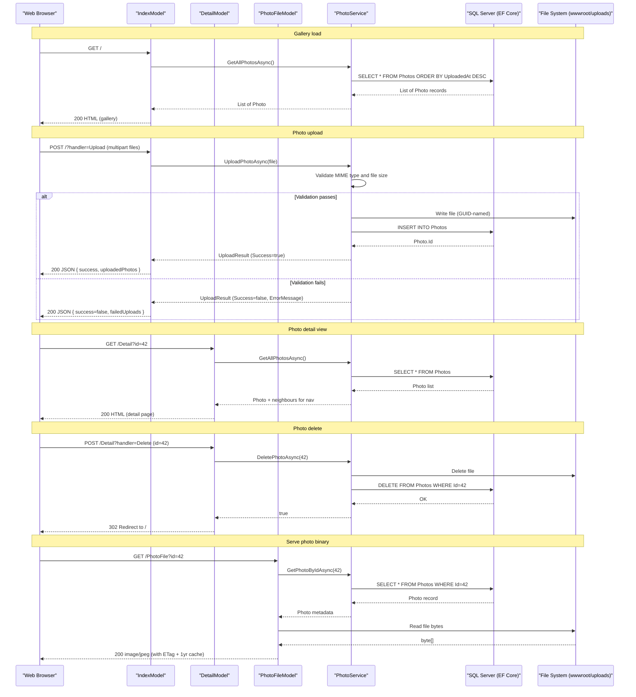

# API & Service Communication Contracts

PhotoAlbum exposes a single web application with 8 Razor Pages handler endpoints (GET/POST), communicating synchronously with a SQL Server database via Entity Framework Core — no inter-service or async messaging patterns are present.

## Service Catalog

| Service | Port | Category | Purpose |
|---|---|---|---|
| PhotoAlbum (web) | 5134 (HTTP) / 7055 (HTTPS) | Business | Razor Pages web app — gallery display, photo upload, detail view, file serving |

## API Endpoints Inventory

| Service | Method | Path | Request Type | Response Type |
|---|---|---|---|---|
| IndexModel | GET | `/` | — | Razor Page (photo gallery, `List<Photo>`) |
| IndexModel | POST | `/?handler=Upload` | `List<IFormFile>` (multipart) | JSON: `{ success, uploadedPhotos[], failedUploads[] }` |
| DetailModel | GET | `/Detail?id={id}` | `id` (query param, int) | Razor Page (single photo) or 404 |
| DetailModel | POST | `/Detail?handler=Delete` | `id` (form field, int) | Redirect to `/` or redirect back with TempData error |
| PhotoFileModel | GET | `/PhotoFile?id={id}` | `id` (query param, int) | Binary file response (image/jpeg, image/png, etc.) or 404 |
| PrivacyModel | GET | `/Privacy` | — | Razor Page (static privacy content) |
| ErrorModel | GET | `/Error` | — | Razor Page (error display) |

## Management & Observability Endpoints

| Service | Endpoint | Custom Metrics |
|---|---|---|
| PhotoAlbum (web) | None configured | None — no health check, Swagger/OpenAPI, or metrics endpoints are registered |

No ASP.NET Core health checks (`/health`/`/healthz`), Swagger UI, or metrics export endpoints are configured.

## DTOs & Contracts

Two model classes participate in the API contract:

- **`UploadResult`** (service-level DTO): Returned by `IPhotoService.UploadPhotoAsync`. Carries `Success` (bool), `PhotoId` (int?), `FileName` (string), and `ErrorMessage` (string?). It is a mutable class (not a record). The `IndexModel.OnPostUploadAsync` handler projects it into an anonymous JSON response object before sending to the client.
- **`Photo`** (domain entity used as response DTO): The `IndexModel` GET handler exposes the full `Photo` entity list to the Razor view. The `Detail` page exposes a single `Photo` entity. Full field details are documented in `data-architecture.md`.

No OpenAPI/Swagger specification, protobuf schemas, or GraphQL schemas are present. Serialization for the upload JSON response uses `System.Text.Json` (the ASP.NET Core default via `JsonResult`).

## Communication Patterns

**Synchronous only**: All communication is synchronous in-process method calls. The Razor Pages page models call `IPhotoService` methods directly; `PhotoService` calls `PhotoAlbumContext` (EF Core) for database operations and `System.IO` APIs for file system access. There are no HTTP client calls to external services, no message queues, and no gRPC channels.

**Resilience policies**: No circuit breaker, retry, or timeout policies are configured (no Polly or similar library). Database connectivity failures surface as unhandled exceptions (wrapped in try/catch with logging at the service level), causing a 500 response or page error.

**Service discovery**: Not applicable — single deployable unit with no external service dependencies.

**Security posture**: HTTPS redirection (`app.UseHttpsRedirection()`) and HSTS are enabled in production (`app.UseHsts()`). `app.UseAuthorization()` is registered in the middleware pipeline but no authentication scheme is configured and no `[Authorize]` attributes are applied, meaning **all pages and endpoints are publicly accessible with no authentication or authorization checks**. Static files are served with a 1-hour cache header; photo files served via `PhotoFileModel` carry a 1-year `Cache-Control` header and an `ETag`.

## Service Technology Matrix

| Service | Web Framework | Data Access | Discovery | Gateway | Health Check | Cache | Metrics |
|---|---|---|---|---|---|---|---|
| PhotoAlbum | ASP.NET Core 9 Razor Pages | EF Core 9 / SQL Server | None | None | None | None (HTTP cache headers only) | None |

## Service Communication Sequence

