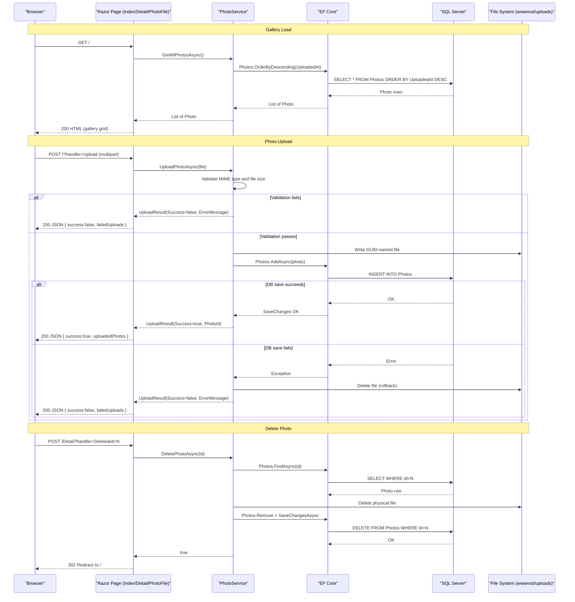

# API & Service Communication Contracts

PhotoAlbum exposes 6 HTTP endpoints (Razor Pages conventions) covering gallery display, photo upload, detail view, delete, and file serving — all synchronous, with no inter-service communication or external API integrations.

## Service Catalog

| Service | Port | Category | Purpose |
|---|---|---|---|
| PhotoAlbum Web | 5000/5001 (HTTP/HTTPS, dev defaults) | Business | Single Razor Pages web application handling gallery display, photo upload, and file serving |

## API Endpoints Inventory

| Service | Method | Path | Request Type | Response Type |
|---|---|---|---|---|
| IndexModel | GET | `/` | — | HTML gallery page (list of Photo) |
| IndexModel | POST | `/?handler=Upload` | `List<IFormFile>` (multipart/form-data) | JSON `{ success, uploadedPhotos[], failedUploads[] }` / 400 |
| DetailModel | GET | `/Detail?id={id}` | `id` (int, query param) | HTML detail page (Photo) / 404 |
| DetailModel | POST | `/Detail?handler=Delete&id={id}` | `id` (int, query param) | Redirect to `/` / Redirect to `/Detail?id={id}` on error |
| PhotoFileModel | GET | `/PhotoFile?id={id}` | `id` (int, query param) | Raw image file (binary, MIME type from DB) / 404 / 500 |
| ErrorModel | GET | `/Error` | — | HTML error page |

## Management & Observability Endpoints

| Service | Endpoint | Custom Metrics |
|---|---|---|
| PhotoAlbum Web | None configured | None — no health check, Swagger, or metrics endpoints are registered |

> Note: No `/health`, `/swagger`, or metrics endpoints are configured. Adding health checks is recommended before deploying to a managed platform (e.g., Azure App Service, AKS).

## DTOs & Contracts

Two model classes participate in the API contract:

- **`Photo`** (service-level domain entity): Used as the response model for GET endpoints. Carries all photo metadata fields. Full field definitions are documented in `data-architecture.md`.
- **`UploadResult`** (service-level DTO): Returned by `PhotoService.UploadPhotoAsync` and surfaced in the JSON upload response. Conveys `Success` (bool), `PhotoId` (int), `FileName` (string), and `ErrorMessage` (string). Not immutable — mutable class with property setters.

No OpenAPI/Swagger specification files exist. No protobuf or GraphQL schemas are present. Serialization uses the default `System.Text.Json` serializer provided by ASP.NET Core (applied to the JSON upload response via `JsonResult`).

## Communication Patterns

**Synchronous only**: All communication is intra-process. The web application handles HTTP requests directly, calls `PhotoService` via constructor-injected `IPhotoService`, and PhotoService interacts with EF Core (SQL Server) and the local file system synchronously within the request pipeline. There are no external HTTP clients, message queues, event buses, or inter-service calls.

**No resilience patterns**: No circuit breakers, retry policies (Polly or otherwise), or timeouts beyond ASP.NET Core request pipeline defaults are configured.

**No service discovery or API gateway**: The application is deployed as a single process; no service registry, reverse proxy, or API gateway is present.

**Security posture**: No authentication or authorization is configured. All endpoints (including upload and delete) are publicly accessible with no JWT, OAuth2, cookie auth, or role-based access checks. HTTPS redirection is enabled via `app.UseHttpsRedirection()`, but no TLS certificate configuration is present in the repository. `app.UseAuthorization()` is registered in the pipeline but no `[Authorize]` attributes or policies are defined — it has no effect.

## Service Technology Matrix

| Service | Web Framework | Data Access | Discovery | Gateway | Health Checks | Cache | Metrics |
|---|---|---|---|---|---|---|---|
| PhotoAlbum Web | ASP.NET Core Razor Pages 9.0 | EF Core 9.0 (SQL Server) | None | None | None | None (static file cache headers only) | None |

## Service Communication Sequence

