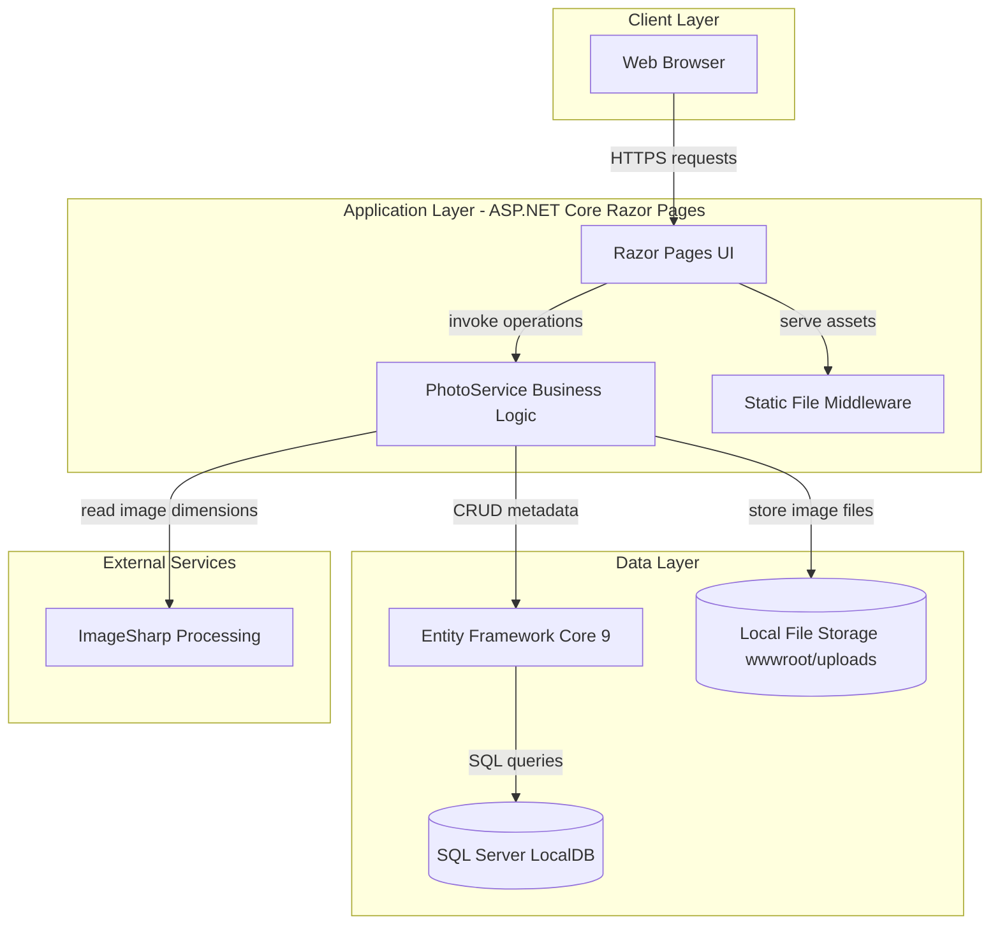
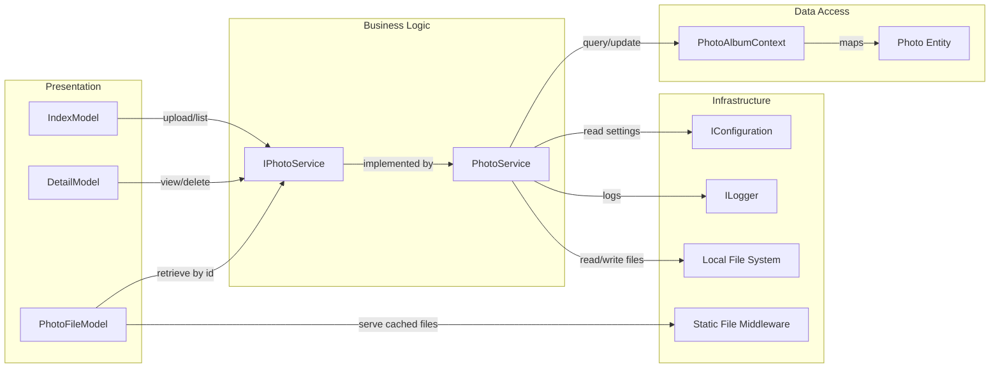

# Architecture Diagram

This application is a single-service ASP.NET Core Razor Pages photo management system with a layered design for presentation, business logic, and persistence.

## Application Architecture

### Technology Stack Summary

| Layer | Technology | Version | Purpose |
|---|---|---|---|
| Presentation | ASP.NET Core Razor Pages | net9.0 | UI pages for gallery, detail, and file serving |
| Business Logic | PhotoService | Custom | Upload validation, deletion, and metadata handling |
| Data Access | EF Core SQL Server Provider | 9.0.9 | ORM and migrations for photo metadata |
| Storage | SQL Server LocalDB + file system | Local | Metadata in DB and binaries in `wwwroot/uploads` |
| Imaging | SixLabors.ImageSharp | 3.1.11 | Extract width and height during upload |

### Data Storage & External Services

The app stores photo metadata in SQL Server via EF Core and stores image binaries on local disk under `wwwroot/uploads`. It does not call remote APIs, queues, or brokers; the only external processing dependency is ImageSharp for image metadata extraction.

### Key Architectural Decisions

- Uses a split storage approach: relational metadata in SQL Server and binary content on local file storage.
- Applies EF Core migrations automatically at startup (unless `IsTestEnvironment` is true).
- Keeps request handling thin in page models and centralizes upload/delete logic in `PhotoService`.

## Component Relationships

### Component Inventory

| Component | Layer | Type | Responsibility |
|---|---|---|---|
| `IndexModel` | Presentation | Razor PageModel | Lists photos and handles multi-file upload requests |
| `DetailModel` | Presentation | Razor PageModel | Displays photo details and handles delete actions |
| `PhotoFileModel` | Presentation | Razor PageModel | Resolves photo IDs to physical files and returns binary content |
| `IPhotoService` | Business Logic | Service contract | Defines photo retrieval, upload, and delete operations |
| `PhotoService` | Business Logic | Service implementation | Validates files, persists metadata, manages file rollback/delete |
| `PhotoAlbumContext` | Data Access | EF Core DbContext | Manages `Photo` table and persistence operations |
| `Photo` | Data Access | Entity | Stores metadata for uploaded images |
| Static File Middleware | Infrastructure | Middleware | Serves static resources with cache headers |
