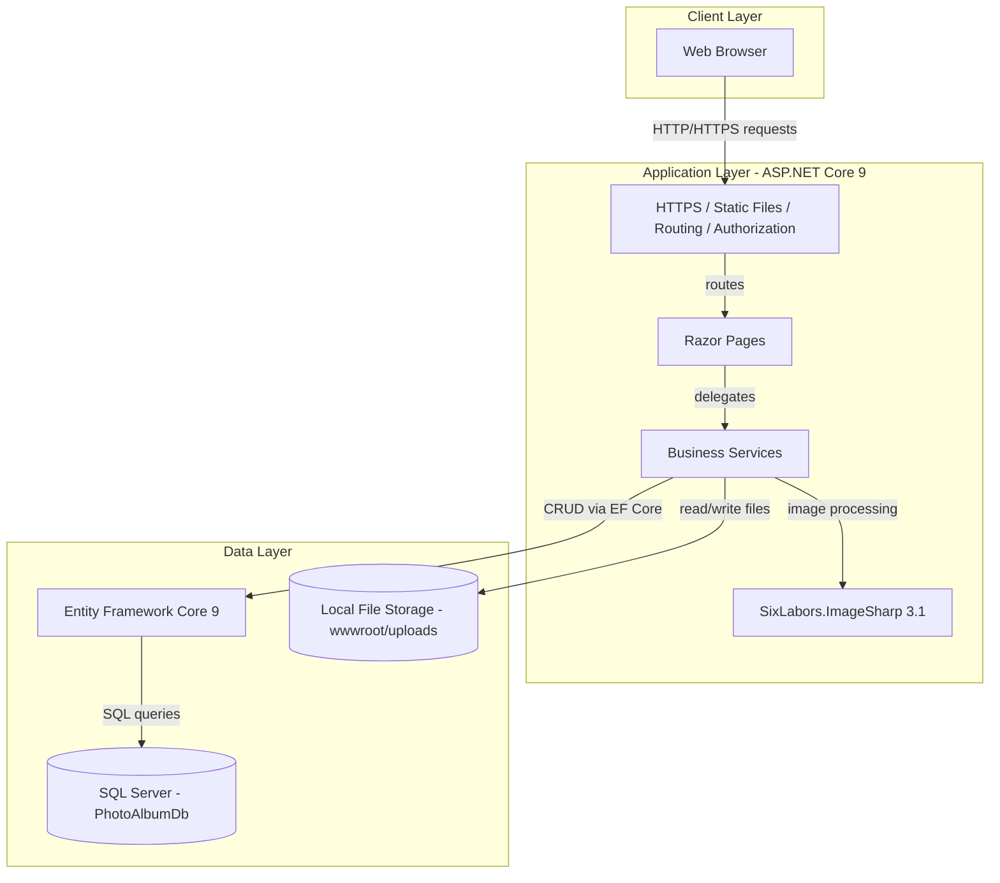
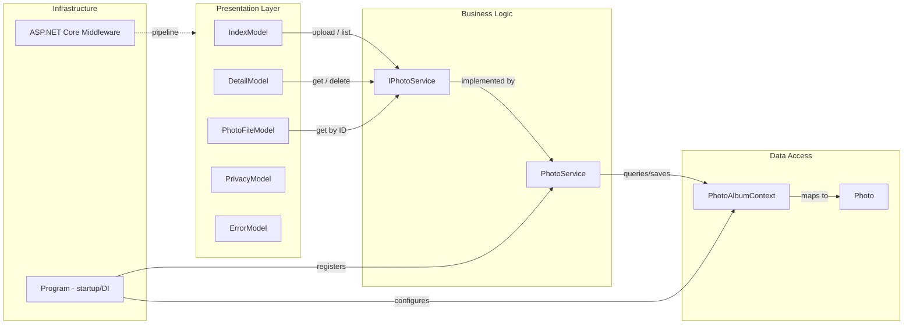

# Architecture Diagram

PhotoAlbum is an ASP.NET Core 9 Razor Pages web application for uploading, browsing, and managing photo albums, backed by a SQL Server database and local file storage.

## Application Architecture

### Technology Stack Summary

| Layer | Technology | Version | Purpose |
|-------|-----------|---------|---------|
| Presentation | ASP.NET Core Razor Pages | 9.0 | Server-side rendered web UI |
| Business Logic | C# Service classes | net9.0 | Photo upload, validation, deletion |
| Image Processing | SixLabors.ImageSharp | 3.1.11 | Extract image dimensions on upload |
| Data Access | Entity Framework Core | 9.0.9 | ORM for SQL Server |
| Database | Microsoft SQL Server | LocalDB/Azure SQL | Persistent photo metadata storage |
| File Storage | Local disk (wwwroot/uploads) | — | Physical photo file storage |
| Runtime | .NET 9 / ASP.NET Core | 9.0 | Web server and dependency injection |

### Data Storage & External Services

The application uses **Microsoft SQL Server** (via EF Core 9) as its primary persistence store, holding photo metadata (file name, path, size, MIME type, dimensions, upload timestamp). Physical image files are stored on the **local file system** under `wwwroot/uploads`, referenced by path in the database. No external cloud services or message brokers are used; there are no caching layers, queues, or third-party APIs beyond the `SixLabors.ImageSharp` NuGet library for in-process image dimension extraction.

### Key Architectural Decisions

- **Razor Pages pattern**: Each page (Index, Detail, PhotoFile, Privacy, Error) has a dedicated PageModel, keeping concerns co-located rather than using MVC controllers.
- **Service abstraction**: `IPhotoService` / `PhotoService` decouples data access and file I/O from the presentation layer, enabling testability via dependency injection.
- **Migrations on startup**: EF Core migrations are applied automatically at application start (skipped when `IsTestEnvironment=true`), simplifying deployment.

## Component Relationships

### Component Inventory

| Component | Layer | Type | Responsibility |
|-----------|-------|------|----------------|
| IndexModel | Presentation | Razor PageModel | Display photo gallery; handle multi-file upload POST |
| DetailModel | Presentation | Razor PageModel | Display single photo with prev/next navigation; handle delete POST |
| PhotoFileModel | Presentation | Razor PageModel | Serve raw photo file bytes by photo ID with caching headers |
| PrivacyModel | Presentation | Razor PageModel | Render static privacy policy page |
| ErrorModel | Presentation | Razor PageModel | Render error page with request ID |
| IPhotoService | Business Logic | Interface | Contract for photo CRUD and upload operations |
| PhotoService | Business Logic | Service | Validates uploads, extracts dimensions, manages file I/O and DB persistence |
| PhotoAlbumContext | Data Access | EF Core DbContext | Provides `Photos` DbSet; configures indexes and column constraints |
| Photo | Data Access | EF Core Entity | Domain model: id, filenames, path, size, MIME type, dimensions, timestamp |
| UploadResult | Business Logic | DTO | Carries upload outcome (success flag, photo ID, error message) |
| Program | Infrastructure | Startup / DI root | Configures services, middleware pipeline, and applies EF migrations on startup |
