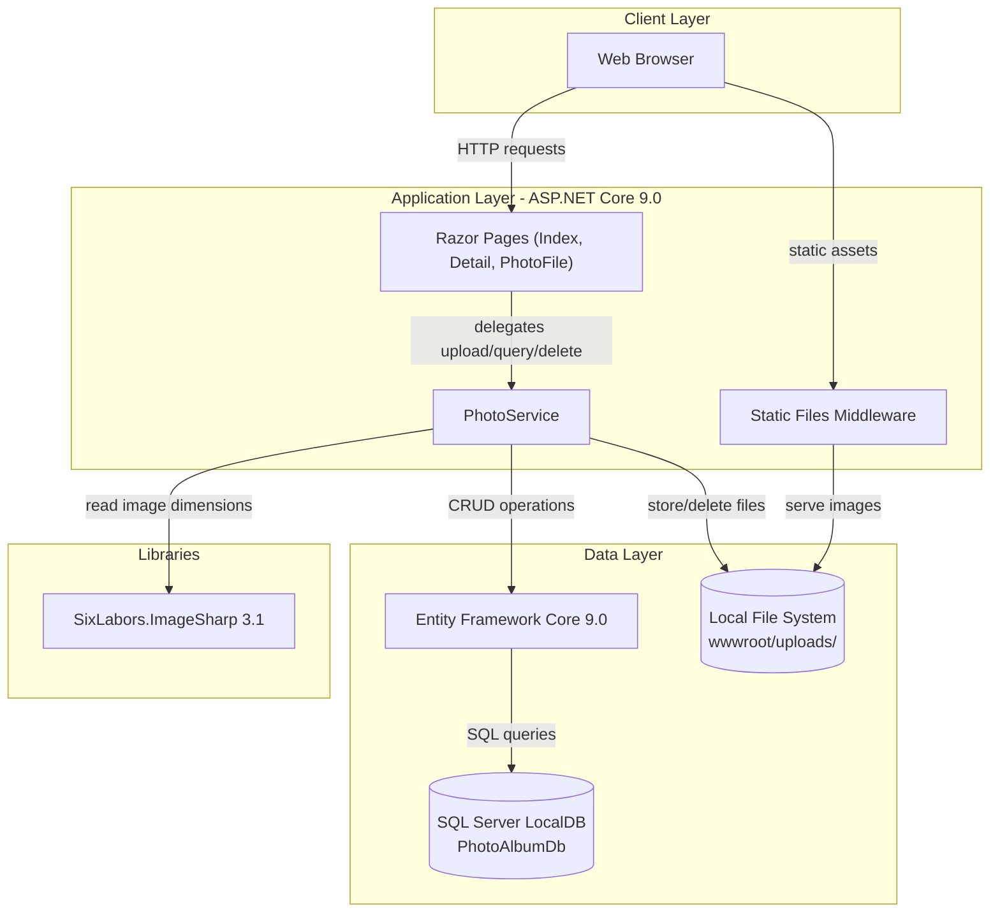
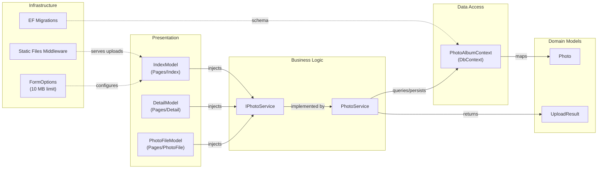

# Architecture Diagram

PhotoAlbum is an ASP.NET Core 9.0 Razor Pages web application for photo gallery management, using Entity Framework Core with SQL Server for persistence and SixLabors.ImageSharp for image processing.

## Application Architecture

### Technology Stack Summary

| Layer | Technology | Version | Purpose |
|---|---|---|---|
| Presentation | ASP.NET Core Razor Pages | 9.0 | Server-side web UI, gallery and upload pages |
| Business Logic | PhotoService | - | Photo upload validation, file I/O, dimension extraction |
| Data Access | Entity Framework Core (SQL Server) | 9.0.9 | ORM for photo metadata persistence |
| Image Processing | SixLabors.ImageSharp | 3.1.11 | Extract image width/height on upload |
| Database | SQL Server LocalDB | - | Relational storage for photo metadata |
| File Storage | Local file system | - | Stores uploaded image files under wwwroot/uploads/ |

### Data Storage & External Services

The application uses SQL Server LocalDB as its relational database (via EF Core 9.0) to persist photo metadata (filenames, MIME type, dimensions, upload timestamp). Image files themselves are stored on the local file system under `wwwroot/uploads/` using GUID-based filenames to avoid collisions. SixLabors.ImageSharp is used at upload time to extract image dimensions. There are no external third-party service integrations.

### Key Architectural Decisions

- **Service layer abstraction**: `IPhotoService` interface decouples photo operations from page models, enabling swapping of storage backends (e.g., local → Azure Blob Storage) without changing presentation code.
- **Transactional consistency**: If the database save fails after a file has been written to disk, PhotoService deletes the orphaned file to maintain consistency.
- **Configuration-driven validation**: File size limits and allowed MIME types are read from `appsettings.json`, keeping validation rules outside the code.

## Component Relationships

### Component Inventory

| Component | Layer | Type | Responsibility |
|---|---|---|---|
| IndexModel | Presentation | Razor Page | Gallery grid view; handles GET (list photos) and POST (upload files) |
| DetailModel | Presentation | Razor Page | Full-size photo display with metadata and prev/next navigation |
| PhotoFileModel | Presentation | Razor Page | File retrieval endpoint serving raw image bytes |
| ErrorModel | Presentation | Razor Page | Generic error display page |
| PrivacyModel | Presentation | Razor Page | Privacy policy page |
| IPhotoService | Business Logic | Interface | Contract for photo upload, retrieval, and deletion |
| PhotoService | Business Logic | Scoped Service | Validates uploads, extracts dimensions, persists files and metadata, handles rollback |
| PhotoAlbumContext | Data Access | EF DbContext | Exposes Photos DbSet; configures schema and index on UploadedAt |
| Photo | Domain Models | EF Entity | Represents a photo record (id, filenames, size, MIME type, dimensions, timestamp) |
| UploadResult | Domain Models | DTO | Carries success/failure outcome and photo ID back from PhotoService |
| EF Migrations | Infrastructure | DB Migration | Manages SQL Server schema creation (InitialCreate) |
| Static Files Middleware | Infrastructure | Middleware | Serves wwwroot assets including uploaded images with cache headers |
| FormOptions | Infrastructure | Configuration | Sets 10 MB multipart body limit for file uploads |
