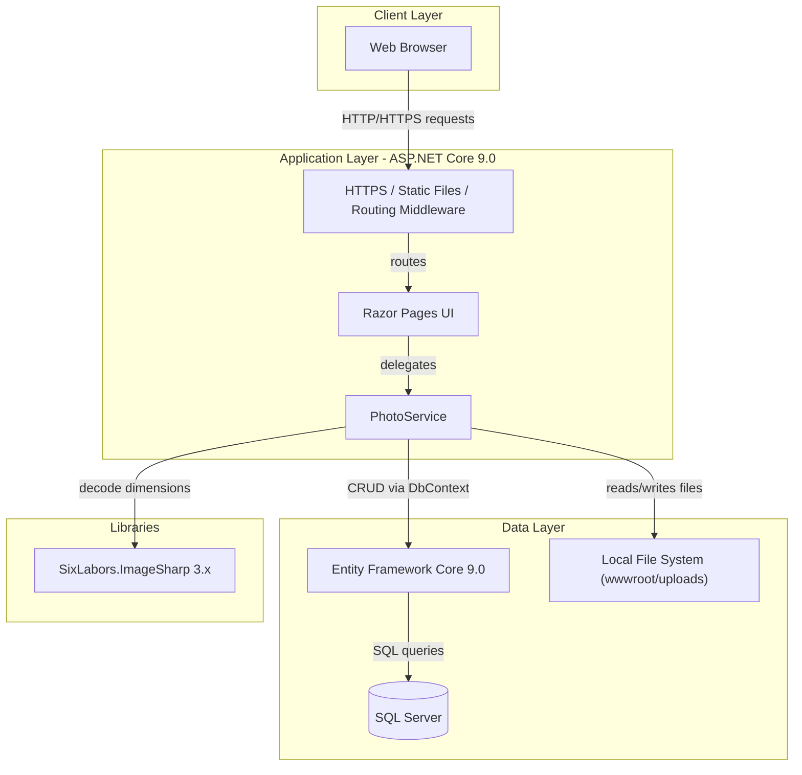
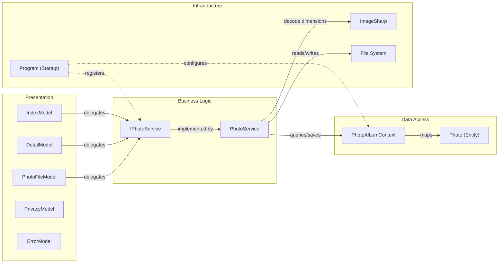

# Architecture Diagram

PhotoAlbum is an ASP.NET Core 9.0 Razor Pages web application for uploading, viewing, and managing photo files, backed by SQL Server via Entity Framework Core.

## Application Architecture

### Technology Stack Summary

| Layer | Technology | Version | Purpose |
|---|---|---|---|
| Presentation | ASP.NET Core Razor Pages | 9.0 | Server-side rendered web UI |
| Business Logic | PhotoService | — | Photo upload, retrieval, deletion |
| Data Access | Entity Framework Core | 9.0.9 | ORM for SQL Server |
| Database | SQL Server (localdb in dev) | — | Persistent photo metadata storage |
| File Storage | Local file system | — | Binary image storage under wwwroot/uploads |
| Image Processing | SixLabors.ImageSharp | 3.1.11 | Extract image width/height on upload |
| Runtime | .NET | 9.0 | Application runtime |

### Data Storage & External Services

The application stores photo metadata (filename, path, size, MIME type, dimensions, upload timestamp) in a SQL Server database accessed through EF Core. Binary image files are persisted to the local file system under `wwwroot/uploads`. No external cloud services or message brokers are used; there is no caching layer beyond ASP.NET Core's built-in static-file cache headers.

### Key Architectural Decisions

- **Razor Pages pattern**: Each page (`Index`, `Detail`, `PhotoFile`, `Privacy`, `Error`) has a dedicated code-behind `PageModel` that encapsulates its own request-handling logic, keeping the presentation layer thin.
- **Service abstraction via `IPhotoService`**: Business logic is decoupled from the pages through a service interface, enabling straightforward unit testing with mocks.
- **Auto-migration on startup**: `context.Database.MigrateAsync()` is called during application startup (skipped in test mode via `IsTestEnvironment` flag), ensuring the database schema is always up to date without manual intervention.

## Component Relationships

### Component Inventory

| Component | Layer | Type | Responsibility |
|---|---|---|---|
| IndexModel | Presentation | Razor PageModel | Displays gallery, handles multi-file upload POST |
| DetailModel | Presentation | Razor PageModel | Displays single photo detail view |
| PhotoFileModel | Presentation | Razor PageModel | Serves photo file stream response |
| PrivacyModel | Presentation | Razor PageModel | Privacy policy page |
| ErrorModel | Presentation | Razor PageModel | Error display page |
| IPhotoService | Business Logic | Interface | Contract for photo operations |
| PhotoService | Business Logic | Service | Upload validation, file I/O, DB persistence, deletion |
| PhotoAlbumContext | Data Access | EF DbContext | EF Core database context; exposes Photos DbSet |
| Photo | Data Access | Entity / Model | Photo metadata entity (id, filename, path, size, MIME, dimensions, timestamp) |
| UploadResult | Business Logic | DTO | Carries upload outcome (success flag, photo id, error message) |
| Program | Infrastructure | Entry Point | DI registration, middleware pipeline, auto-migration |
