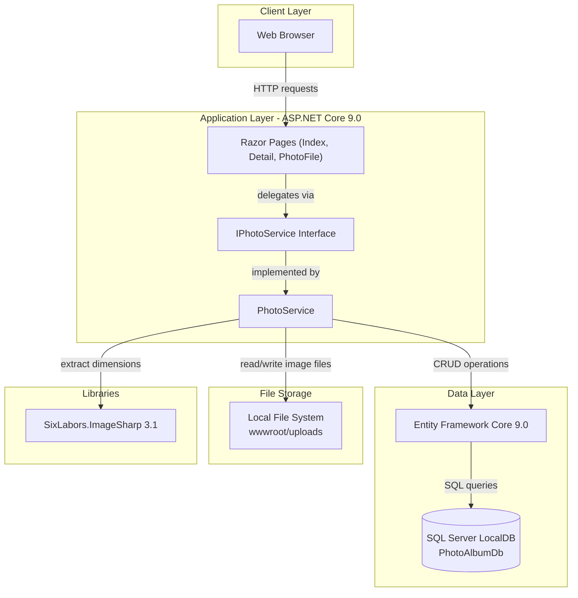
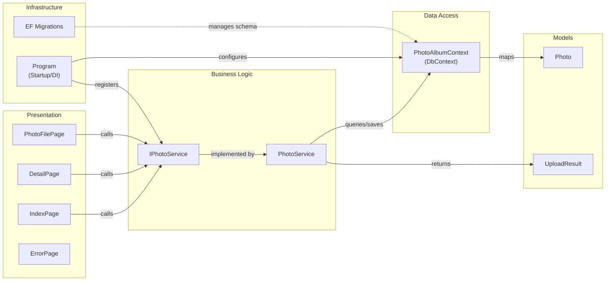

# Architecture Diagram

PhotoAlbum is an ASP.NET Core 9.0 Razor Pages web application for photo gallery management, using Entity Framework Core with SQL Server for persistence and local file storage for images.

## Application Architecture

### Technology Stack Summary

| Layer | Technology | Version | Purpose |
|-------|------------|---------|---------|
| Presentation | ASP.NET Core Razor Pages | 9.0 | Server-side web UI with HTML rendering |
| Business Logic | PhotoService | - | Photo upload, validation, retrieval, deletion |
| Data Access | Entity Framework Core (SQL Server) | 9.0 | ORM for photo metadata persistence |
| Image Processing | SixLabors.ImageSharp | 3.1.11 | Extracting image dimensions on upload |
| Data Storage | SQL Server LocalDB | - | Relational storage for photo metadata |
| File Storage | Local Filesystem | - | Binary image file storage in wwwroot/uploads |

### Data Storage & External Services

The application uses SQL Server LocalDB for relational storage of photo metadata (filenames, MIME type, dimensions, timestamps) via EF Core with a `Photos` table indexed on `UploadedAt`. Binary image files are stored directly on the local filesystem under `wwwroot/uploads/` using GUID-based filenames to avoid conflicts. There are no external service integrations (no cloud storage, no email, no third-party APIs) in the current implementation.

### Key Architectural Decisions

- **Service layer abstraction**: `IPhotoService` interface decouples the Razor Pages from the concrete `PhotoService` implementation, designed to facilitate a future swap from local file storage to Azure Blob Storage.
- **Transactional consistency via manual rollback**: If the EF Core `SaveChangesAsync` fails after a file has been written to disk, the service deletes the orphaned file to maintain consistency.
- **Configuration-driven constraints**: File size limits (10 MB), allowed MIME types, and upload path are read from `appsettings.json`, enabling environment-specific overrides without code changes.

## Component Relationships

### Component Inventory

| Component | Layer | Type | Responsibility |
|-----------|-------|------|---------------|
| IndexPage | Presentation | Razor Page | Gallery grid view; handles photo upload form submission |
| DetailPage | Presentation | Razor Page | Full-size photo display with metadata and prev/next navigation |
| PhotoFilePage | Presentation | Razor Page | Serves image file bytes as HTTP response |
| ErrorPage | Presentation | Razor Page | Renders error information |
| IPhotoService | Business Logic | Interface | Abstraction for photo CRUD operations |
| PhotoService | Business Logic | Service | Validates, stores, retrieves, and deletes photos |
| PhotoAlbumContext | Data Access | EF DbContext | Manages Photos DbSet and schema configuration |
| Photo | Models | Entity | Photo metadata entity (id, filenames, size, MIME type, dimensions, timestamp) |
| UploadResult | Models | DTO | Carries upload success/failure result back to caller |
| Program | Infrastructure | Entry Point | Configures DI, middleware pipeline, and auto-migrations |
| EF Migrations | Infrastructure | Migration | Manages SQL Server schema evolution |
