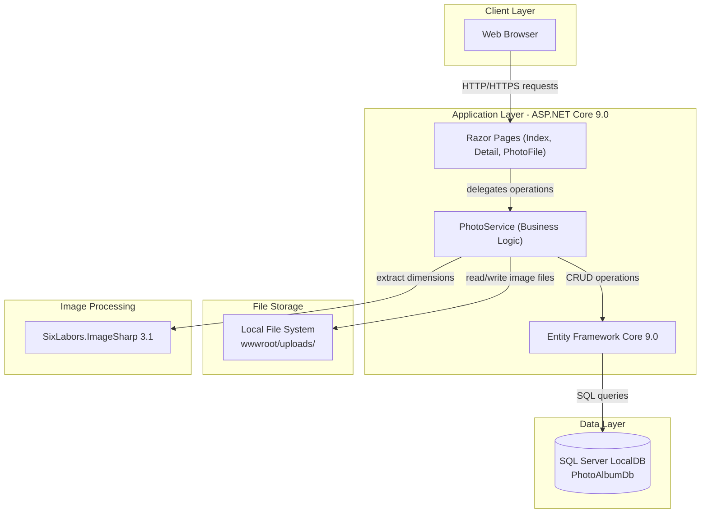
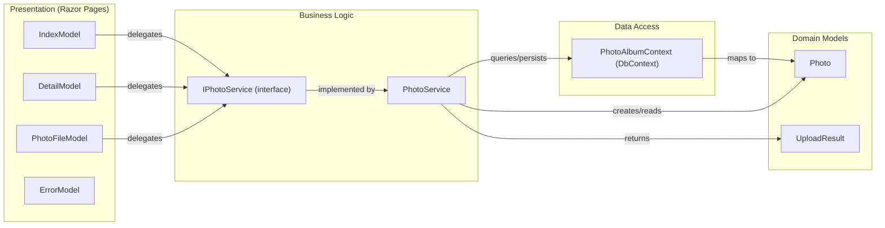

# Architecture Diagram

PhotoAlbum is an ASP.NET Core 9.0 Razor Pages application providing a photo gallery with upload, browse, and delete capabilities backed by SQL Server via Entity Framework Core.

## Application Architecture

### Technology Stack Summary

| Layer | Technology | Version | Purpose |
|---|---|---|---|
| Presentation | ASP.NET Core Razor Pages | 9.0 | Server-side web UI framework |
| Business Logic | PhotoService | — | Photo upload, validation, retrieval, deletion |
| Data Access | Entity Framework Core (SQL Server) | 9.0.9 | ORM for database persistence |
| Image Processing | SixLabors.ImageSharp | 3.1.11 | Image dimension extraction |
| Runtime | .NET | 9.0 | Application host |
| Database | SQL Server LocalDB | — | Relational data storage |
| Static Files | Local file system (`wwwroot/uploads/`) | — | Uploaded photo storage |

### Data Storage & External Services

The application uses a single SQL Server LocalDB instance (`PhotoAlbumDb`) for photo metadata persistence and a local `wwwroot/uploads/` directory for physical image file storage. There are no external cloud services, message queues, or caches configured in the current state.

### Key Architectural Decisions

- **Service abstraction**: `IPhotoService` interface decouples the business logic from Razor Pages, making the storage backend swappable (e.g., local → Azure Blob Storage).
- **Transactional file consistency**: If a database save fails after a file is written to disk, the service deletes the orphaned file to keep file and database state in sync.
- **Configuration-driven constraints**: File size limits (10 MB) and allowed MIME types are read from `appsettings.json`, avoiding hard-coded values in service logic.

## Component Relationships

### Component Inventory

| Component | Layer | Type | Responsibility |
|---|---|---|---|
| IndexModel | Presentation | Razor Page Model | Gallery view; handles file upload POST and photo list GET |
| DetailModel | Presentation | Razor Page Model | Single photo display with navigation; handles delete POST |
| PhotoFileModel | Presentation | Razor Page Model | Serves physical photo files by ID with cache headers |
| ErrorModel | Presentation | Razor Page Model | Error display page |
| IPhotoService | Business Logic | Interface | Contract for photo operations (upload, retrieve, delete) |
| PhotoService | Business Logic | Service | Implements IPhotoService; validates, stores, and manages photos |
| PhotoAlbumContext | Data Access | EF Core DbContext | Database context exposing `Photos` DbSet; configures indexes |
| Photo | Domain Models | Entity / Model | Photo metadata entity (filenames, size, MIME, dimensions, timestamp) |
| UploadResult | Domain Models | DTO | Upload operation result carrying success flag, photo ID, and error message |
