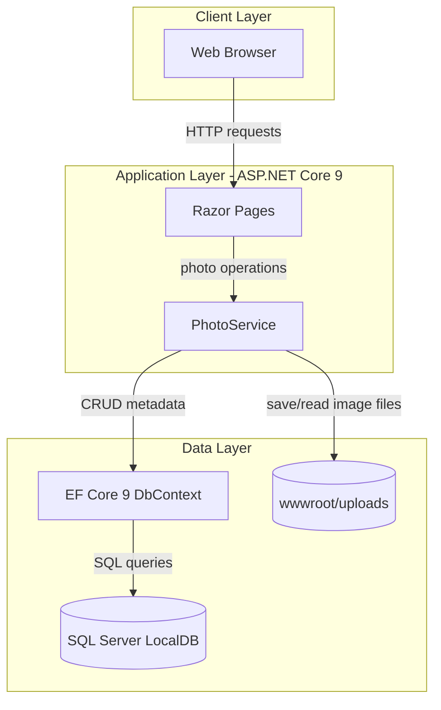
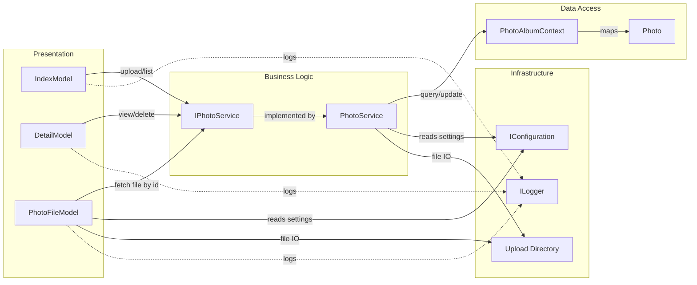

# Architecture Diagram

PhotoAlbum is a single ASP.NET Core Razor Pages application with a service layer for photo operations and an EF Core persistence layer backed by SQL Server LocalDB.

## Application Architecture

### Technology Stack Summary

| Layer | Technology | Version | Purpose |
|---|---|---|---|
| Presentation | ASP.NET Core Razor Pages | 9.0 | Web UI and handler endpoints |
| Business Logic | PhotoService (`IPhotoService`) | N/A | Upload, retrieval, and delete orchestration |
| Data Access | Entity Framework Core SQL Server provider | 9.0.9 | Persist photo metadata |
| Imaging | SixLabors.ImageSharp | 3.1.11 | Extract image dimensions |

### Data Storage & External Services

The app stores photo metadata in SQL Server LocalDB through EF Core and stores binary image files in the local `wwwroot/uploads` folder. No external APIs, message brokers, or third-party SaaS integrations are configured.

### Key Architectural Decisions

- Uses a service abstraction (`IPhotoService`) between Razor Pages and persistence/storage concerns.
- Persists file metadata in the database while storing image binaries on local disk.
- Applies migrations at startup (except when `IsTestEnvironment` is set) to keep schema synchronized.

## Component Relationships

### Component Inventory

| Component | Layer | Type | Responsibility |
|---|---|---|---|
| IndexModel | Presentation | Razor PageModel | Lists photos and handles multi-file upload |
| DetailModel | Presentation | Razor PageModel | Shows photo details and handles delete action |
| PhotoFileModel | Presentation | Razor PageModel | Serves photo binary content by ID |
| IPhotoService | Business Logic | Service interface | Contract for photo operations |
| PhotoService | Business Logic | Service class | Validates uploads, writes files, persists metadata |
| PhotoAlbumContext | Data Access | EF Core DbContext | Maps and queries `Photos` table |
| Photo | Data Access | Entity model | Photo metadata persisted in database |
