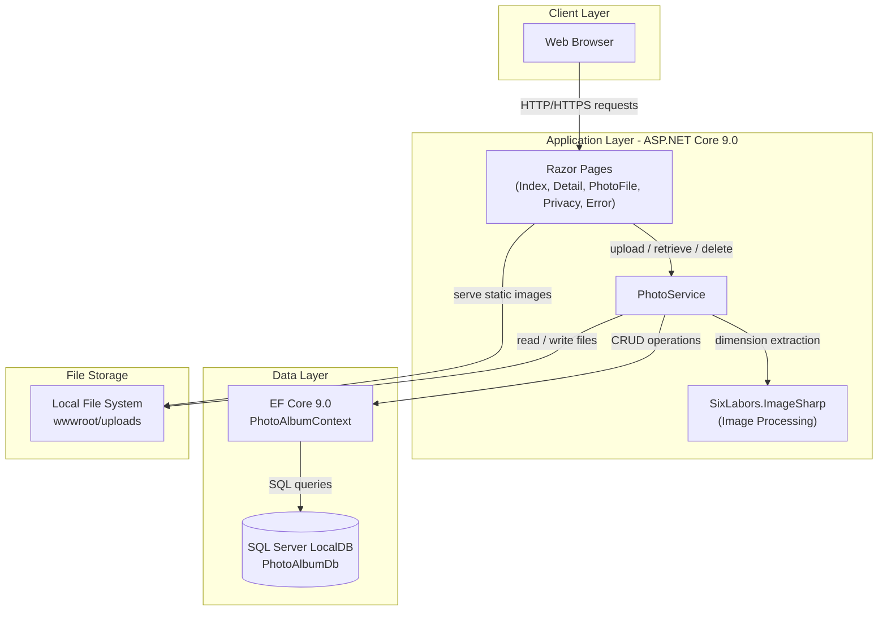
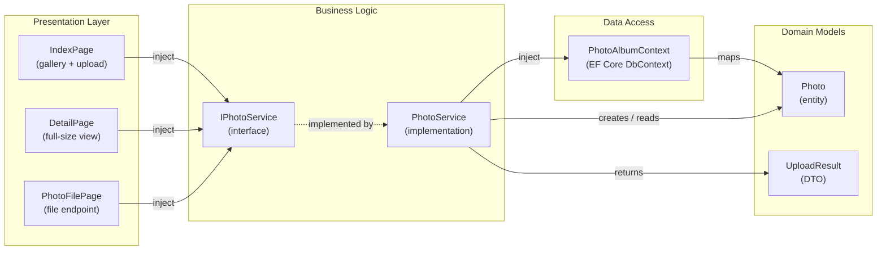

# Architecture Diagram

PhotoAlbum is an ASP.NET Core 9.0 Razor Pages web application for photo gallery management, using SQL Server LocalDB for metadata persistence and local file system storage for uploaded images.

## Application Architecture

### Technology Stack Summary

| Layer | Technology | Version | Purpose |
|---|---|---|---|
| Presentation | ASP.NET Core Razor Pages | 9.0 | Server-side web framework and page rendering |
| Business Logic | PhotoService | — | File validation, image processing, upload orchestration |
| Image Processing | SixLabors.ImageSharp | 3.1.11 | Image dimension extraction on upload |
| Data Access | Entity Framework Core (SQL Server) | 9.0.9 | ORM for photo metadata persistence |
| Database | SQL Server LocalDB | — | Relational storage for photo metadata |
| File Storage | Local file system | — | GUID-named image files under wwwroot/uploads |

### Data Storage & External Services

The application uses a single SQL Server LocalDB database (`PhotoAlbumDb`) to store photo metadata (filenames, MIME types, dimensions, timestamps). Uploaded image files are stored directly on the local file system under `wwwroot/uploads/` with GUID-based filenames to prevent collisions. There are no external third-party API integrations or cloud storage services in the current implementation.

### Key Architectural Decisions

- **Service layer abstraction**: `IPhotoService` interface decouples the Razor Pages from storage implementation, enabling a future swap from local file system to Azure Blob Storage without changing page code.
- **Transactional consistency**: If the EF Core `SaveChangesAsync()` call fails after a file is written to disk, the file is deleted immediately to prevent orphaned files.
- **Configuration-driven uploads**: File size limits and allowed MIME types are read from `appsettings.json`, making them environment-specific without code changes.

## Component Relationships

### Component Inventory

| Component | Layer | Type | Responsibility |
|---|---|---|---|
| IndexPage | Presentation | Razor Page | Gallery grid view and multi-file upload form |
| DetailPage | Presentation | Razor Page | Full-size photo display with metadata and prev/next navigation |
| PhotoFilePage | Presentation | Razor Page | Serves image files from the upload directory |
| IPhotoService | Business Logic | Interface | Contract for photo CRUD and upload operations |
| PhotoService | Business Logic | Service | File validation, image dimension extraction, disk I/O, DB persistence |
| PhotoAlbumContext | Data Access | EF Core DbContext | Manages `Photos` DbSet and model configuration/indexes |
| Photo | Domain | Entity | Photo metadata (filenames, size, MIME type, dimensions, timestamp) |
| UploadResult | Domain | DTO | Carries upload success/failure state and new photo ID back to the caller |
