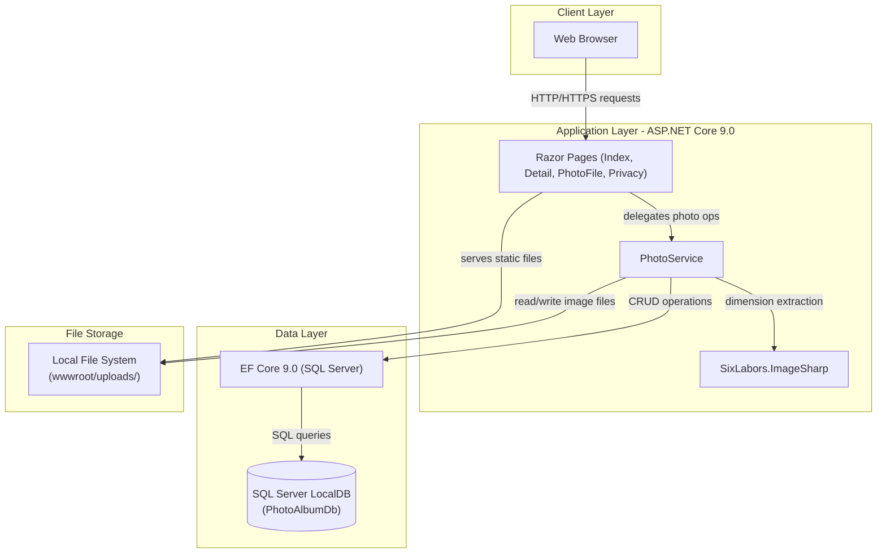
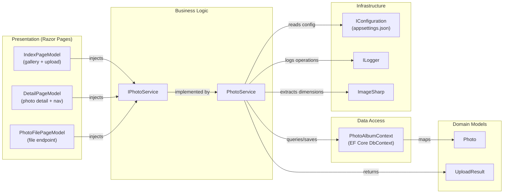

# Architecture Diagram

PhotoAlbum is an ASP.NET Core 9.0 Razor Pages application for photo gallery management, following a layered architecture with local file storage and a SQL Server database backend.

## Application Architecture

### Technology Stack Summary

| Layer | Technology | Version | Purpose |
|---|---|---|---|
| Presentation | ASP.NET Core Razor Pages | 9.0 | Server-side HTML rendering and routing |
| Business Logic | PhotoService | - | Photo upload, validation, retrieval, deletion |
| Image Processing | SixLabors.ImageSharp | 3.1.11 | Extract image width/height at upload time |
| Data Access | Entity Framework Core (SQL Server) | 9.0.9 | ORM for photo metadata persistence |
| Database | SQL Server LocalDB | - | Relational storage for photo metadata |
| File Storage | Local File System | - | Stores image binaries in wwwroot/uploads/ |

### Data Storage & External Services

The application uses **SQL Server LocalDB** (via EF Core 9.0) to persist photo metadata (filename, path, MIME type, size, dimensions, upload timestamp). Image binary files are stored on the **local file system** under `wwwroot/uploads/` using GUID-based filenames to avoid collisions. There are no external cloud services, caches, or message brokers in the current architecture.

### Key Architectural Decisions

- **Service layer abstraction**: `IPhotoService` interface decouples Razor Pages from storage implementation, enabling a future swap to Azure Blob Storage without modifying page code.
- **Transactional consistency**: On database save failure after file write, the uploaded file is immediately deleted to prevent orphaned files on disk.
- **Configuration-driven limits**: Max file size (10 MB), allowed MIME types, and upload path are externalized to `appsettings.json`, not hardcoded.

## Component Relationships

### Component Inventory

| Component | Layer | Type | Responsibility |
|---|---|---|---|
| IndexPageModel | Presentation | Razor Page | Displays photo gallery grid; handles multi-file upload form POST |
| DetailPageModel | Presentation | Razor Page | Shows full-size photo with metadata, navigation, and delete action |
| PhotoFilePageModel | Presentation | Razor Page | Serves image file bytes directly to the browser |
| PrivacyPageModel | Presentation | Razor Page | Static privacy policy page |
| IPhotoService | Business Logic | Interface | Contract for photo CRUD and upload operations |
| PhotoService | Business Logic | Service | Validates, stores, and manages photos; orchestrates file I/O and DB |
| PhotoAlbumContext | Data Access | EF DbContext | Manages Photos DbSet; configures indices and column constraints |
| Photo | Domain Models | Entity | Represents a photo with metadata (name, path, size, MIME, dimensions) |
| UploadResult | Domain Models | DTO | Communicates upload outcome (success/failure, PhotoId, error message) |
