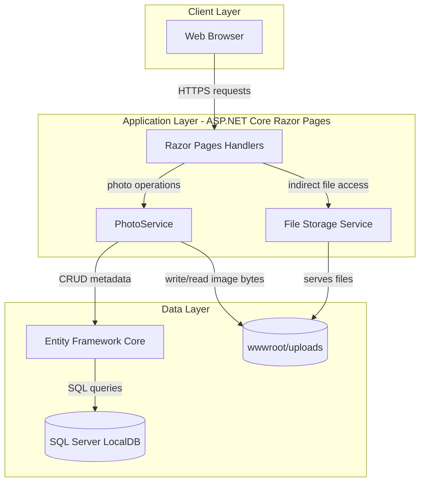
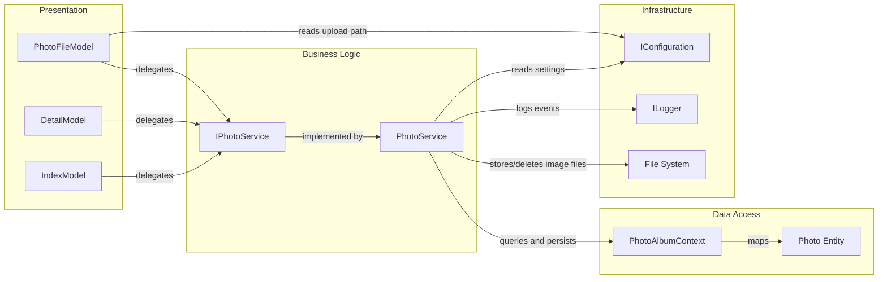

# Architecture Diagram

This document summarizes the PhotoAlbum application's high-level architecture and key component relationships.

## Application Architecture

### Technology Stack Summary

| Layer | Technology | Version | Purpose |
|---|---|---|---|
| Presentation | ASP.NET Core Razor Pages | .NET 9 | Web UI and request handlers |
| Business Logic | Scoped service layer (`PhotoService`) | .NET 9 | Upload, retrieval, deletion workflows |
| Data Access | Entity Framework Core SQL Server provider | 9.0.9 | ORM and migrations |
| Storage | SQL Server LocalDB + file system | Configured in appsettings | Metadata and binary image storage |

### Data Storage & External Services

The app stores photo metadata in a SQL Server database through EF Core and stores binary image files under `wwwroot/uploads`. No external third-party service integrations were identified in the current implementation.

### Key Architectural Decisions

- Uses a service abstraction (`IPhotoService`) to keep page handlers thin and centralize file/database coordination.
- Applies EF Core migrations automatically at startup (except when test environment flag is set).
- Uses indirect photo-file serving through a page model to control MIME handling and response headers.

## Component Relationships

### Component Inventory

| Component | Layer | Type | Responsibility |
|---|---|---|---|
| IndexModel | Presentation | Razor PageModel | Lists photos and handles upload requests |
| DetailModel | Presentation | Razor PageModel | Shows single photo and handles delete action |
| PhotoFileModel | Presentation | Razor PageModel | Serves image files by photo ID |
| IPhotoService | Business Logic | Service contract | Defines photo domain operations |
| PhotoService | Business Logic | Service implementation | Validates files, coordinates storage and metadata |
| PhotoAlbumContext | Data Access | EF Core DbContext | Persists `Photo` records and model configuration |
| Photo | Data Access | Entity | Photo metadata persisted in database |
