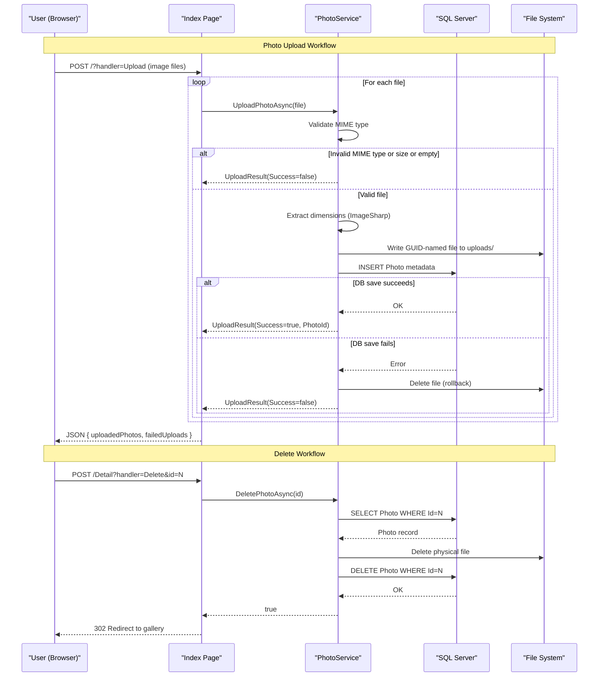

# Core Business Workflows

PhotoAlbum is a photo gallery application that allows users to upload, view, and delete images, maintaining a chronological gallery with per-photo metadata and full-size detail views.

## Domain Entities

| Entity | Service / Bounded Context | Description | Key Relationships |
|---|---|---|---|
| Photo | Photo Gallery | Represents an uploaded image — tracks both the original filename and the GUID-based stored filename, plus metadata (size, MIME type, dimensions, upload time) | None — single root aggregate, no relationships to other entities |

## Service-to-Domain Mapping

| Service | Domain Context | Owned Entities | External Dependencies |
|---|---|---|---|
| PhotoAlbum Web | Photo Gallery | Photo | Local file system (wwwroot/uploads/) for image binaries; SQL Server for metadata |

The application is a single-service monolith. All business logic resides in `PhotoService`, which is the sole owner of the `Photo` domain entity.

## Primary Workflows

### Workflow 1: Upload Photos

A user selects one or more image files and submits them via the gallery page. For each file, the application validates the MIME type and file size, extracts image dimensions, saves the file to the local upload directory, and persists the photo metadata to the database. Failures at any stage produce per-file error messages; a database save failure triggers file deletion to maintain consistency.

**Steps:**
1. User submits a multipart POST with one or more image files.
2. **For each file**: validate that the MIME type is in the allowed list (JPEG, PNG, GIF, WebP).
3. Validate that file size does not exceed the configured maximum (default 10 MB).
4. Validate that the file is not empty.
5. Extract image width and height using ImageSharp. If extraction fails, dimensions are left null and the upload continues.
6. Write the file to disk under `wwwroot/uploads/` using a GUID-based filename to avoid collisions.
7. Persist a `Photo` record to the database with metadata.
8. If the database save fails, delete the file written in step 6 (compensating action / rollback).
9. Return a JSON response listing successfully uploaded photos and any failures.

### Workflow 2: Browse Gallery

A user opens the gallery page to see all uploaded photos sorted newest-first.

**Steps:**
1. User sends a GET request to `/`.
2. All `Photo` records are fetched from the database, ordered by `UploadedAt` descending.
3. The gallery page renders a grid of thumbnails using the stored file paths.
4. If the database query fails, an empty gallery is displayed (error is logged; no exception is surfaced to the user).

### Workflow 3: View Photo Detail

A user selects a photo to view it full-size with metadata and navigation to adjacent photos.

**Steps:**
1. User navigates to `/Detail?id={id}`.
2. All photos are fetched and the target photo is located by ID.
3. Previous and next photo IDs are calculated from the sorted list to enable navigation.
4. If the photo is not found, a 404 response is returned.

### Workflow 4: Delete Photo

A user deletes a photo from the detail page.

**Steps:**
1. User submits a POST to `/Detail?handler=Delete&id={id}`.
2. The photo record is loaded from the database by ID.
3. The physical image file is deleted from disk.
4. The `Photo` record is removed from the database.
5. On success, the user is redirected to the gallery. On failure, a TempData error message is set and the user is returned to the detail page.

### Workflow 5: Serve Photo File

A photo's image bytes are served directly (used when images are accessed via the PhotoFile endpoint rather than static file middleware).

**Steps:**
1. User/browser sends a GET request to `/PhotoFile?id={id}`.
2. The `Photo` record is loaded to determine the stored filename and MIME type.
3. The physical file is read from disk.
4. The file bytes are returned with the appropriate `Content-Type` header and long-lived cache headers (1-year `Cache-Control` + `ETag`).

## Cross-Service Data Flows

The application is a single-service monolith with no inter-service communication. All data flows are intra-process:

- **Metadata → File System**: When a photo is uploaded, the `Photo` entity (DB) and the physical image file (disk) must remain in sync. The only consistency mechanism is the compensating delete in `PhotoService.UploadPhotoAsync` — if the DB save fails after the file is written, the file is deleted. There is no two-phase commit or distributed transaction.
- **DB metadata → HTTP response**: The `Photo.FilePath` field (stored as a relative path like `/uploads/{guid}.jpg`) is used directly in Razor Pages to construct `` `src` attributes, linking the DB record to the physical file via the static file middleware.

No circuit breaker, fallback, or degradation patterns are relevant in a single-service context.

## Business Workflow Sequence



## Business Rules & Decision Logic

### Validation Rules (Upload)

| Rule | Condition | Outcome |
|---|---|---|
| Allowed MIME type | `file.ContentType` must be one of `image/jpeg`, `image/png`, `image/gif`, `image/webp` (case-insensitive) | Reject with "File type not supported" message |
| Maximum file size | `file.Length` must be ≤ `FileUpload:MaxFileSizeBytes` (default 10 MB) | Reject with "{N}MB limit exceeded" message |
| Non-empty file | `file.Length` must be > 0 | Reject with "File is empty" message |
| Maximum files per upload | `MaxFilesPerUpload` is configured as 10 | Enforced by UI / form; not re-validated in service |

### Business Constraints

- **GUID filename collision avoidance**: Each uploaded file is stored using a `Guid.NewGuid()` filename, ensuring uniqueness without relying on the original filename.
- **Chronological ordering**: All gallery and navigation queries order photos by `UploadedAt` descending; no manual ordering or ranking is supported.
- **No re-upload or update**: There is no workflow for replacing or editing an existing photo's file or metadata — only upload (create) and delete are supported.

### State Transitions

Photos have a simple two-state lifecycle:

```
[Uploaded] → (delete) → [Deleted]
```

No draft, published, or archived states exist.

### Transactions & Data Integrity

- EF Core's default per-`SaveChanges` transaction is used; no explicit `TransactionScope` or `@Transactional` annotations are present.
- **Compensating action**: File is deleted from disk if the EF Core save fails after a write, preventing orphaned files.
- **No reverse compensating action**: If file deletion succeeds but DB delete fails (during `DeletePhotoAsync`), the DB record remains but the file is gone — this is a known consistency gap that would surface as a broken image link.

### Cross-Cutting Concerns

- **Logging**: All major operations (upload success/failure, delete success/failure, file serving) are logged via `ILogger<T>` using structured logging with photo ID and filename as properties.
- **Error handling**: Exceptions in page handlers are caught and either return 404/500 HTTP results or redirect with a `TempData` error message. Service-layer exceptions propagate up; page models catch them and degrade gracefully (e.g., empty gallery on DB error).
- **Authorization**: No authentication or authorization is configured — all workflows are publicly accessible.
- **Audit trail**: No audit log or change history is maintained beyond the `UploadedAt` timestamp on the `Photo` entity.
