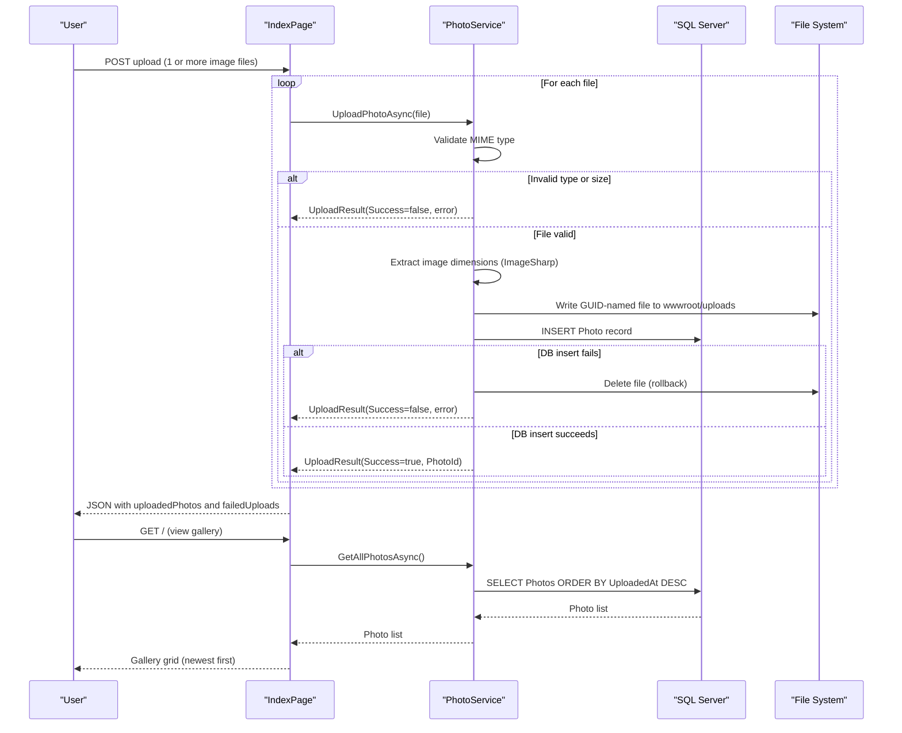

# Core Business Workflows

PhotoAlbum is a personal photo gallery application that lets users upload, browse, view, and delete images, with automatic metadata extraction and chronological display.

## Domain Entities

| Entity | Service / Bounded Context | Description | Key Relationships |
|---|---|---|---|
| Photo | Photo Gallery (single context) | Represents an uploaded image with its metadata — original name, stored filename, file path, size, MIME type, dimensions, and upload timestamp | Self-contained; no relationships to other entities |

## Service-to-Domain Mapping

| Service | Domain Context | Owned Entities | External Dependencies |
|---|---|---|---|
| PhotoAlbum Web (PhotoService) | Photo Gallery | Photo | Local file system (image binaries), SQL Server (metadata) |

The application is a monolith with a single bounded context. All domain logic resides in `PhotoService`; there are no inter-service calls or cross-context data exchanges.

## Primary Workflows

### Workflow 1: Upload Photos

A user selects one or more image files and submits them via the gallery page. For each file, the service validates the type and size, extracts image dimensions, writes the file to disk, and persists the metadata record to the database. Each file is processed independently — a failure on one file does not abort the remaining uploads. The caller receives a JSON response listing succeeded and failed uploads.

**Steps:**
1. User submits `multipart/form-data` POST with one or more files
2. Handler rejects the request immediately if no files are provided (400)
3. For each file:
   a. Validate MIME type against the allowed list (JPEG, PNG, GIF, WebP)
   b. Validate file size ≤ 10 MB
   c. Validate file is not empty
   d. Generate a GUID-based stored filename
   e. Extract image dimensions via ImageSharp (non-blocking failure — continues without dimensions)
   f. Write file to `wwwroot/uploads/`
   g. Insert `Photo` record into the database
   h. On DB failure: delete the just-written file (rollback) and mark file as failed
4. Return JSON with `uploadedPhotos[]` and `failedUploads[]`

### Workflow 2: Browse Gallery

A user opens the gallery page and sees all uploaded photos in reverse-chronological order.

**Steps:**
1. User sends GET request to `/`
2. `PhotoService.GetAllPhotosAsync()` queries all photos sorted by `UploadedAt` descending
3. Gallery page renders thumbnail grid; on any DB error, an empty gallery is shown (silent degradation)

### Workflow 3: View Photo Detail

A user clicks a photo to see it full-size along with metadata and prev/next navigation.

**Steps:**
1. User sends GET `/Detail?id={id}`
2. All photos are fetched and the requested photo is located by ID
3. Adjacent photos (by chronological position) are identified for navigation links
4. If the photo ID does not exist, a 404 is returned

### Workflow 4: Delete Photo

A user deletes a photo from the detail page.

**Steps:**
1. User submits POST to `/Detail?handler=Delete&id={id}`
2. `PhotoService.DeletePhotoAsync(id)` locates the photo record
3. The physical file is deleted from disk (failure is logged but does not abort the operation)
4. The `Photo` database record is removed
5. User is redirected to the gallery; on error, redirected back to the detail page with an error message

### Workflow 5: Serve Photo File

The application serves the binary image data for display in `` tags.

**Steps:**
1. Browser sends GET `/PhotoFile?id={id}`
2. Photo metadata is retrieved by ID
3. Physical file is read from `wwwroot/uploads/`
4. File is returned with correct MIME type, long-lived cache headers (`max-age=31536000`), and an ETag

## Cross-Service Data Flows

The application is a single-service monolith with no inter-service communication. All data originates from and returns to the same SQL Server database and local file system. There are no gateway aggregation patterns, circuit breakers, or downstream service calls.

The only notable dual-store access pattern is in **Workflow 5**: the Razor Page queries the relational database for photo metadata (to retrieve the stored filename and MIME type) and then reads the image binary directly from the file system. These two stores must stay in sync — an orphaned file or a missing file both result in a degraded experience.

## Business Workflow Sequence

## Business Rules & Decision Logic

### Validation Rules

| Rule | Scope | Detail |
|---|---|---|
| Allowed MIME types | Per-file upload | Only `image/jpeg`, `image/png`, `image/gif`, `image/webp` are accepted; anything else is rejected with a user-friendly message |
| Maximum file size | Per-file upload | Files larger than 10 MB (configurable via `FileUpload:MaxFileSizeBytes`) are rejected |
| Non-empty file | Per-file upload | Files with `Length <= 0` are rejected |
| Files provided | Request level | POST upload with zero files returns HTTP 400 immediately |

### Decision Logic

- **Per-file independence**: Each file in a multi-file upload is processed independently. A validation or save failure on one file does not prevent the others from being processed.
- **Dimension extraction is non-blocking**: If ImageSharp cannot read the image dimensions (e.g., corrupt file header), the upload proceeds without dimension metadata rather than failing.
- **Navigation direction**: On the detail page, "previous" means an older photo (higher index in the newest-first list) and "next" means a newer photo (lower index). This is inverted from typical chronological navigation.

### State Transitions

Photos have a simple two-state lifecycle: **Uploaded** (present in DB and on disk) → **Deleted** (removed from both). There is no draft, pending, or soft-delete state.

### Transactions & Data Integrity

There is no explicit `TransactionScope` or EF Core transaction. The implicit consistency strategy is:

1. Write file to disk first
2. Attempt DB insert
3. If DB insert fails → delete the file (compensating action)

This means a crash between step 2 (file written) and step 3 (DB insert not yet attempted) can leave orphaned files on disk with no corresponding database record. Similarly, during deletion, the file is removed before the DB record — a crash between those two steps leaves a dangling DB record pointing to a missing file.

### Error Handling

- Upload errors return structured JSON `{ success: false, error: "..." }` per file — the caller receives a partial success response when some files succeed and others fail
- Gallery load errors are silently swallowed — an empty list is shown instead of an error page
- Detail / file-serve errors return HTTP 404 or redirect back with a `TempData["Error"]` message
- File-deletion errors during photo delete are logged but do not abort the database deletion

### Authorization

No authentication or authorization is implemented. All workflows are publicly accessible to any user without any identity verification.
