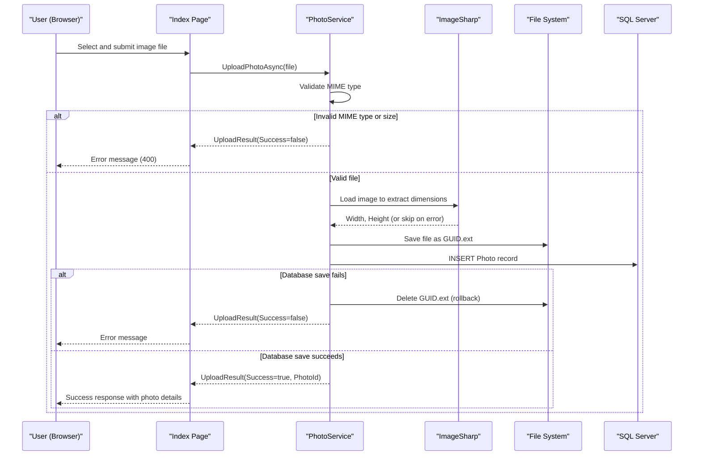

# Core Business Workflows

PhotoAlbum is a personal photo gallery application that allows users to upload, browse, view, and delete photos through a web interface.

## Domain Entities

| Entity | Service / Bounded Context | Description | Key Relationships |
|---|---|---|---|
| Photo | Photo Management | Represents an uploaded image with its metadata, storage path, and display properties | Standalone entity; no relationships to other entities |

## Service-to-Domain Mapping

PhotoAlbum is a monolithic single-service application. All domain logic resides within one bounded context.

| Service | Domain Context | Owned Entities | External Dependencies |
|---|---|---|---|
| PhotoAlbum | Photo Management | Photo | SQL Server (metadata), Local file system (image files) |

## Primary Workflows

### Workflow 1: Upload Photo

A user selects one or more image files from the gallery page. The application validates each file's MIME type and size, extracts image dimensions, saves the file to disk with a GUID-based name, and persists the metadata to the database. If the database save fails, the disk file is deleted to prevent orphaned files.

**Steps:**
1. User selects image file(s) via the upload form on the gallery page (POST `/Index?handler=Upload`).
2. For each file: MIME type is checked against the allowed list (JPEG, PNG, GIF, WebP).
3. File size is checked against the 10 MB limit.
4. File is non-empty check.
5. Image dimensions are extracted using ImageSharp (best-effort; failures are logged and skipped).
6. File is saved to `wwwroot/uploads/` with a GUID-based filename.
7. Photo metadata (original filename, stored filename, path, size, MIME type, dimensions, UTC timestamp) is inserted into the database.
8. On DB failure: disk file is deleted (rollback). Error returned to client.
9. Success response includes photo ID, path, dimensions, and upload timestamp.

### Workflow 2: Browse Gallery

A user visits the gallery page to see all uploaded photos in reverse-chronological order.

**Steps:**
1. User navigates to `/` or `/Index` (GET).
2. `PhotoService.GetAllPhotosAsync()` queries all photos ordered by `UploadedAt` descending.
3. Photos are rendered as a responsive grid showing thumbnails and filenames.

### Workflow 3: View Photo Detail

A user clicks on a photo thumbnail to view the full-size image with metadata and navigation.

**Steps:**
1. User navigates to `/Detail?id={id}` (GET).
2. All photos are loaded and the target photo is located by ID.
3. Previous and next photo IDs are determined from the chronologically ordered list (for navigation).
4. Full-size image, metadata (filename, size, dimensions, upload date), and navigation controls are rendered.

### Workflow 4: Delete Photo

A user deletes a photo from the detail page.

**Steps:**
1. User clicks the delete button on `/Detail?id={id}` (POST `/Detail?handler=Delete`).
2. Photo metadata is retrieved from the database.
3. Physical file is deleted from `wwwroot/uploads/` (errors are logged but do not stop DB deletion).
4. Photo record is removed from the database.
5. User is redirected to the gallery index.

### Workflow 5: Serve Photo File

A browser or direct request retrieves a photo binary file by ID.

**Steps:**
1. Request arrives at `/PhotoFile?id={id}` (GET).
2. Photo metadata is fetched to obtain the stored filename and MIME type.
3. Physical file path is constructed from the upload directory and stored filename.
4. File bytes are read and returned with the appropriate `Content-Type` header, plus long-lived `Cache-Control` and `ETag` headers.

## Cross-Service Data Flows

PhotoAlbum is a single-service application with no inter-service communication. All data flows are intra-process between Razor Page models, `PhotoService`, `PhotoAlbumContext`, and the local file system.

## Business Workflow Sequence

## Business Rules & Decision Logic

**Validation Rules:**
- MIME type must be one of: `image/jpeg`, `image/png`, `image/gif`, `image/webp` (configured in `appsettings.json`).
- File size must not exceed 10 MB (configured `FileUpload:MaxFileSizeBytes`).
- File must not be empty (length > 0).

**Decision Logic:**
- Image dimension extraction is best-effort: if ImageSharp cannot parse the file, dimensions are stored as `null` and the upload continues.
- File deletion on DB failure: if `SaveChangesAsync()` throws after writing to disk, the service attempts to delete the physical file to prevent orphaned storage.

**State Transitions:**
- Photo lifecycle: *Uploaded* → *Stored* (file on disk + DB record) → *Deleted* (file removed, DB record removed).

**Business Constraints:**
- Stored filenames use `Guid.NewGuid()` to prevent collisions and avoid exposing original filenames in URLs.
- Upload path is configurable; the application creates the directory on startup if it does not exist.

**Transactions:**
- EF Core uses implicit transactions for `SaveChangesAsync()`. No explicit `TransactionScope` or distributed transactions are used.
- File system writes are not transactional; the rollback (file deletion on DB failure) is a compensating action, not an atomic transaction.

**Error Handling:**
- All service methods catch exceptions, log them, and either return a failure result or rethrow to the caller.
- The detail page redirects to itself with a `TempData["Error"]` message on delete failure.

**Authorization:**
- No authentication or role-based authorization is enforced. All endpoints (including upload and delete) are publicly accessible.
