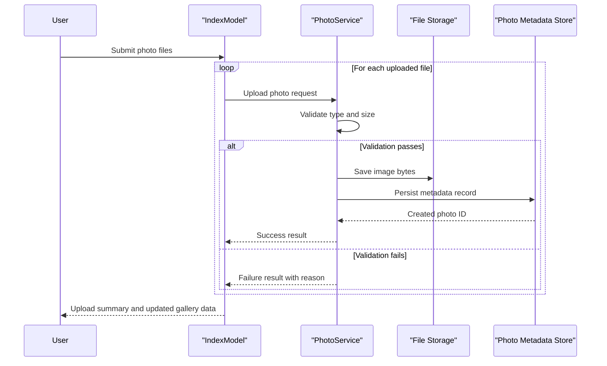

# Core Business Workflows

The application supports a simple photo-gallery business domain where users upload images, browse galleries, view details, and remove photos.

## Domain Entities

| Entity | Service / Bounded Context | Description | Key Relationships |
|---|---|---|---|
| Photo | Photo Management | Represents uploaded media and its display metadata | Central entity used by gallery, detail, and file-serving workflows |
| UploadResult | Photo Management | Communicates per-file upload outcome to caller | Produced by upload workflow and consumed by page handlers |

## Service-to-Domain Mapping

| Service | Domain Context | Owned Entities | External Dependencies |
|---|---|---|---|
| PhotoAlbum Razor Pages app | Photo Management | Photo, UploadResult | SQL Server (metadata), file system (image bytes) |

## Primary Workflows

### Workflow 1: Upload Photos to Gallery

User submits one or more files from the gallery page. Each file is validated for MIME type and size, then image bytes are written to storage and metadata is persisted. The workflow returns success/failure results per file and updates visible gallery results.

### Workflow 2: View Photo Detail and Navigate

User opens a detail page for a selected photo. The system loads ordered metadata and computes previous/next navigation references within the gallery timeline.

### Workflow 3: Delete Photo

User triggers delete from detail view. The system attempts file deletion, removes metadata entry, and redirects to gallery.

## Cross-Service Data Flows

The app is monolithic with no cross-service network aggregation. Data flow is coordinated between application handlers, service logic, EF Core persistence, and file storage. If binary file operations fail during rollback paths, the system logs errors and preserves business continuity where possible.

## Business Workflow Sequence

## Business Rules & Decision Logic

- Upload accepts only configured image MIME types and rejects unsupported content.
- Upload enforces configured maximum file size and rejects empty files.
- Metadata creation occurs only after storage write succeeds; rollback attempts remove file if DB persistence fails.
- Delete workflow tolerates missing binary file and continues metadata deletion to keep gallery state consistent.
