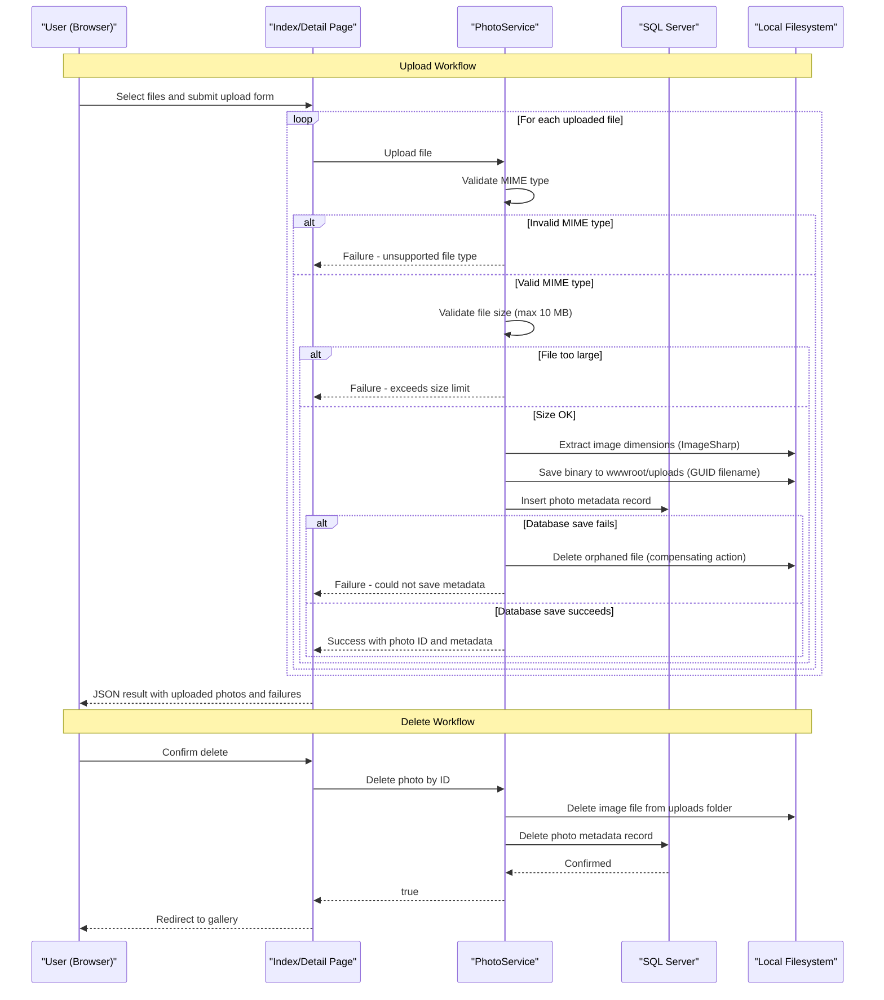

# Core Business Workflows

PhotoAlbum is a personal photo gallery application that allows users to upload, browse, view, and delete images through a web interface.

## Domain Entities

| Entity | Service / Bounded Context | Description | Key Relationships |
|--------|--------------------------|-------------|------------------|
| Photo | Photo Gallery | Represents an uploaded image with its metadata (filenames, size, type, dimensions, timestamp) | Standalone entity; no relationships to other domain entities |

## Service-to-Domain Mapping

| Service | Domain Context | Owned Entities | External Dependencies |
|---------|---------------|---------------|----------------------|
| PhotoAlbum Web | Photo Gallery | Photo | SQL Server LocalDB (metadata), Local Filesystem (image binaries) |

This is a single-service application. There are no inter-service data flows or cross-context boundaries.

## Primary Workflows

### Workflow 1: Upload Photo(s)

A user selects one or more image files and submits them via the gallery page. For each file the system:
1. Validates the MIME type against the allowed list (`image/jpeg`, `image/png`, `image/gif`, `image/webp`).
2. Validates the file size is within the 10 MB limit.
3. Validates the file is non-empty.
4. Extracts image dimensions using ImageSharp (non-fatal if it fails).
5. Saves the binary file to `wwwroot/uploads/` under a GUID-based filename to prevent collisions.
6. Persists the photo metadata record to SQL Server.
7. On database-save failure: deletes the newly written file to prevent orphaned files (compensating action).
8. Returns a JSON response listing successfully uploaded photos and any failures.

Partial success is possible: if one file in a batch fails validation, it is reported in `failedUploads` while the other files continue to be processed.

### Workflow 2: Browse Gallery

The user loads the gallery home page. The system retrieves all photo metadata records from the database, ordered newest-first, and renders a grid of thumbnail links. No filtering, pagination, or search is currently implemented.

### Workflow 3: View Photo Detail

The user selects a photo from the gallery. The system:
1. Loads the full list of photos (ordered newest-first).
2. Locates the requested photo by ID.
3. Determines the adjacent photos (older/newer) for prev/next navigation.
4. Renders the detail page with full-size image, metadata, and navigation controls.
5. Returns 404 if the photo ID does not exist.

### Workflow 4: Serve Image File

The browser requests the image binary for display (via `/PhotoFile?id=N`). The system:
1. Looks up the photo metadata record by ID.
2. Resolves the physical file path from the stored filename.
3. Reads the file bytes from the local filesystem.
4. Returns the bytes with the correct MIME type and long-lived cache headers (`Cache-Control: public, max-age=31536000`, `ETag`).
5. Returns 404 if the record or physical file does not exist; returns 500 on unexpected errors.

### Workflow 5: Delete Photo

The user deletes a photo from the detail page. The system:
1. Looks up the photo by ID.
2. Deletes the physical image file from the filesystem.
3. Deletes the metadata record from the database.
4. Redirects the user to the gallery home page on success.
5. On failure: redirects back to the detail page with an error message in TempData. File deletion failure is logged but does not abort the database delete.

## Cross-Service Data Flows

PhotoAlbum is a self-contained single-service application. There are no cross-service data flows, API gateway aggregations, or message-broker integrations. All data flows occur within a single process: Razor Page handlers → `PhotoService` → `PhotoAlbumContext` (SQL Server) and local filesystem.

## Business Workflow Sequence

## Business Rules & Decision Logic

**Validation Rules (upload):**
- MIME type must be one of: `image/jpeg`, `image/png`, `image/gif`, `image/webp` (configured in `FileUpload:AllowedMimeTypes`).
- File size must not exceed 10 MB (configured in `FileUpload:MaxFileSizeBytes`).
- File must be non-empty (length > 0).
- Up to 10 files may be submitted in a single upload request (configured in `FileUpload:MaxFilesPerUpload`; enforced client-side).

**Filename & Storage Rules:**
- The original filename is preserved as metadata (`OriginalFileName`) for display purposes.
- The stored filename is always a new GUID + original extension (`StoredFileName`) to prevent collisions and avoid exposing original paths.
- The relative file path stored in the database is always `/uploads/{guid}.ext`, prefixed from `wwwroot`.

**Consistency & Compensating Actions:**
- If the database insert fails after the file has been written to disk, the file is deleted to prevent orphaned binaries (compensating action in `PhotoService.UploadPhotoAsync`).
- If the filesystem delete fails during photo deletion, the error is logged but does not abort the database record deletion (no compensating action on the DB side; a dangling record without a file may result).

**Caching Rules:**
- Served image files carry `Cache-Control: public, max-age=31536000` and an `ETag` derived from `photoId + UploadedAt.Ticks`. This allows browsers and CDNs to cache images aggressively. Cache invalidation relies on the ETag changing if the photo record is replaced (which currently cannot happen — there is no update workflow).

**Authorization:**
- No authentication or authorization rules are implemented. All workflows are publicly accessible to any user.

**Audit / Logging:**
- Upload start/success/failure, retrieval errors, and deletion events are logged via `ILogger` at `Information`, `Warning`, and `Error` levels respectively. No structured audit trail or change-tracking is implemented beyond standard application logs.
