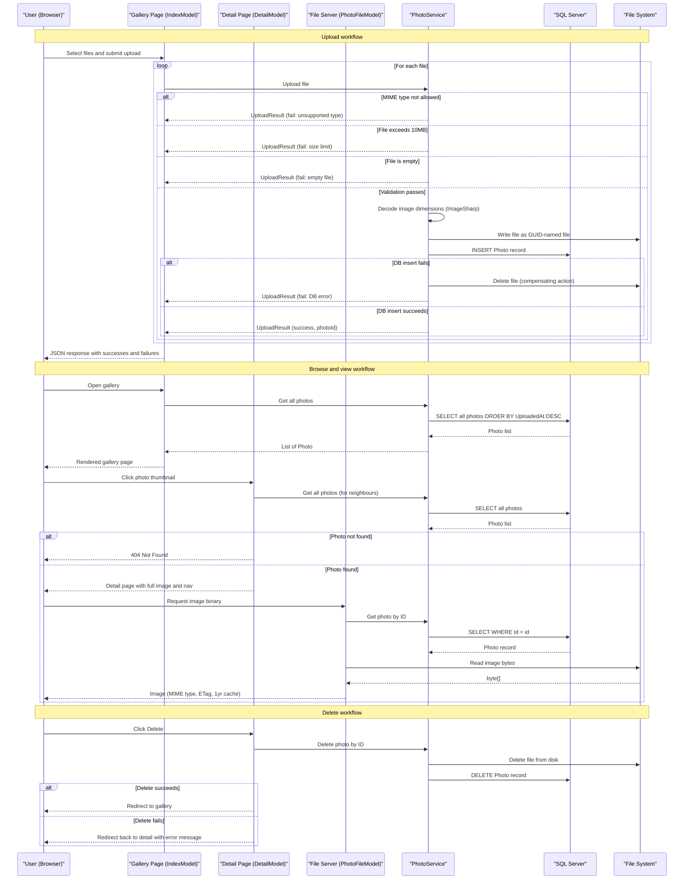

# Core Business Workflows

PhotoAlbum allows users to upload, browse, view, and delete personal photos through a web-based gallery, with automatic image metadata extraction and chronological display.

## Domain Entities

| Entity | Service / Bounded Context | Description | Key Relationships |
|---|---|---|---|
| Photo | Photo Management | Represents a single uploaded image with metadata (name, path, size, type, dimensions, upload time) | Root aggregate; no relationships to other entities |

## Service-to-Domain Mapping

| Service | Domain Context | Owned Entities | External Dependencies |
|---|---|---|---|
| PhotoAlbum (web) | Photo Management | Photo | Local file system (image binaries); SQL Server (metadata) |

The application is a single-service monolith. All business logic resides within `PhotoService`, which is the sole owner of the `Photo` domain entity. There are no cross-service boundaries or external domain dependencies.

## Primary Workflows

### Workflow 1: Upload Photo(s)

A user selects one or more image files from the browser and submits them to the gallery. Each file is validated and persisted independently; partial success (some files succeed, some fail) is supported.

**Steps:**
1. User selects up to 10 image files via the drag-and-drop or file picker UI and submits the upload form.
2. For each file, `PhotoService.UploadPhotoAsync` is invoked:
   a. **MIME type validation** — file must be `image/jpeg`, `image/png`, `image/gif`, or `image/webp`.
   b. **File size validation** — file must be ≤ 10 MB (configurable via `FileUpload:MaxFileSizeBytes`).
   c. **Empty file check** — zero-byte files are rejected.
3. If validation passes: ImageSharp decodes the image to extract pixel width and height (non-critical; failures are swallowed).
4. File stream position is reset; the file is written to `wwwroot/uploads/<guid>.<ext>` on disk.
5. A `Photo` record is inserted into the database (`Photos` table).
6. If the database insert fails, the on-disk file is deleted as a compensating action (best-effort rollback).
7. The handler returns a JSON response listing successfully uploaded photos and failed uploads with error messages.

### Workflow 2: Browse Gallery

A user visits the home page to view all uploaded photos in reverse chronological order.

**Steps:**
1. User navigates to `/`.
2. `PhotoService.GetAllPhotosAsync` queries all photos ordered by `UploadedAt` descending.
3. The gallery page renders thumbnails/cards for each photo, showing filename, size, and upload date.
4. If the database is unreachable, an empty gallery is displayed (exception caught, logged, empty list returned).

### Workflow 3: View Photo Detail

A user clicks a photo to view it at full size with navigation to adjacent photos.

**Steps:**
1. User navigates to `/Detail?id={id}`.
2. All photos are loaded to determine the photo's neighbours (previous/next by upload date) for gallery navigation.
3. If no photo with the given ID exists, a 404 Not Found response is returned.
4. The detail page renders the full-size image (via `/PhotoFile?id={id}`), photo metadata, and Previous/Next navigation links.

### Workflow 4: Serve Photo Binary

The browser requests the raw image bytes for display.

**Steps:**
1. Browser requests `/PhotoFile?id={id}`.
2. `PhotoService.GetPhotoByIdAsync` looks up the `Photo` record by ID.
3. The physical file path is constructed from the stored filename and the configured upload path.
4. If the file does not exist on disk (record present but file missing), a 404 is returned.
5. File bytes are read and returned with the stored MIME type, a `Cache-Control: public, max-age=31536000` header (1 year), and an `ETag` derived from `Photo.Id` and `UploadedAt`.

### Workflow 5: Delete Photo

A user deletes a photo from the detail page.

**Steps:**
1. User clicks "Delete" on the detail page; the browser submits `POST /Detail?handler=Delete` with the photo ID.
2. `PhotoService.DeletePhotoAsync` loads the photo record by ID.
3. The physical file is deleted from disk (if the file does not exist, deletion is skipped without error).
4. The `Photo` record is removed from the database.
5. The user is redirected to the gallery (home page). If deletion fails, an error message is stored in `TempData` and the user is redirected back to the detail page.

## Cross-Service Data Flows

PhotoAlbum is a single-service application with no inter-service communication. All data flows are internal:

- **Photo metadata** flows: Browser → Razor Page handler → `PhotoService` → EF Core `DbContext` → SQL Server.
- **Photo binary** flows: Browser → `PhotoFileModel` → `PhotoService` (metadata lookup) → File system (binary read) → Browser.
- **No aggregation, composition, or cross-service batch patterns** are present. There are no circuit breaker fallback behaviors across services. The only degradation path is the empty-gallery fallback when the database is unavailable during gallery load.

## Business Workflow Sequence

## Business Rules & Decision Logic

### Validation Rules (Upload)

| Rule | Condition | Outcome |
|---|---|---|
| Allowed MIME types | `ContentType` must be one of: `image/jpeg`, `image/png`, `image/gif`, `image/webp` | Reject with "File type not supported" message |
| Maximum file size | `file.Length` ≤ `FileUpload:MaxFileSizeBytes` (default 10 MB) | Reject with size limit message if exceeded |
| Non-empty file | `file.Length` > 0 | Reject with "File is empty" message |
| Max files per upload | Up to 10 files per upload batch (`FileUpload:MaxFilesPerUpload` config key) | Enforced by UI; no server-side check beyond processing each file in the loop |

### State Transitions

The `Photo` entity has no explicit lifecycle states. Its lifecycle is binary: it either exists (after a successful upload) or it is deleted. No draft, pending, or soft-delete states are modeled.

### Constraints

- **File naming**: On-disk filenames are always GUID-based (`<guid>.<original-extension>`), preventing filename collisions and path traversal via user-supplied names.
- **Physical–logical consistency**: The database record and on-disk file are co-created and co-deleted. If the database insert fails, the file is proactively deleted. However, there is no reverse guarantee: a file deletion failure does not block the database record deletion.

### Error Handling

- **Upload partial failure**: Each file in a batch is processed independently. A failure for one file does not abort the remaining files; failed uploads are returned alongside successful ones in the JSON response.
- **Gallery load failure**: A database exception during gallery load is caught and logged; the page renders with an empty gallery rather than showing an error page.
- **Detail/file serving**: Database or file-not-found conditions return HTTP 404. Server errors return HTTP 500.
- **Delete failure**: Caught, logged, and surfaced to the user via `TempData["Error"]` with a redirect back to the detail page.

### Authorization

No authentication or authorization rules are enforced. All workflows are publicly accessible without login. See `api-service-contracts.md` for the full security posture assessment.

### Audit / Logging

All significant business events are logged via `ILogger<PhotoService>`:
- Upload rejected (MIME type, size, empty) — `LogWarning`
- File save error — `LogError`
- DB save error with rollback — `LogError`
- Successful upload — `LogInformation` (with filename and assigned ID)
- Photo not found for deletion — `LogWarning`
- File deletion error during delete — `LogError`
- Successful deletion — `LogInformation`

No structured audit trail or change-tracking table is maintained beyond the `UploadedAt` timestamp on the `Photo` entity.
