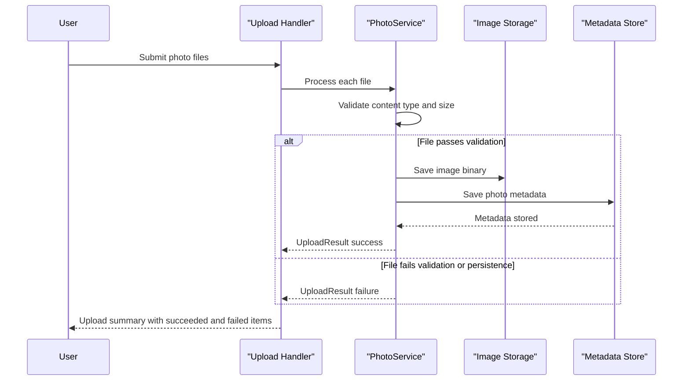

# Core Business Workflows

The application supports end-user photo album management: uploading photos, browsing gallery items, viewing details, serving originals, and deleting entries.

## Domain Entities

| Entity | Service / Bounded Context | Description | Key Relationships |
|---|---|---|---|
| Photo | Photo Management | Canonical record representing an uploaded image and its metadata | Produced by upload workflow, consumed by gallery/detail/file workflows |
| UploadResult | Photo Management | Outcome contract for upload attempts, including success/error state | Returned to client per uploaded file |

## Service-to-Domain Mapping

| Service | Domain Context | Owned Entities | External Dependencies |
|---|---|---|---|
| PhotoAlbum Web (`PhotoService`) | Photo Management | Photo, UploadResult | SQL persistence + local file storage + image metadata extraction |

## Primary Workflows

### Workflow 1: Upload Photos to Album

Entry point: `POST /?handler=Upload`.
1. User submits one or more files.
2. System validates MIME type, file size, and non-empty content.
3. Service generates a unique stored filename and extracts image dimensions.
4. File is saved to storage and metadata is persisted.
5. Success and failure items are aggregated into one JSON response.
6. If metadata persistence fails, stored file is rolled back (deleted).

### Workflow 2: Browse, View, and Delete Photos

Entry points: `GET /`, `GET /Detail?id=...`, `POST /Detail?handler=Delete&id=...`, `GET /PhotoFile?id=...`.
1. Gallery request retrieves photos ordered by newest first.
2. Detail request resolves current photo and computes previous/next navigation context.
3. File-serving request resolves photo ID and streams binary content.
4. Delete request removes file content and metadata, then redirects to gallery.

## Cross-Service Data Flows

No cross-service or cross-context data composition exists. All workflows are contained within a single service boundary, combining database metadata access with local file-system content operations.

## Business Workflow Sequence

## Business Rules & Decision Logic

- **Validation rules**: Only configured image MIME types are accepted; files must be non-empty and below configured max size.
- **Decision logic**: Upload path branches by validation outcome and persistence success; failures return user-facing error details.
- **State transitions**: Photo lifecycle follows `Submitted -> Stored -> Indexed -> Listed -> Deleted`.
- **Business constraints**: Batch upload accepts multiple files, but each file is independently validated and reported.
- **Computed values**: Width/height are derived during upload when possible.
- **Data integrity**: File and metadata persistence are coordinated with rollback behavior when DB save fails.
- **Cross-cutting concerns**: Structured logging around success/failure paths; no explicit role-based authorization rules detected.
