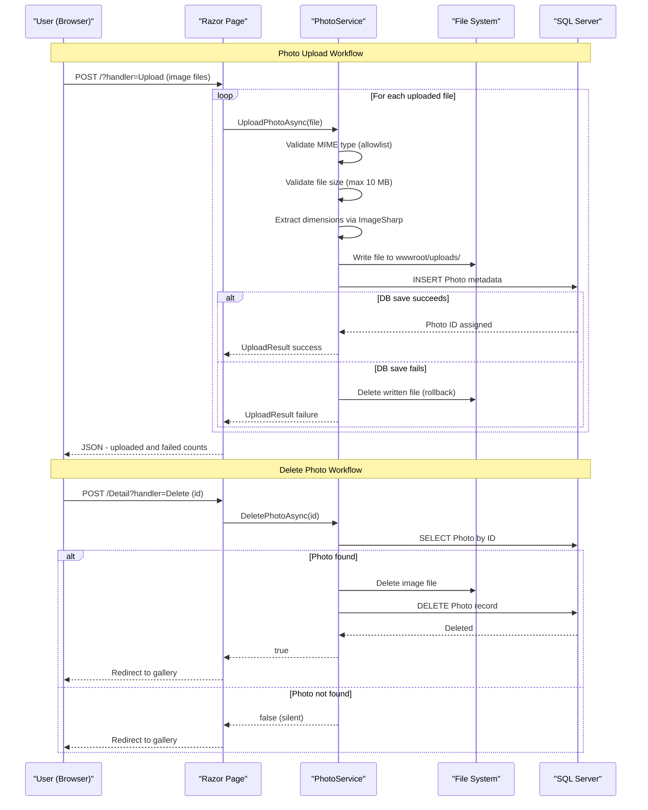

# Core Business Workflows

PhotoAlbum is a personal photo gallery application that allows users to upload, view, and delete images, maintaining a browsable grid of photos with full-size detail views and navigation.

## Domain Entities

| Entity | Service / Bounded Context | Description | Key Relationships |
|---|---|---|---|
| Photo | Photo Management (single context) | Represents an uploaded image with display metadata (original name, stored path, file size, MIME type, dimensions, upload time) | Stand-alone root aggregate; no relationships to other entities |

## Service-to-Domain Mapping

| Service | Domain Context | Owned Entities | External Dependencies |
|---|---|---|---|
| PhotoAlbum Web | Photo Management | Photo | Local file system (image binaries); SQL Server LocalDB (metadata) |

This is a single-service application with no inter-service communication. `PhotoService` is the sole domain service and owns the full lifecycle of the `Photo` aggregate.

## Primary Workflows

### Workflow 1: Upload Photos

A user selects one or more image files via the gallery page and submits them. For each file, the system validates MIME type and file size, extracts image dimensions, writes the binary to local storage, and persists the metadata to the database. If the database save fails, the written file is deleted (rollback). The response is a JSON object listing which uploads succeeded (with photo IDs and metadata) and which failed (with error messages).

**Steps:**
1. User submits `POST /?handler=Upload` with one or more files (multipart form, up to 10 MB each).
2. For each file: validate MIME type against allowlist (`image/jpeg`, `image/png`, `image/gif`, `image/webp`).
3. Validate file size ≤ 10 MB.
4. Validate file is non-empty.
5. Generate GUID-based storage filename to avoid collisions.
6. Extract image dimensions (width/height) via ImageSharp; failure is non-fatal.
7. Write image binary to `wwwroot/uploads/{guid}.ext`.
8. Insert `Photo` record in database.
9. On DB failure: delete written file; mark upload as failed.
10. Return JSON with `uploadedPhotos[]` and `failedUploads[]`.

### Workflow 2: Browse Gallery

A user navigates to the home page and sees all photos displayed in a grid ordered newest-first. No pagination is implemented — all photos are loaded in a single query.

**Steps:**
1. User navigates to `GET /`.
2. `PhotoService.GetAllPhotosAsync()` returns all photos ordered by `UploadedAt` descending.
3. Razor Page renders the gallery grid with thumbnails and upload dates.

### Workflow 3: View Photo Detail

A user clicks a photo to see it full-size with metadata and navigation arrows to adjacent photos (older/newer).

**Steps:**
1. User navigates to `GET /Detail?id={id}`.
2. All photos are loaded (same query as gallery), and the requested photo is located by ID.
3. Previous and next photo IDs are computed by index position in the ordered list.
4. The page renders the full-size image, metadata (filename, size, dimensions, upload date), and navigation links.
5. If the photo ID is not found, the page returns 404.

### Workflow 4: Serve Photo File

A photo's binary content is served through a dedicated endpoint that looks up the photo metadata by ID, resolves the physical file path, and streams the bytes with HTTP caching headers.

**Steps:**
1. Browser requests `GET /PhotoFile?id={id}`.
2. `PhotoService.GetPhotoByIdAsync(id)` retrieves the metadata record.
3. Physical file path is resolved from `wwwroot/uploads/` + filename.
4. File bytes are read and returned with `Content-Type` from the stored MIME type.
5. Response includes `Cache-Control: public, max-age=31536000` (1 year) and an `ETag` for browser caching.
6. If record or file is missing, 404 is returned.

### Workflow 5: Delete Photo

A user deletes a photo from the detail page. The file is removed from local storage, then the database record is deleted.

**Steps:**
1. User submits `POST /Detail?handler=Delete&id={id}`.
2. `PhotoService.DeletePhotoAsync(id)` looks up the photo record.
3. The physical file is deleted from `wwwroot/uploads/`.
4. The database record is removed.
5. User is redirected to the gallery page.
6. If the photo is not found, the method returns `false` and no error is surfaced (silent no-op).

## Cross-Service Data Flows

This is a single-service application with no inter-service communication. All data flows are within a single process:

- **Metadata ↔ Binary split**: Photo metadata lives in SQL Server; binary files live on the local file system. These two stores are kept consistent by the upload rollback logic (file is deleted if DB insert fails) and by deletion order (file is removed before the DB record, so a crash mid-delete leaves an orphan record rather than an orphan file).
- **No circuit breaker or fallback**: If SQL Server or the file system is unavailable, operations fail immediately with exceptions; there is no retry, degraded mode, or fallback path.

## Business Workflow Sequence

## Business Rules & Decision Logic

### Validation Rules (Upload)

| Rule | Condition | Outcome |
|---|---|---|
| MIME type allowlist | File `Content-Type` must be `image/jpeg`, `image/png`, `image/gif`, or `image/webp` | Rejected with user-facing error message |
| Max file size | File size must be ≤ 10 MB (configurable via `FileUpload:MaxFileSizeBytes`) | Rejected with size-exceeded message |
| Non-empty file | File length must be > 0 bytes | Rejected with "File is empty" message |
| No files submitted | `files` list is null or empty | HTTP 400 with `{ success: false, error: "No files provided" }` |

### File Naming & Storage

- Storage filename is generated as `{Guid.NewGuid()}{extension}` to prevent collisions and avoid leaking original filenames on disk.
- `FilePath` is stored as a relative URL path (`/uploads/{storedFileName}`) for portability.

### Consistency & Transactions

- EF Core `SaveChangesAsync()` wraps the database INSERT in a single transaction.
- No distributed transaction spans the file system and the database. Consistency is maintained by the compensating action: delete the written file if the DB INSERT fails.
- File deletion during photo delete is best-effort: if the file delete fails, the error is logged and execution continues to the database DELETE. A dangling file is possible if deletion fails partway through.

### Photo Navigation

- Previous/next photo links are computed at request time by sorting all photos by `UploadedAt` descending and finding the index of the current photo in that list. "Next" means a newer photo (lower index) and "Previous" means an older photo (higher index).

### Authorization

- No authentication or authorization is implemented. All workflows are publicly accessible with no ownership or role checks.

### Error Handling

- Upload failures (validation, file I/O, DB) are surfaced per-file in the JSON response — partial success is possible (some files upload, others fail).
- Detail and file-serving pages return HTTP 404 for unknown photo IDs.
- Exceptions during gallery load result in an empty photo list (no error surface to user).
- Database migration failures at startup cause the process to terminate immediately.
