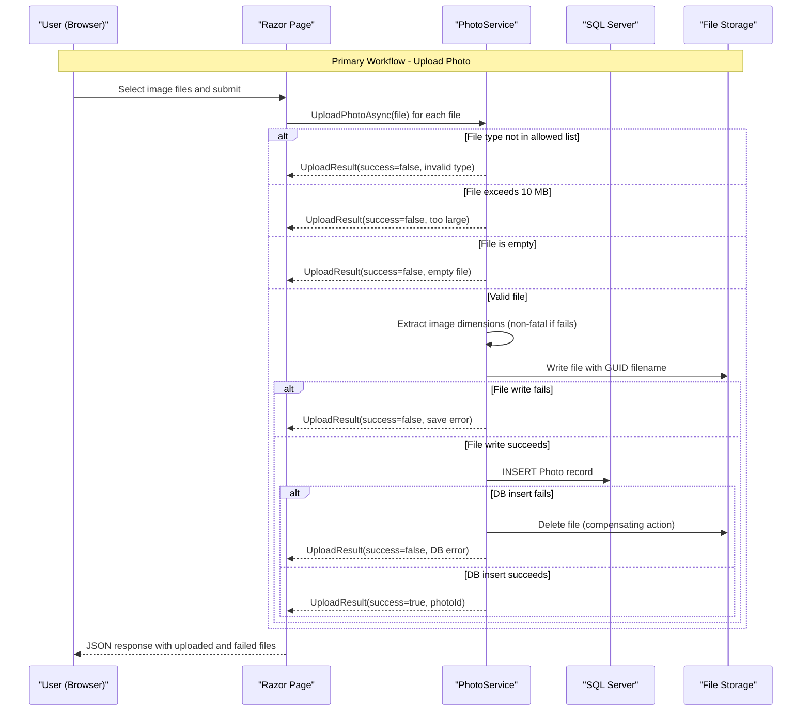

# Core Business Workflows

PhotoAlbum is a personal photo management application that lets users upload, browse, view, and delete images through a web gallery interface.

## Domain Entities

| Entity | Service / Bounded Context | Description | Key Relationships |
|--------|--------------------------|-------------|-------------------|
| Photo | Photo Management | Represents a single uploaded image with its metadata (file info, dimensions, upload time) | Self-contained; no relationships to other entities |

The domain model is intentionally minimal — a single aggregate root (`Photo`) with no sub-entities, as the application manages a flat collection of images.

## Service-to-Domain Mapping

| Service | Domain Context | Owned Entities | External Dependencies |
|---------|---------------|----------------|-----------------------|
| PhotoAlbum (monolith) | Photo Management | Photo | SQL Server (metadata), Local file system / Azure Blob Storage (image files) |

As a single-service application, there are no cross-service domain dependencies. All business logic is encapsulated within `PhotoService`, which owns the entire photo management context.

## Primary Workflows

### Workflow 1: Upload Photos

A user selects one or more image files and submits them for upload. The application validates each file individually, processes it, and saves it.

**Steps:**
1. User selects up to 10 image files and submits the upload form.
2. For each file, `PhotoService.UploadPhotoAsync` is called sequentially.
3. MIME type is validated against the allowed list (JPEG, PNG, GIF, WebP). Rejected files are added to `failedUploads` immediately.
4. File size is validated against the 10 MB maximum. Oversized files are added to `failedUploads`.
5. Empty files (length ≤ 0) are rejected.
6. A GUID-based stored filename is generated (e.g., `a1b2c3d4.jpg`), preserving the original extension.
7. Image dimensions are extracted using SixLabors.ImageSharp. Failure is non-fatal — upload continues without dimension metadata.
8. The image file is written to the upload directory (`wwwroot/uploads`).
9. A `Photo` record is saved to the database.
10. If the database save fails, the physical file is deleted as a compensating action.
11. The response JSON lists all successfully uploaded photos and all failed uploads.

### Workflow 2: Browse the Gallery

A user navigates to the home page to view all uploaded photos as a grid.

**Steps:**
1. User requests the home page (`GET /`).
2. `PhotoService.GetAllPhotosAsync` retrieves all photos ordered by upload date (newest first).
3. The Razor Page renders the gallery grid showing thumbnails, filenames, sizes, and upload timestamps.
4. If the database is unavailable, an empty gallery is shown (exception is caught and logged; no error page is rendered).

### Workflow 3: View and Navigate a Single Photo

A user clicks a photo in the gallery to view it at full size, with navigation to adjacent photos.

**Steps:**
1. User requests a detail page (`GET /Detail?id={id}`).
2. All photos are retrieved and the target photo is located by ID.
3. The previous and next photo IDs are determined by position in the chronological list (newest-first ordering).
4. The Razor Page renders the full-size photo with prev/next navigation controls.
5. If the photo ID is not found, a 404 response is returned.

### Workflow 4: Delete a Photo

A user deletes a photo from the detail page.

**Steps:**
1. User submits the delete form (`POST /Detail?handler=Delete&id={id}`).
2. `PhotoService.DeletePhotoAsync` is called.
3. The photo record is fetched from the database.
4. The physical file is deleted from disk. If file deletion fails, the error is logged but database deletion proceeds.
5. The database record is removed.
6. The user is redirected to the gallery page.
7. If the photo ID is not found, the service returns `false` (no error surfaced to the user).

### Workflow 5: Serve a Photo File

The browser requests a raw photo file for display.

**Steps:**
1. Browser requests a photo file (`GET /PhotoFile?id={id}`).
2. `PhotoService.GetPhotoByIdAsync` retrieves the photo metadata.
3. The physical file is read from disk using the stored GUID filename.
4. The binary file content is returned with the correct MIME type and long-term cache headers (`Cache-Control: public, max-age=31536000`).
5. An `ETag` header based on photo ID and upload timestamp is included for conditional request support.

## Cross-Service Data Flows

PhotoAlbum is a single-service monolith. There are no cross-service data flows or gateway aggregation patterns. All data composition (metadata from SQL Server + file bytes from disk) happens within a single `PhotoService` instance in the same process.

The only cross-boundary concern is the **two-store consistency** between SQL Server metadata and the file system (or Azure Blob Storage in cloud deployment): the application implements a manual compensating transaction at the service layer — file is written first, then the database record is inserted; on database failure, the file is deleted.

## Business Workflow Sequence

## Business Rules & Decision Logic

### Validation Rules

| Rule | Applied In | Behavior on Violation |
|------|-----------|----------------------|
| Allowed MIME types: `image/jpeg`, `image/png`, `image/gif`, `image/webp` | Upload | File rejected; added to `failedUploads`; other files in batch continue |
| Maximum file size: 10 MB (10,485,760 bytes) | Upload | File rejected; added to `failedUploads` |
| Non-empty file required (length > 0) | Upload | File rejected with "File is empty" message |
| Maximum 10 files per upload batch | Upload (form option) | Enforced by `FormOptions.MultipartBodyLengthLimit` and `MaxFilesPerUpload` config |

### Business Constraints

- **Filename anonymization**: Uploaded files are stored under a GUID-based filename, not the user's original filename, preventing path traversal and filename conflicts. The original filename is preserved in the database for display purposes only.
- **No duplicate detection**: No business rule prevents uploading identical images; each upload creates a new record with a unique stored filename.
- **No user ownership**: Photos are not associated with a user or session — the gallery is a shared, anonymous collection.
- **Ordering**: Photos are always displayed newest-first (descending `UploadedAt`). There is no sort control for the user.

### State & Consistency

- **No explicit state machine**: `Photo` has no lifecycle states (e.g., draft/published). Once uploaded, a photo exists until deleted.
- **Two-store consistency (compensating transaction)**:
  - On upload: write file → insert DB record → if DB fails, delete file.
  - On delete: delete file (log failure, continue) → delete DB record.
  - There is no distributed transaction or saga. A crash between the two operations can leave an orphaned file on disk or a DB record pointing to a missing file.

### Error Handling

- Upload errors per file are collected and returned to the caller; a partial success (some files uploaded, some failed) is possible.
- Gallery load errors are silently swallowed — an empty gallery is shown rather than an error page.
- Detail page and file-serve errors result in HTTP 404 or HTTP 500 responses.
- Delete failures on the detail page store an error message in `TempData` and redirect back to the detail page.

### Authorization

No authentication or user-based authorization is implemented. All endpoints are publicly accessible. Any visitor can upload and delete photos.
