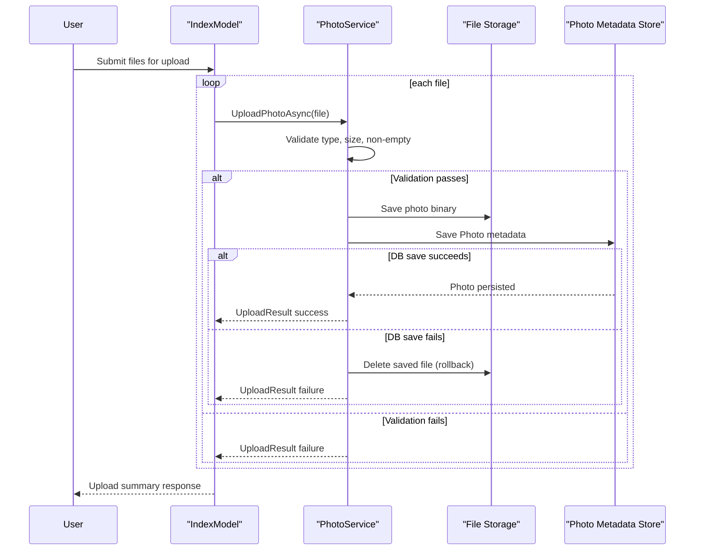

# Core Business Workflows

PhotoAlbum enables users to upload, browse, view, and delete photos through a gallery experience. The core business flow is preserving image metadata and file content consistently during upload and cleanup.

## Domain Entities

| Entity | Service / Bounded Context | Description | Key Relationships |
|---|---|---|---|
| Photo | Photo Management | Represents a gallery item and its metadata | Central entity used by upload, list, detail, and delete workflows |
| UploadResult | Photo Management | Communicates per-file upload success/failure outcomes | Produced by service and returned by upload handler |

## Service-to-Domain Mapping

| Service | Domain Context | Owned Entities | External Dependencies |
|---|---|---|---|
| PhotoAlbum web app + `PhotoService` | Photo Management | Photo, UploadResult | SQL Server LocalDB, local file storage |

## Primary Workflows

### Workflow 1: Upload Photos to Gallery

1. User submits one or more image files.
2. Upload handler validates request contains files.
3. `PhotoService` validates MIME type, size, and non-empty content.
4. Service generates unique stored file name and writes image file.
5. Service creates/persists `Photo` metadata.
6. If DB save fails, service deletes the newly written file (rollback).
7. Handler returns JSON with successful uploads and per-file failures.

### Workflow 2: Delete Photo

1. User triggers delete from detail page.
2. Service loads photo by id.
3. Service attempts physical file deletion.
4. Service removes DB row and persists changes.
5. User is redirected back to gallery.

## Cross-Service Data Flows

This is a single-service application, so business data composition is in-process only. The service composes file-system state and database state in one workflow; if persistence fails during upload, a compensating delete avoids orphaned files.

## Business Workflow Sequence

## Business Rules & Decision Logic

- Accepted MIME types are restricted to jpeg/png/gif/webp.
- Maximum upload size is controlled by configuration (`FileUpload:MaxFileSizeBytes`).
- Empty files are rejected.
- Upload uses generated GUID-based stored names to avoid collisions.
- Data consistency rule: if metadata persistence fails, file write is compensated by deleting the file.
- Deletion continues with metadata cleanup even if physical file is already missing.
