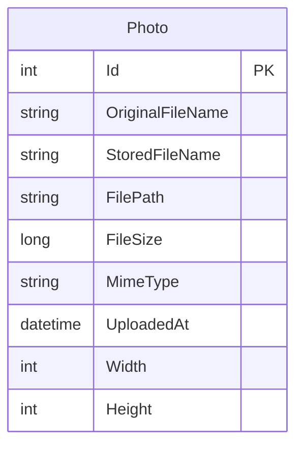

# Data Architecture & Persistence Layer

The data layer uses EF Core with SQL Server LocalDB and currently persists one primary entity (`Photo`) for metadata while image binaries are stored separately in local file storage.

## Database Configuration

| Service/Module | DB Type | Profile | Driver | Connection | Migration Tool |
|---|---|---|---|---|---|
| PhotoAlbum | SQL Server LocalDB | Default/Development | EF Core SqlServer 9.0.9 | LocalDB connection string in appsettings | EF Core Migrations (`Database.MigrateAsync`) |
| PhotoAlbum.Tests | In-Memory provider (tests) | Test runtime | EF Core InMemory 9.0.9 | In-memory test context | Not applicable |

## Data Ownership per Service

| Service | Tables Owned | ORM Framework | Caching | Notes |
|---|---|---|---|---|
| PhotoAlbum | Photos | EF Core | None at persistence layer | Single bounded context with one DbContext |

## Entity Model

## Key Repository Methods

| Service | Repository | Notable Methods | Purpose |
|---|---|---|---|
| PhotoAlbum | `PhotoAlbumContext` (`DbSet<Photo>`) | `FindAsync(id)` | Retrieve single photo metadata by identifier |
| PhotoAlbum | `PhotoAlbumContext` (`DbSet<Photo>`) | `OrderByDescending(UploadedAt).ToListAsync()` | Gallery listing newest-first |
| PhotoAlbum | `PhotoAlbumContext` (`DbSet<Photo>`) | `AddAsync(photo)` + `SaveChangesAsync()` | Persist upload metadata |
| PhotoAlbum | `PhotoAlbumContext` (`DbSet<Photo>`) | `Remove(photo)` + `SaveChangesAsync()` | Delete persisted photo metadata |

## Caching Strategy

Caching is limited to HTTP/static file response headers (`Cache-Control`) and ETag usage for served image files. No dedicated persistence/query cache provider (Redis, MemoryCache, distributed cache) is configured in the data layer.

## Data Ownership Boundaries

The application uses a single database and a single service boundary. There is no cross-service data exchange, CQRS split, or shared-schema ownership conflict across modules.

### Data Classification & Sensitivity

| Entity | Sensitive Fields | Classification (PII/PHI/PCI/None) | Controls in Place |
|---|---|---|---|
| Photo | OriginalFileName, FilePath (may contain user-provided identifiers) | PII (potential) | No explicit field-level encryption or masking detected |

