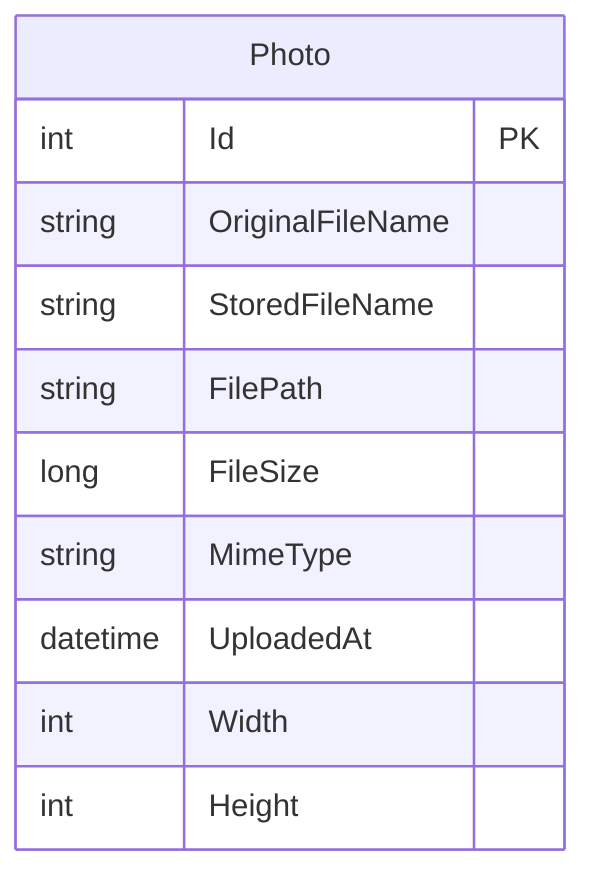

# Data Architecture & Persistence Layer

The data layer is centered on EF Core with a single persisted entity for photo metadata and file-system-backed binary content storage.

## Database Configuration

| Service/Module | DB Type | Profile | Driver | Connection | Migration Tool |
|---|---|---|---|---|---|
| PhotoAlbum | SQL Server LocalDB | Default | Microsoft.EntityFrameworkCore.SqlServer | Connection string from `DefaultConnection` | EF Core migrations run on startup |
| PhotoAlbum.Tests | In-memory database | Test runtime | Microsoft.EntityFrameworkCore.InMemory | In-memory provider with GUID database names | None |

## Data Ownership per Service

| Service | Tables Owned | ORM Framework | Caching | Notes |
|---|---|---|---|---|
| PhotoAlbum | Photos | EF Core | None | Metadata in DB; image bytes on local disk |

## Entity Model

## Key Repository Methods

| Service | Repository | Notable Methods | Purpose |
|---|---|---|---|
| PhotoAlbum | `PhotoAlbumContext` (`DbSet<Photo>`) | `FindAsync(id)`, ordered query by `UploadedAt`, `AddAsync(photo)`, `SaveChangesAsync()` | Retrieve, insert, and remove photo metadata records |

## Caching Strategy

The application does not use an explicit distributed or in-memory application cache layer for entity data. Static assets and served file responses include cache headers (`max-age` values) to leverage browser/proxy caching for performance.

## Data Ownership Boundaries

Data ownership is consolidated in one service boundary. SQL Server stores normalized metadata while the file system stores image binaries referenced by `StoredFileName` and `FilePath`. There are no cross-service data joins, CQRS split stores, or external data owners.

### Data Classification & Sensitivity

| Entity | Sensitive Fields | Classification (PII/PHI/PCI/None) | Controls in Place |
|---|---|---|---|
| Photo | OriginalFileName (potentially user-provided), FilePath | None to low sensitivity | No explicit encryption-at-rest or masking configured in app code |

No PHI or PCI data patterns were detected in the modeled entity.
