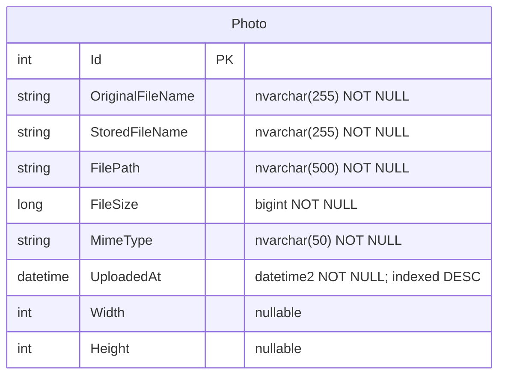

# Data Architecture & Persistence Layer

PhotoAlbum uses a single SQL Server database accessed via Entity Framework Core 9, with one entity (`Photo`) persisted to a single `Photos` table.

## Database Configuration

| Service/Module | DB Type | Profile | Driver | Connection | Migration Tool |
|---------------|---------|---------|--------|-----------|----------------|
| PhotoAlbum | SQL Server | Development | Microsoft.Data.SqlClient (via EF Core SqlServer 9.0.9) | LocalDB `(localdb)\mssqllocaldb`, database `PhotoAlbumDb` | EF Core Migrations (applied automatically on startup via `MigrateAsync`) |
| PhotoAlbum | SQL Server | Production | Microsoft.Data.SqlClient | Connection string from environment/config (`DefaultConnection`) | EF Core Migrations (applied automatically on startup) |
| PhotoAlbum.Tests | In-Memory | Test | EF Core InMemory 9.0.9 | In-process memory store | N/A — migrations skipped when `IsTestEnvironment=true` |

Schema management is handled exclusively by EF Core migrations. The initial migration (`20250930101715_InitialCreate`) creates the `Photos` table with a descending index on `UploadedAt`. No seed data files or programmatic data seeding are present. See `configuration-inventory.md` for full connection string property details.

## Data Ownership per Service

| Service | Tables Owned | ORM Framework | Caching | Notes |
|---------|-------------|--------------|---------|-------|
| PhotoAlbum | Photos | EF Core 9 (Code-First) | None | Single deployable service; no schema-per-service separation needed |
| PhotoAlbum.Tests | — (in-memory) | EF Core 9 InMemory | None | Test project uses InMemory provider; migrations skipped |

## Entity Model

## Key Repository Methods

EF Core's `DbContext` is used directly in `PhotoService` without a separate repository interface layer.

| Service | Context / Access | Notable Methods | Purpose |
|---------|-----------------|----------------|---------|
| PhotoAlbum | `PhotoAlbumContext.Photos` | `OrderByDescending(p => p.UploadedAt).ToListAsync()` | Retrieve all photos sorted newest-first for gallery display |
| PhotoAlbum | `PhotoAlbumContext.Photos` | `FindAsync(id)` | Retrieve single photo by primary key for detail view or file serving |
| PhotoAlbum | `PhotoAlbumContext.Photos` | `AddAsync(photo)` + `SaveChangesAsync()` | Persist new photo record after successful file save |
| PhotoAlbum | `PhotoAlbumContext.Photos` | `Remove(photo)` + `SaveChangesAsync()` | Delete photo record; file deletion is performed first (with fallback on file I/O error) |

No custom LINQ queries, raw SQL, named queries, or stored procedures are used. All data access goes through EF Core's LINQ API.

## Caching Strategy

No caching layer is configured. There is no Redis, `IMemoryCache`, `IDistributedCache`, Spring Cache, or second-level cache provider present. Static assets (CSS, JS) are served with `Cache-Control: public, max-age=3600` (1 hour) via the static files middleware, and served photo files receive `Cache-Control: public, max-age=31536000` (1 year) plus an `ETag` header — both are HTTP response cache headers set by the application, not server-side in-process caches.

If the gallery grows large, adding `IMemoryCache` or Redis for photo listings would be a low-risk improvement.

## Data Ownership Boundaries

PhotoAlbum is a single-service monolith with one database. There are no cross-service data access concerns: all reads and writes go through the single `PhotoAlbumContext` within the same process.

**File storage boundary:** Physical image files are stored on the local file system (`wwwroot/uploads`), while metadata is stored in SQL Server. The two stores are coupled at the service layer (`PhotoService`) which manages consistency: on upload, the file is written first and then the DB record is inserted; if the DB insert fails, the file is deleted (compensating transaction). On delete, the file is removed first and then the DB record is deleted; file deletion failure is logged but does not abort the DB delete.

**Read/write patterns:** All operations are simple CRUD — no CQRS, event sourcing, or read-replica configuration is present.

### Data Classification & Sensitivity

| Entity | Sensitive Fields | Classification | Controls in Place |
|--------|-----------------|---------------|-------------------|
| Photo | `OriginalFileName` (may reflect user's original filename) | Low — metadata only, no personal identifiers | None; filenames are stored as uploaded |
| Photo | `StoredFileName`, `FilePath` | None — GUID-based names with no PII | N/A |

No PII (names, addresses, email), PHI, or PCI data is stored in the database. The `OriginalFileName` field retains the user-supplied filename (e.g., `IMG_0042.jpg`) which may incidentally contain personal information (e.g., a person's name in the filename), but this is low risk. No encryption-at-rest, data masking, or field-level access controls are configured — this is appropriate given the absence of regulated data categories.
