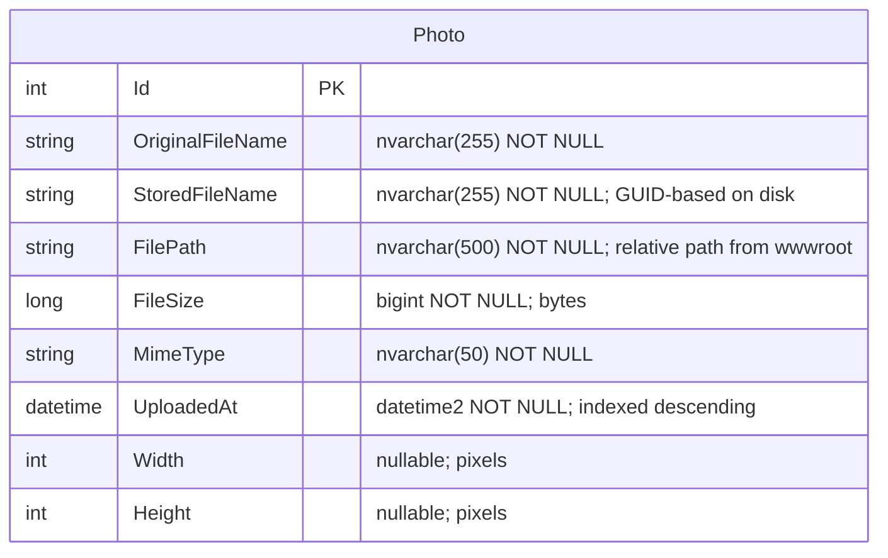

# Data Architecture & Persistence Layer

PhotoAlbum uses a single SQL Server database with one entity (`Photo`) managed via EF Core 9.0, plus local filesystem storage for the actual image binaries.

## Database Configuration

| Service/Module | DB Type | Profile/Environment | Driver | Connection | Migration Tool |
|---------------|---------|---------------------|--------|------------|---------------|
| PhotoAlbum | SQL Server LocalDB | All (default) | Microsoft.EntityFrameworkCore.SqlServer 9.0.9 | `Server=(localdb)\\mssqllocaldb;Database=PhotoAlbumDb;Trusted_Connection=true` | EF Core Migrations (auto-applied on startup) |
| PhotoAlbum.Tests | In-Memory (EF Core) | Test only | Microsoft.EntityFrameworkCore.InMemory 9.0.9 | No connection string; `IsTestEnvironment=true` suppresses migration on startup | None (schema created by EF Core in-memory provider) |

EF Core migrations are applied automatically at startup via `context.Database.MigrateAsync()`. This behavior is suppressed in the test environment via the `IsTestEnvironment` configuration flag. See `configuration-inventory.md` for the full property inventory.

## Data Ownership per Service

| Service | Tables Owned | ORM Framework | Caching | Notes |
|---------|-------------|--------------|---------|-------|
| PhotoAlbum | Photos | EF Core 9.0 (Code First) | None | Single `DbContext` (`PhotoAlbumContext`). Image binaries stored on local filesystem outside the DB. |

## Entity Model

## Key Repository Methods

| Service | Repository / Context | Notable Methods | Purpose |
|---------|---------------------|----------------|---------|
| PhotoAlbum | `PhotoAlbumContext` (EF Core DbContext, no separate repository interface) | `Photos.OrderByDescending(p => p.UploadedAt).ToListAsync()` | Retrieves all photos newest-first for gallery and detail navigation |
| PhotoAlbum | `PhotoAlbumContext` | `Photos.FindAsync(id)` | Retrieves a single photo by primary key |
| PhotoAlbum | `PhotoAlbumContext` | `Photos.AddAsync(photo)` + `SaveChangesAsync()` | Persists a new photo record transactionally; file deletion rollback on failure is handled in service layer code, not EF |
| PhotoAlbum | `PhotoAlbumContext` | `Photos.Remove(photo)` + `SaveChangesAsync()` | Removes a photo record after the corresponding file has been deleted from disk |

The application does not use a dedicated repository interface; all data access is performed directly through the `PhotoAlbumContext` injected into `PhotoService`. There are no named queries, stored procedures, or raw SQL calls.

## Caching Strategy

No caching layer is configured. There is no `IMemoryCache`, `IDistributedCache`, Redis, or any HTTP response caching applied to data queries. HTTP-level caching headers are written manually on the file-serving endpoint (`/PhotoFile`) with `Cache-Control: public, max-age=31536000` and an `ETag` derived from the photo ID and upload timestamp, but these are browser/CDN hints only and do not reduce database queries on the server.

## Data Ownership Boundaries

The application is a single deployable unit with a single shared SQL Server database instance. There is no database-per-service separation, no schema isolation, and no cross-service data access to reason about. The `PhotoAlbumContext` is the sole data access boundary.

**Binary storage separation**: Image file binaries are stored outside the database on the local filesystem (`wwwroot/uploads/`). The `Photos` table stores only the metadata (path, filename, dimensions) needed to locate and serve the file. This creates an implicit dual-store dependency: a photo record in SQL Server and its corresponding file on disk must stay in sync. The service layer performs a compensating delete of the orphaned file if the database write fails, but there is no equivalent mechanism for database-record cleanup if file deletion fails.

### Data Classification & Sensitivity

| Entity | Sensitive Fields | Classification | Controls in Place |
|--------|-----------------|---------------|------------------|
| Photo | `OriginalFileName` (may contain user-provided names) | Low — no PII/PHI/PCI | None — field is stored as plain text |

No PII (names, email addresses, phone numbers), PHI, or PCI data is stored in the entity model. The `OriginalFileName` field stores the browser-supplied filename which in some cases could contain a user's personal naming conventions, but no identity or contact information is explicitly captured. No encryption-at-rest, field-level masking, or access controls are configured.
