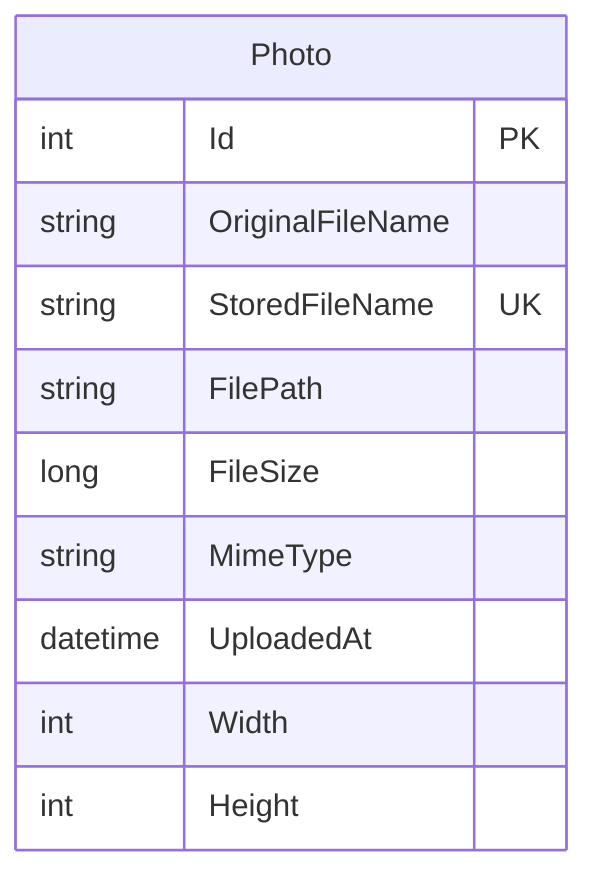

# Data Architecture & Persistence Layer

The data layer contains one core entity persisted with EF Core to SQL Server, with file binaries stored outside the relational store. Persistence logic is centralized in a single DbContext and service-driven access path.

## Database Configuration

| Service/Module | DB Type | Profile | Driver | Connection | Migration Tool |
|---|---|---|---|---|---|
| PhotoAlbum | SQL Server LocalDB | Default/Development | `Microsoft.EntityFrameworkCore.SqlServer` | LocalDB connection string in appsettings | EF Core migrations (startup `MigrateAsync`) |
| PhotoAlbum.Tests | In-memory provider | Test | `Microsoft.EntityFrameworkCore.InMemory` | In-memory test database | Not applicable |

## Data Ownership per Service

| Service | Tables Owned | ORM Framework | Caching | Notes |
|---|---|---|---|---|
| PhotoAlbum Web | `Photos` | EF Core 9 | None (only HTTP cache headers for static files) | Owns photo metadata; image binaries stored on local disk |

## Entity Model

## Key Repository Methods

| Service | Repository | Notable Methods | Purpose |
|---|---|---|---|
| PhotoAlbum Web | `PhotoAlbumContext` (`Data/PhotoAlbumContext.cs`) | `DbSet<Photo> Photos`, `SaveChangesAsync()` | Persist and retrieve photo metadata records |
| PhotoAlbum Web | `PhotoService` data access usage | `GetAllPhotosAsync()`, `GetPhotoByIdAsync(id)`, `AddAsync(photo)` | Application-level query and command patterns over EF Core |

## Caching Strategy

No application data cache provider (Redis/MemoryCache/DistributedCache) is configured for entity/query caching. Caching is limited to HTTP response headers for static content (`Cache-Control`) and long-lived caching headers for image file responses.

## Data Ownership Boundaries

The application uses a single shared data boundary within one service: SQL Server stores metadata and the local file system stores content binaries. There is no cross-service data access, no CQRS split, and no externally shared database.

### Data Classification & Sensitivity

| Entity | Sensitive Fields | Classification (PII/PHI/PCI/None) | Controls in Place |
|---|---|---|---|
| Photo | Original file names may include personal names | PII (potential) | No explicit masking or field-level controls detected |
| Photo | File path and MIME metadata | None | Standard DB/file access only |

No PHI or PCI data patterns were detected in the entity model.
