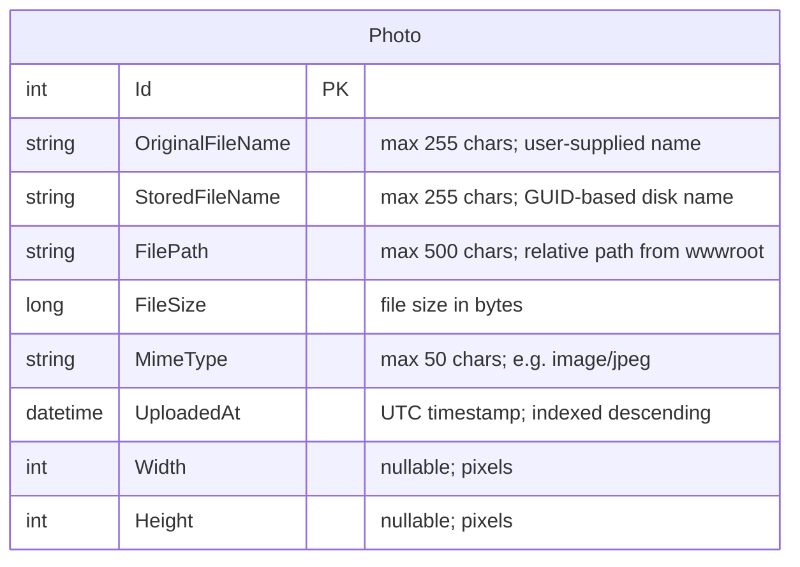

# Data Architecture & Persistence Layer

PhotoAlbum uses a single SQL Server database with one entity managed by EF Core 9.0 via code-first migrations, plus a local file system for the image binary data.

## Database Configuration

| Service | DB Type | Profile | Driver | Connection | Migration Tool |
|---|---|---|---|---|---|
| PhotoAlbum Web | SQL Server LocalDB | Production / Development | Microsoft.EntityFrameworkCore.SqlServer 9.0.9 | `Server=(localdb)\mssqllocaldb;Database=PhotoAlbumDb` (connection pooling via EF Core defaults) | EF Core Migrations (applied automatically at startup) |
| PhotoAlbum.Tests | In-Memory (EF Core InMemory) | Test | Microsoft.EntityFrameworkCore.InMemory 9.0.9 | In-process, no connection string | No migration needed — test DB recreated per test run |

Migrations are applied automatically on startup via `context.Database.MigrateAsync()`. The `IsTestEnvironment` configuration flag suppresses migration execution in the test host. No seed data scripts are present. For the full connection string and property inventory, see `configuration-inventory.md`.

## Data Ownership per Service

| Service | Tables Owned | ORM Framework | Caching | Notes |
|---|---|---|---|---|
| PhotoAlbum Web | Photos | EF Core 9.0 | HTTP response cache headers only (no server-side cache) | Single bounded context; file binaries stored on local file system outside the DB |

## Entity Model

## Key Repository Methods

| Service | Repository / Context | Notable Methods | Purpose |
|---|---|---|---|
| PhotoAlbum Web | `PhotoAlbumContext.Photos` (DbSet) | `OrderByDescending(p => p.UploadedAt).ToListAsync()` | Retrieves all photos sorted newest-first for the gallery page |
| PhotoAlbum Web | `PhotoAlbumContext.Photos` (DbSet) | `FindAsync(id)` | Fetches a single photo by primary key for detail view and file serving |
| PhotoAlbum Web | `PhotoAlbumContext.Photos` (DbSet) | `AddAsync(photo)` + `SaveChangesAsync()` | Persists a new photo record after successful file write |
| PhotoAlbum Web | `PhotoAlbumContext.Photos` (DbSet) | `Remove(photo)` + `SaveChangesAsync()` | Deletes a photo record after deleting the physical file |

There is no dedicated repository interface layer. All data access is performed directly through the EF Core `DbContext` inside `PhotoService`. No custom `@Query`/raw SQL, stored procedures, or batch/bulk query methods are used.

## Caching Strategy

No server-side caching layer is implemented. The application applies HTTP response caching headers only:

- **Static assets** (CSS, JS, images): `Cache-Control: public, max-age=3600` (1 hour) set via `StaticFileOptions.OnPrepareResponse` in `Program.cs`.
- **Photo file endpoint** (`/PhotoFile?id=...`): `Cache-Control: public, max-age=31536000` (1 year) plus an `ETag` header derived from `photo.Id` and `photo.UploadedAt.Ticks`.

No Redis, MemoryCache, IDistributedCache, or query-result caching is configured. Frequently-called queries (e.g., `GetAllPhotosAsync()` called on every page load and again after each upload) hit the database directly on every request.

## Data Ownership Boundaries

The application has a single bounded context with one service owning one database. There is no inter-service data sharing, no cross-service joins, and no read/write split.

The binary image files are stored outside the relational database on the local file system (`wwwroot/uploads/`). The `Photos` table holds only metadata; the `StoredFileName` and `FilePath` columns act as a pointer to the file on disk. This dual-store design (relational metadata + file system blobs) is the primary migration concern: moving to a stateless cloud deployment requires replacing the file system store with Azure Blob Storage while keeping the SQL metadata unchanged.

### Data Classification & Sensitivity

| Entity | Sensitive Fields | Classification | Controls in Place |
|---|---|---|---|
| Photo | OriginalFileName | Low — user-supplied filename may inadvertently reveal path or personal context | No masking or scrubbing |
| Photo | UploadedAt, Width, Height, FileSize | Non-sensitive metadata | None needed |
| Photo (file) | Image binary (stored on disk) | Potentially sensitive — images may contain personal content | No encryption-at-rest; no access control beyond public HTTP serving |

No PII (names, addresses), PHI (health records), or PCI (payment data) is stored in the database schema. However, uploaded image files themselves may contain personal content (faces, documents). No encryption-at-rest, access control, or content moderation is configured for the stored files.
