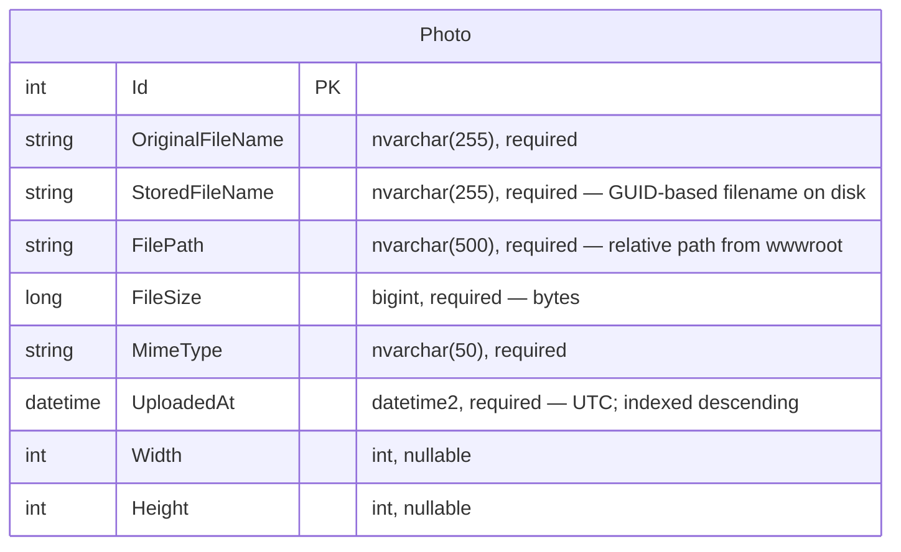

# Data Architecture & Persistence Layer

PhotoAlbum uses a single SQL Server database with one EF Core entity (`Photo`), managed via EF Core code-first migrations. No caching layer is present.

## Database Configuration

| Service/Module | DB Type | Profile | Driver | Connection | Migration Tool |
|---|---|---|---|---|---|
| PhotoAlbum | SQL Server LocalDB | Development (default) | Microsoft.EntityFrameworkCore.SqlServer 9.0.9 | `Server=(localdb)\\mssqllocaldb;Database=PhotoAlbumDb` | EF Core Migrations (auto-applied at startup) |
| PhotoAlbum.Tests | EF Core In-Memory | Test | Microsoft.EntityFrameworkCore.InMemory 9.0.9 | In-memory (no connection string) | None — schema auto-created by InMemory provider |

EF Core migrations are applied automatically on startup via `context.Database.MigrateAsync()`. This step is skipped when the `IsTestEnvironment` configuration flag is `true`. Schema is fully managed by EF Core; no external SQL scripts or seed data files are present.

## Data Ownership per Service

| Service | Tables Owned | ORM Framework | Caching | Notes |
|---|---|---|---|---|
| PhotoAlbum | Photos | EF Core 9.0 (SQL Server) | None | Single DbContext (`PhotoAlbumContext`); single migration (`InitialCreate`) |

## Entity Model

## Key Repository Methods

| Service | Repository / DbContext | Notable Methods | Purpose |
|---|---|---|---|
| PhotoAlbum | `PhotoAlbumContext.Photos` (DbSet) | `OrderByDescending(p => p.UploadedAt).ToListAsync()` | Returns all photos newest-first — used by gallery and navigation |
| PhotoAlbum | `PhotoAlbumContext.Photos` (DbSet) | `FindAsync(id)` | Lookup by primary key — used by detail view, file serving, and deletion |
| PhotoAlbum | `PhotoAlbumContext.Photos` (DbSet) | `AddAsync(photo)` + `SaveChangesAsync()` | Persists new photo metadata after file write |
| PhotoAlbum | `PhotoAlbumContext.Photos` (DbSet) | `Remove(photo)` + `SaveChangesAsync()` | Deletes photo record; file deletion handled separately before this call |

No Spring Data / EF Core `IRepository` abstraction is used — `PhotoService` accesses `PhotoAlbumContext` directly via constructor injection.

## Caching Strategy

No caching layer is configured. All reads hit the SQL Server database directly via EF Core. Static image files served from `wwwroot/uploads/` benefit from browser-level HTTP caching: `PhotoFile` responses include `Cache-Control: public, max-age=31536000` (1 year) and an `ETag` header derived from photo ID and upload timestamp. Static assets served by ASP.NET Core's static file middleware use `Cache-Control: public, max-age=3600` (1 hour). No server-side cache provider (Redis, MemoryCache, EF Core second-level cache) is in use.

## Data Ownership Boundaries

The application uses a single shared SQL Server LocalDB instance with one database (`PhotoAlbumDb`). There is only one deployable service, so there are no cross-service data access concerns. All reads and writes are routed through `PhotoAlbumContext` within the same process.

The binary image files are stored separately on the local file system (`wwwroot/uploads/`), creating a dual-store pattern: the database holds metadata and the file system holds binaries. Consistency is maintained by an inline rollback: if the database `INSERT` fails after a file has been written, the file is immediately deleted. There is no outbox, saga, or distributed transaction mechanism.

### Data Classification & Sensitivity

| Entity | Sensitive Fields | Classification | Controls in Place |
|---|---|---|---|
| Photo | `OriginalFileName` (may contain user-supplied names) | Low — file metadata only, no PII/PHI/PCI | No encryption-at-rest, no masking; stored in plaintext |

No PII (names, addresses, emails, phone numbers), PHI, or PCI data is modeled in the entity schema. `OriginalFileName` is user-supplied and may contain the uploader's filename, but no identity or contact data is captured. No authentication or user identity is stored.
