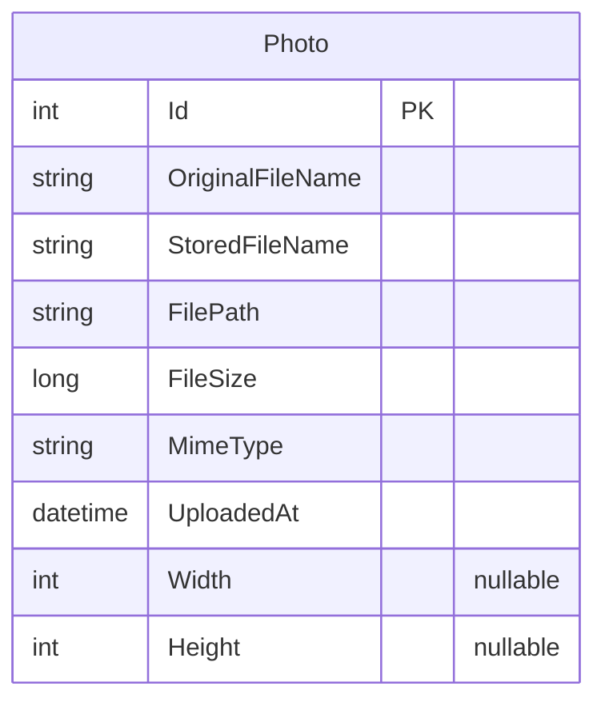

# Data Architecture & Persistence Layer

PhotoAlbum uses a single SQL Server database with one EF Core entity (`Photo`), managed through EF Core Migrations with automatic schema application on startup.

## Database Configuration

| Service/Module | DB Type | Profile | Driver | Connection | Migration Tool |
|---|---|---|---|---|---|
| PhotoAlbum | SQL Server | Development (default) | Microsoft.Data.SqlClient (via EFCore.SqlServer 9.0.9) | LocalDB (`(localdb)\mssqllocaldb`), database `PhotoAlbumDb`, trusted connection | EF Core Migrations (auto-applied on startup via `MigrateAsync()`) |
| PhotoAlbum | SQL Server | Production | Same driver; connection string supplied via environment / Azure App Settings override | Same migration approach | EF Core Migrations |
| PhotoAlbum (test) | In-memory EF Core provider | Test | `Microsoft.EntityFrameworkCore.InMemory` 9.0.9 | No physical connection string; `IsTestEnvironment=true` flag bypasses migration | None (in-memory, schema-less) |

Schema management: EF Core controls the schema entirely through code-first migrations. The single migration `20250930101715_InitialCreate` creates the `Photos` table with a descending index on `UploadedAt`. No seed data scripts (`data.sql`, `import.sql`) are present. Full configuration property details are in `configuration-inventory.md`.

## Data Ownership per Service

| Service | Tables Owned | ORM Framework | Caching | Notes |
|---|---|---|---|---|
| PhotoAlbum | Photos | EF Core 9.0.9 | None | Single deployable unit; no cross-service data access |

## Entity Model

**Entity notes:**
- `OriginalFileName` — user-supplied filename as uploaded (nvarchar 255, required)
- `StoredFileName` — GUID-based on-disk filename with extension (nvarchar 255, required)
- `FilePath` — relative URL path from wwwroot root, e.g. `/uploads/<guid>.jpg` (nvarchar 500, required)
- `FileSize` — size in bytes (bigint, required, ≥ 1)
- `MimeType` — MIME type string, e.g. `image/jpeg` (nvarchar 50, required)
- `UploadedAt` — UTC timestamp; has a **descending** index `IX_Photos_UploadedAt` for chronological gallery queries
- `Width` / `Height` — image pixel dimensions extracted at upload time by ImageSharp; nullable (int)

No entity-to-entity relationships exist; the model is a flat single-entity design.

## Key Repository Methods

The application does not use a repository interface abstraction layer; all data access flows through `PhotoAlbumContext` directly within `PhotoService`.

| Service | Access Point | Notable Methods | Purpose |
|---|---|---|---|
| PhotoAlbum | `PhotoAlbumContext.Photos` (DbSet) | `OrderByDescending(p => p.UploadedAt).ToListAsync()` | Returns all photos newest-first for gallery display |
| PhotoAlbum | `PhotoAlbumContext.Photos` (DbSet) | `FindAsync(id)` | Point-lookup by primary key for detail/file serving |
| PhotoAlbum | `PhotoAlbumContext.Photos` (DbSet) | `AddAsync(photo)` + `SaveChangesAsync()` | Inserts a new photo record after successful file write |
| PhotoAlbum | `PhotoAlbumContext.Photos` (DbSet) | `Remove(photo)` + `SaveChangesAsync()` | Deletes a photo record; physical file deletion is performed before the DB call |

No `@Transactional`/`TransactionScope` wrappers are used; each `SaveChangesAsync()` call is its own implicit transaction. There are no stored procedures, raw SQL, or named queries.

## Caching Strategy

No caching layer is configured for data queries. The application uses only HTTP-level cache headers:

- Static files (CSS, JS, images under `wwwroot`): `Cache-Control: public, max-age=3600` (1 hour), set globally in middleware.
- Photo files served via `/PhotoFile?id={id}`: `Cache-Control: public, max-age=31536000` (1 year) with an ETag based on `Photo.Id` and `Photo.UploadedAt.Ticks`.

No Redis, MemoryCache (`IMemoryCache`), distributed cache (`IDistributedCache`), or EF Core second-level cache is present. All gallery and detail page loads hit SQL Server on every request.

## Data Ownership Boundaries

The application is a single deployable unit with a single database. There are no inter-service data access patterns, cross-service queries, or CQRS separations. The `PhotoAlbumContext` is the sole data store owner; no external service reads from or writes to the `Photos` table.

File binaries (the actual image data) are stored separately on the local file system under `wwwroot/uploads` and are not persisted in the database. The `FilePath` column in the `Photos` table acts as a pointer to the file on disk. This creates a two-phase commit risk: if the database `INSERT` succeeds but the file write fails (or vice versa), the application performs a best-effort rollback (deletes the file if the DB save fails), but there is no transactional guarantee across the two stores.

### Data Classification & Sensitivity

| Entity | Sensitive Fields | Classification | Controls in Place |
|---|---|---|---|
| Photo | `OriginalFileName` (user-supplied filename, may contain personal names) | Low — incidental PII | None — stored in plaintext; no masking or encryption-at-rest configured |
| Photo | `StoredFileName`, `FilePath` | Internal | GUID-based filenames provide obscurity but no access control |
| Photo (file on disk) | Binary image content (photos may contain faces, personal information) | Potential PII | No encryption-at-rest; files are publicly accessible via static file middleware at `/uploads/<guid>.<ext>` with no authentication required |

No PHI (health records) or PCI (payment card data) fields are present. The primary sensitivity concern is that uploaded images (which may contain personal photos) are served without authentication — any user who discovers a file URL can access it directly. No encryption-at-rest, data masking, or field-level access controls are configured.
