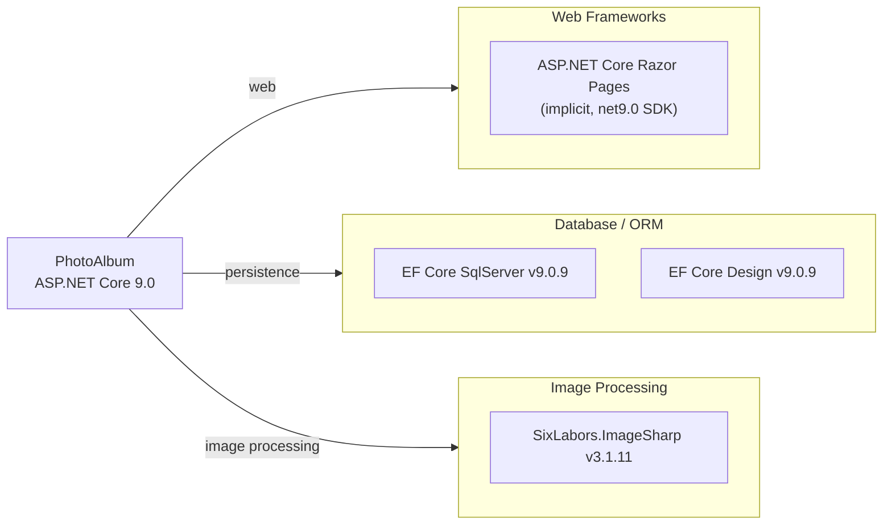

# Dependency Map

PhotoAlbum is an ASP.NET Core 9.0 Razor Pages application with 3 production dependencies (plus 6 test-scoped packages). All packages are managed directly in project files with no central package management file.

## Dependencies

### Dependency Summary

| Category | Count | Key Libraries | Notes |
|---|---|---|---|
| Web Frameworks | 1 | ASP.NET Core Razor Pages (SDK implicit) | Provided by Microsoft.NET.Sdk.Web — no explicit package reference needed |
| Database / ORM | 2 | Microsoft.EntityFrameworkCore.SqlServer 9.0.9, Microsoft.EntityFrameworkCore.Design 9.0.9 | EF Core 9.0 targeting SQL Server LocalDB; Design package is build-time only |
| Image Processing | 1 | SixLabors.ImageSharp 3.1.11 | Used for reading image dimensions on upload |

### Version & Compatibility Risks

All production dependencies are current and align with .NET 9.0. EF Core 9.0.9 and SixLabors.ImageSharp 3.1.11 are recent stable releases with no known end-of-life concerns at time of assessment. The application targets `net9.0`, which is in active support until May 2026; upgrading to `net10.0` (LTS) would extend support to November 2029 and is the recommended next step. SQL Server LocalDB is suitable for development but is not appropriate for production cloud deployments — migration to Azure SQL Database or another managed SQL service should be planned.

### Notable Observations

- **Minimal dependency footprint**: Only 3 production package references; the web framework itself is provided implicitly by the `Microsoft.NET.Sdk.Web` SDK, keeping the surface area small.
- **No logging library**: The application relies on the built-in ASP.NET Core logging abstractions with no structured logging provider (e.g., Serilog, NLog) configured — this may be a gap for production observability.
- **No security/authentication library**: There is no authentication or authorization middleware configured; all gallery operations (upload, delete) are publicly accessible.
- **LocalDB not production-ready**: The configured SQL Server connection string points to `(localdb)\mssqllocaldb`, which is a developer-only engine; a managed database service is needed for production or cloud deployment.

## Test Dependencies

| Framework | Version | Notes |
|---|---|---|
| xunit | 2.9.2 | Primary test framework |
| xunit.runner.visualstudio | 2.8.2 | VS/CLI test runner integration |
| Microsoft.NET.Test.Sdk | 17.12.0 | MSBuild test SDK host |
| Microsoft.AspNetCore.Mvc.Testing | 9.0.9 | Integration test WebApplicationFactory |
| Microsoft.EntityFrameworkCore.InMemory | 9.0.9 | In-memory DB for integration/unit tests |
| coverlet.collector | 6.0.2 | Code coverage collection |

Total test-scope dependencies: 6

The test infrastructure is well-structured, using xUnit 2.9 with `Microsoft.AspNetCore.Mvc.Testing` for integration tests and an in-memory EF Core provider to avoid database dependencies. No contract-testing or mutation-testing library is present, which is typical for a project of this scope.
