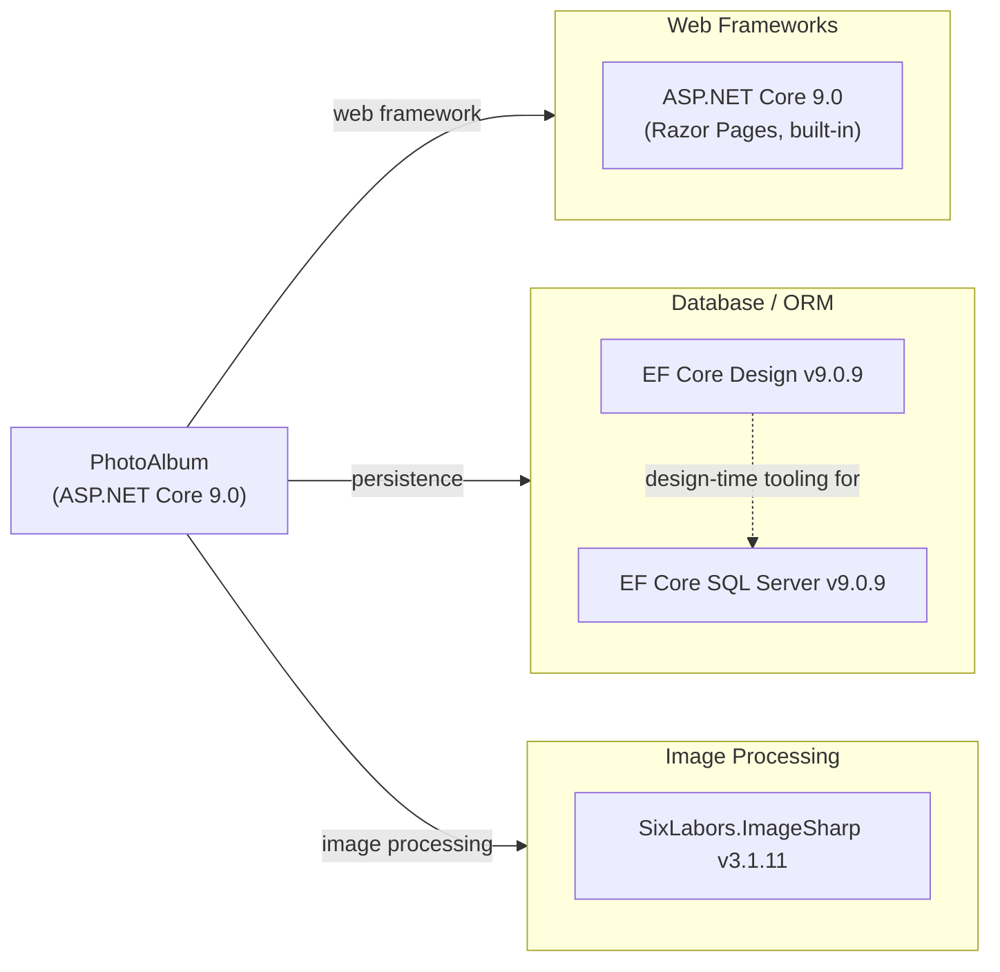

# Dependency Map

PhotoAlbum is an ASP.NET Core 9.0 Razor Pages application with 4 production dependencies and 6 test-scoped dependencies declared across 2 project files.

## Dependencies

### Dependency Summary

| Category | Count | Key Libraries | Notes |
|---|---|---|---|
| Web Frameworks | 1 | ASP.NET Core 9.0 (Razor Pages) | Built into the SDK; no separate package reference needed |
| Database / ORM | 2 | Microsoft.EntityFrameworkCore.SqlServer 9.0.9, Microsoft.EntityFrameworkCore.Design 9.0.9 | EF Core targets SQL Server LocalDB; Design is private/build-time only |
| Image Processing | 1 | SixLabors.ImageSharp 3.1.11 | Used to extract image dimensions on upload |

### Version & Compatibility Risks

The application targets `net9.0`, which reaches end of standard support in May 2026. The EF Core and SQL Server provider are both pinned to 9.0.9, which aligns with the framework version. SixLabors.ImageSharp 3.1.11 is the current stable series (3.x). There are no immediately end-of-life production dependencies, but upgrading the target framework to `net10.0` (LTS) would be the highest-priority modernization action to extend the support window.

### Notable Observations

- **SQL Server LocalDB dependency**: The app is hard-wired to SQL Server LocalDB via the connection string in `appsettings.json`. Migrating to Azure SQL or another cloud database requires only a connection string change thanks to EF Core's provider abstraction.
- **Local file system storage**: Images are stored on disk under `wwwroot/uploads/`. This is the main blocker for cloud-hosted (stateless) deployments; replacing `PhotoService` with an Azure Blob Storage-backed implementation is the key migration step.
- **Minimal dependency footprint**: With only 4 production packages, the library surface is very small, making the application straightforward to upgrade or migrate.
- **No logging, caching, or observability libraries**: The app relies solely on ASP.NET Core's built-in logging and has no distributed caching or APM instrumentation, which should be added before a production cloud deployment.

## Test Dependencies

| Framework / Library | Version | Notes |
|---|---|---|
| xunit | 2.9.2 | Core test framework |
| xunit.runner.visualstudio | 2.8.2 | VS / dotnet test runner adapter |
| Microsoft.NET.Test.Sdk | 17.12.0 | MSBuild test SDK integration |
| Microsoft.AspNetCore.Mvc.Testing | 9.0.9 | In-process integration test WebApplicationFactory |
| Microsoft.EntityFrameworkCore.InMemory | 9.0.9 | In-memory EF Core provider for unit/integration tests |
| coverlet.collector | 6.0.2 | Code coverage data collector |

Total test-scope dependencies: 6

The test project uses xUnit 2.9.2 with `Microsoft.AspNetCore.Mvc.Testing` for integration testing and an in-memory EF Core provider to avoid requiring a real database. Code coverage is collected via `coverlet`. No contract-testing or load-testing library is present.
