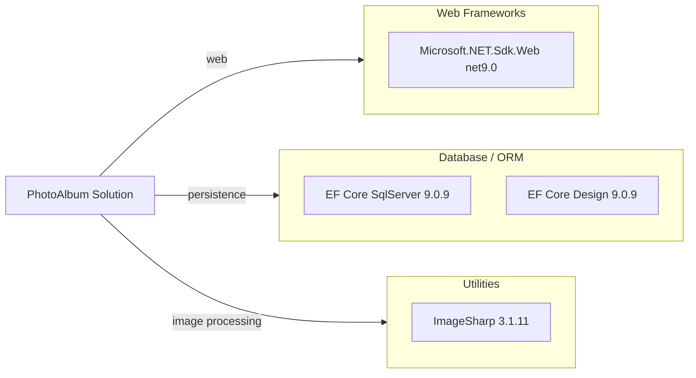

# Dependency Map

This map summarizes declared external dependencies for the PhotoAlbum solution across application and test projects.

## Dependencies

### Dependency Summary

| Category | Count | Key Libraries | Notes |
|---|---:|---|---|
| Web Frameworks | 1 | Microsoft.NET.Sdk.Web | Razor Pages web application on .NET 9 |
| Database / ORM | 2 | Microsoft.EntityFrameworkCore.SqlServer, Microsoft.EntityFrameworkCore.Design | EF Core for SQL Server and migration tooling |
| Utilities | 1 | SixLabors.ImageSharp | Image metadata extraction |

### Version & Compatibility Risks

The application targets `net9.0`, which is newer than many current long-term support baselines and may require planned alignment when targeting long-lived production environments. EF Core and ASP.NET packages are version-aligned at 9.0.9, reducing immediate package mismatch risk.

### Notable Observations

- Dependency footprint in the production project is small and focused.
- Entity Framework design package is marked private assets and remains build-time scoped.
- Image processing is centralized in a single external library, reducing overlap.

## Test Dependencies

| Framework | Version | Notes |
|---|---|---|
| xUnit | 2.9.2 | Unit test framework |
| xUnit runner (Visual Studio) | 2.8.2 | Test discovery/execution integration |
| Microsoft.NET.Test.Sdk | 17.12.0 | Test host and execution infrastructure |
| Microsoft.AspNetCore.Mvc.Testing | 9.0.9 | ASP.NET Core test support |
| Microsoft.EntityFrameworkCore.InMemory | 9.0.9 | In-memory provider for tests |
| coverlet.collector | 6.0.2 | Coverage collection |

Total test-scope dependencies: 6

Test infrastructure includes both unit-test and ASP.NET integration-test support with an in-memory database provider for fast isolated tests.
