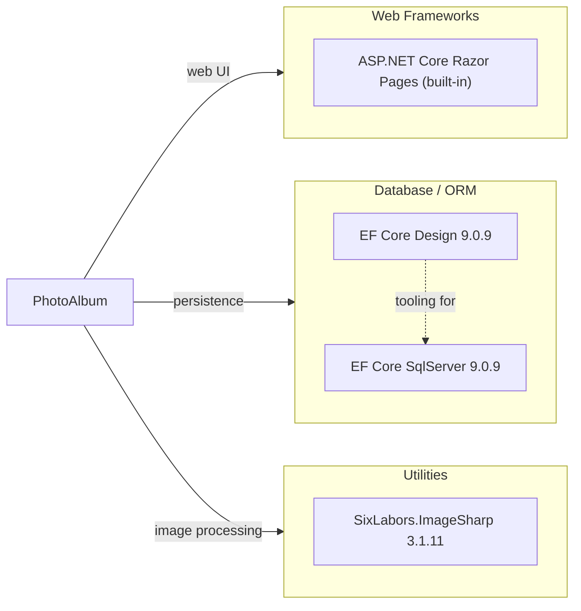

# Dependency Map

PhotoAlbum is an ASP.NET Core 9.0 Razor Pages application with 3 production dependencies and 6 test-scope dependencies across both projects.

## Dependencies

### Dependency Summary

| Category | Count | Key Libraries | Notes |
|---|---|---|---|
| Web Frameworks | 1 | ASP.NET Core Razor Pages (framework-included) | Built-in with the .NET 9.0 SDK Web target |
| Database / ORM | 2 | Microsoft.EntityFrameworkCore.SqlServer 9.0.9, Microsoft.EntityFrameworkCore.Design 9.0.9 | Latest EF Core 9 targeting SQL Server |
| Utilities | 1 | SixLabors.ImageSharp 3.1.11 | Used to extract image dimensions on upload |

### Version & Compatibility Risks

All production dependencies target .NET 9.0, which is the current Standard Term Support release with a support end-date of May 2026. `SixLabors.ImageSharp` 3.x is the current stable release series and has no known end-of-life concerns. `Microsoft.EntityFrameworkCore.SqlServer` 9.0.9 is the latest patch for EF Core 9, aligned with the project's .NET 9.0 target. No end-of-life or deprecated packages are present; however, the project will need to upgrade to .NET 10.0 (Long-Term Support) or later before .NET 9.0 reaches end-of-support in May 2026.

### Notable Observations

- **Minimal dependency footprint**: The application has only 3 declared production NuGet packages, relying heavily on framework-provided capabilities (Razor Pages, routing, DI, static files).
- **No logging library**: Structured logging relies on the built-in `Microsoft.Extensions.Logging` (included with ASP.NET Core), so no third-party logging sink (e.g., Serilog, NLog) is configured — logs only go to the console/debug output by default.
- **Local file system storage**: Images are stored on the local file system (`wwwroot/uploads`), which is not compatible with scale-out deployments or Azure App Service unless switched to Azure Blob Storage or a shared mount.
- **`EFCore.Design` in runtime assets**: The `Microsoft.EntityFrameworkCore.Design` package is scoped with `<PrivateAssets>all</PrivateAssets>`, correctly preventing it from being deployed as a runtime dependency.

## Test Dependencies

| Framework | Version | Notes |
|---|---|---|
| xunit | 2.9.2 | Primary test framework |
| xunit.runner.visualstudio | 2.8.2 | Visual Studio / dotnet test runner adapter |
| Microsoft.NET.Test.Sdk | 17.12.0 | MSBuild test infrastructure |
| Microsoft.AspNetCore.Mvc.Testing | 9.0.9 | In-process integration testing via WebApplicationFactory |
| Microsoft.EntityFrameworkCore.InMemory | 9.0.9 | In-memory EF Core provider for test isolation |
| coverlet.collector | 6.0.2 | Code coverage data collector |

Total test-scope dependencies: 6

The test project uses xUnit 2.9 with an ASP.NET Core `WebApplicationFactory` pattern for integration tests backed by the EF Core in-memory provider — a solid baseline for testing Razor Pages. No mocking library (e.g., Moq, NSubstitute) is present; tests currently rely on the in-memory EF context for service-level isolation.
