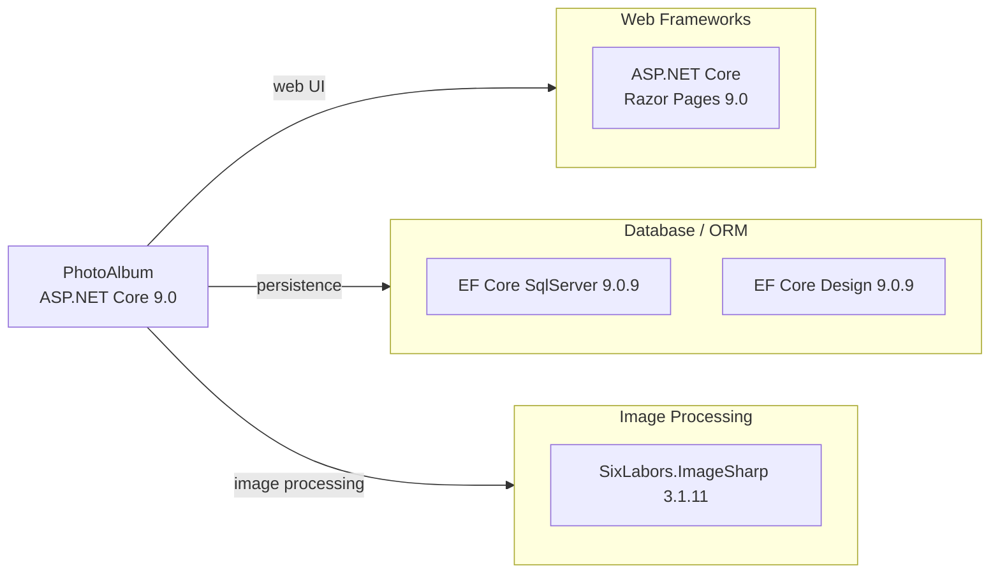

# Dependency Map

PhotoAlbum is an ASP.NET Core 9.0 Razor Pages application with 3 production dependencies and 6 test-scoped dependencies.

## Dependencies

### Dependency Summary

| Category | Count | Key Libraries | Notes |
|----------|-------|--------------|-------|
| Web Frameworks | 1 | ASP.NET Core Razor Pages 9.0 | Included via SDK; no explicit package reference needed |
| Database / ORM | 2 | Microsoft.EntityFrameworkCore.SqlServer 9.0.9, EF Core Design 9.0.9 | EF Design is a build-time only tool (PrivateAssets=all) |
| Image Processing | 1 | SixLabors.ImageSharp 3.1.11 | Used for image dimension extraction on upload |

### Version & Compatibility Risks

All production dependencies target .NET 9.0, which is a Standard-Term Support (STS) release that reaches end-of-life in May 2026. Entity Framework Core 9.0.9 is current for the net9.0 target. SixLabors.ImageSharp 3.1.11 is the latest stable release. The main migration risk is the short STS lifecycle of .NET 9; upgrading to .NET 10 LTS would extend support to November 2029.

### Notable Observations

- **No logging framework package**: The application relies exclusively on the built-in `Microsoft.Extensions.Logging` abstractions supplied by the ASP.NET Core SDK — no Serilog, NLog, or Application Insights package is declared, limiting structured/remote logging capability.
- **No caching or messaging libraries**: The application has no caching layer (e.g., Redis, IMemoryCache) and no messaging infrastructure, which could become bottlenecks for high-volume upload workloads.
- **Local filesystem storage only**: There is no Azure Blob Storage, AWS S3, or any cloud storage SDK declared; images are stored on the local filesystem (`wwwroot/uploads`), making the application stateful and non-scalable horizontally.
- **EF Core Design is build-time only**: `Microsoft.EntityFrameworkCore.Design` is correctly scoped with `PrivateAssets=all`, so it does not ship with the published application.

## Test Dependencies

| Framework | Version | Notes |
|-----------|---------|-------|
| xunit | 2.9.2 | Core test framework |
| xunit.runner.visualstudio | 2.8.2 | Visual Studio / dotnet test runner integration |
| Microsoft.NET.Test.Sdk | 17.12.0 | MSBuild test infrastructure |
| Microsoft.AspNetCore.Mvc.Testing | 9.0.9 | Integration testing with in-process test server |
| Microsoft.EntityFrameworkCore.InMemory | 9.0.9 | In-memory EF provider for unit/integration tests |
| coverlet.collector | 6.0.2 | Code coverage collection |

Total test-scope dependencies: 6

The test project uses xUnit 2.9.2 with ASP.NET Core integration testing (`Mvc.Testing`) and an in-memory EF Core provider, providing good coverage for service-layer and HTTP-level tests. No contract testing (e.g., Pact) or load testing library is included.
