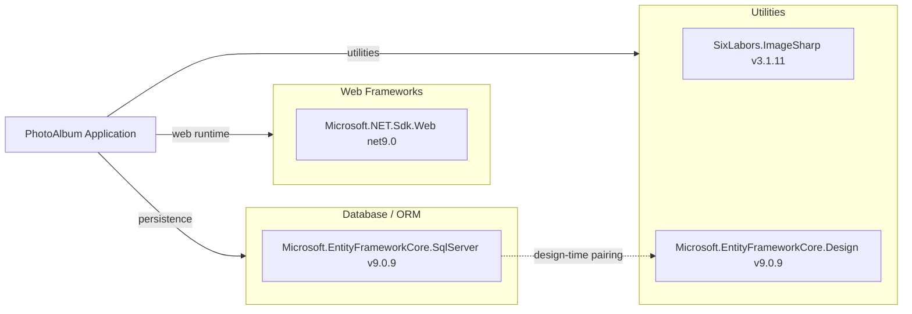

# Dependency Map

PhotoAlbum declares 3 runtime dependencies and 6 test-scope dependencies across the web app and test project.

## Dependencies

### Dependency Summary

| Category | Count | Key Libraries | Notes |
|---|---:|---|---|
| Web Frameworks | 1 | `Microsoft.NET.Sdk.Web` | ASP.NET Core Razor Pages host |
| Database / ORM | 1 | `Microsoft.EntityFrameworkCore.SqlServer` | SQL Server provider for EF Core |
| Utilities | 2 | `Microsoft.EntityFrameworkCore.Design`, `SixLabors.ImageSharp` | EF tooling and image metadata extraction |

### Version & Compatibility Risks

The project targets `net9.0`, which is current, but the generated upgrade assessment should still be reviewed for net10 readiness and package support. `Microsoft.EntityFrameworkCore.Design` is marked private assets, so runtime impact is low, but tooling compatibility must be tracked with SDK upgrades.

### Notable Observations

- Dependency surface is intentionally small, reducing migration blast radius.
- Image processing is handled through a single external package (ImageSharp), simplifying security/version tracking.
- No dedicated observability, messaging, or caching libraries are declared.

## Test Dependencies

| Framework | Version | Notes |
|---|---|---|
| xunit | 2.9.2 | Unit testing framework |
| xunit.runner.visualstudio | 2.8.2 | Test runner integration |
| Microsoft.NET.Test.Sdk | 17.12.0 | .NET test host |
| coverlet.collector | 6.0.2 | Code coverage collector |
| Microsoft.AspNetCore.Mvc.Testing | 9.0.9 | Integration test host support |
| Microsoft.EntityFrameworkCore.InMemory | 9.0.9 | In-memory DB testing provider |

Total test-scope dependencies: 6  
Test infrastructure includes both unit and integration support; no contract-testing-specific library is declared.
