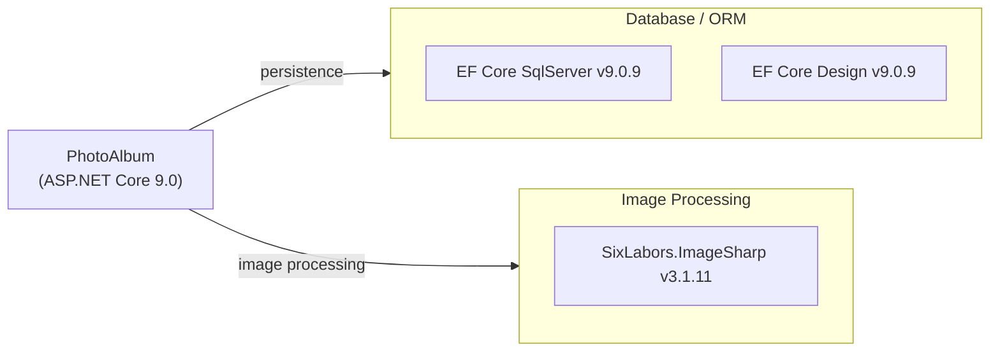

# Dependency Map

PhotoAlbum is an ASP.NET Core 9.0 Razor Pages application with 3 runtime production dependencies (EF Core SQL Server, ImageSharp) plus 6 test-scoped dependencies.

## Dependencies

### Dependency Summary

| Category | Count | Key Libraries | Notes |
|---|---|---|---|
| Database / ORM | 2 | Microsoft.EntityFrameworkCore.SqlServer 9.0.9, Microsoft.EntityFrameworkCore.Design 9.0.9 | EF Core 9.0 with SQL Server provider; Design package is build/dev tooling only |
| Image Processing | 1 | SixLabors.ImageSharp 3.1.11 | Used for image dimension extraction on upload |

### Version & Compatibility Risks

All production dependencies target .NET 9.0 and are current minor releases (9.0.9). SixLabors.ImageSharp 3.x is the current stable major version. There are no end-of-life or deprecated packages in use. The application currently targets `net9.0`, which is a Standard Term Support (STS) release (end of support May 2026 approximately); upgrading to `net10.0` (LTS) should be considered.

### Notable Observations

- **Minimal dependency footprint**: Only three direct runtime packages, making the application easy to upgrade and audit.
- **No caching library**: There is no distributed or in-process caching layer configured; all photo queries hit SQL Server directly.
- **No observability library**: No Application Insights, OpenTelemetry, or Serilog/NLog package is present — logging relies entirely on the built-in `Microsoft.Extensions.Logging` console provider.
- **Local file storage only**: No Azure Blob Storage or cloud storage SDK is referenced; uploaded images are stored in `wwwroot/uploads/`, making horizontal scaling non-trivial.

## Test Dependencies

| Framework | Version | Notes |
|---|---|---|
| xunit | 2.9.2 | Primary test framework |
| xunit.runner.visualstudio | 2.8.2 | Visual Studio / dotnet test runner |
| Microsoft.NET.Test.Sdk | 17.12.0 | MSTest / xUnit host for `dotnet test` |
| Microsoft.AspNetCore.Mvc.Testing | 9.0.9 | In-process integration test server |
| Microsoft.EntityFrameworkCore.InMemory | 9.0.9 | In-memory EF Core provider for test isolation |
| coverlet.collector | 6.0.2 | Code coverage data collector |

Total test-scope dependencies: 6

The test infrastructure is well-suited for integration testing of the Razor Pages layer; `Mvc.Testing` combined with the in-memory EF Core provider allows full request-level tests without a real database. No contract-testing or load-testing library is present.
