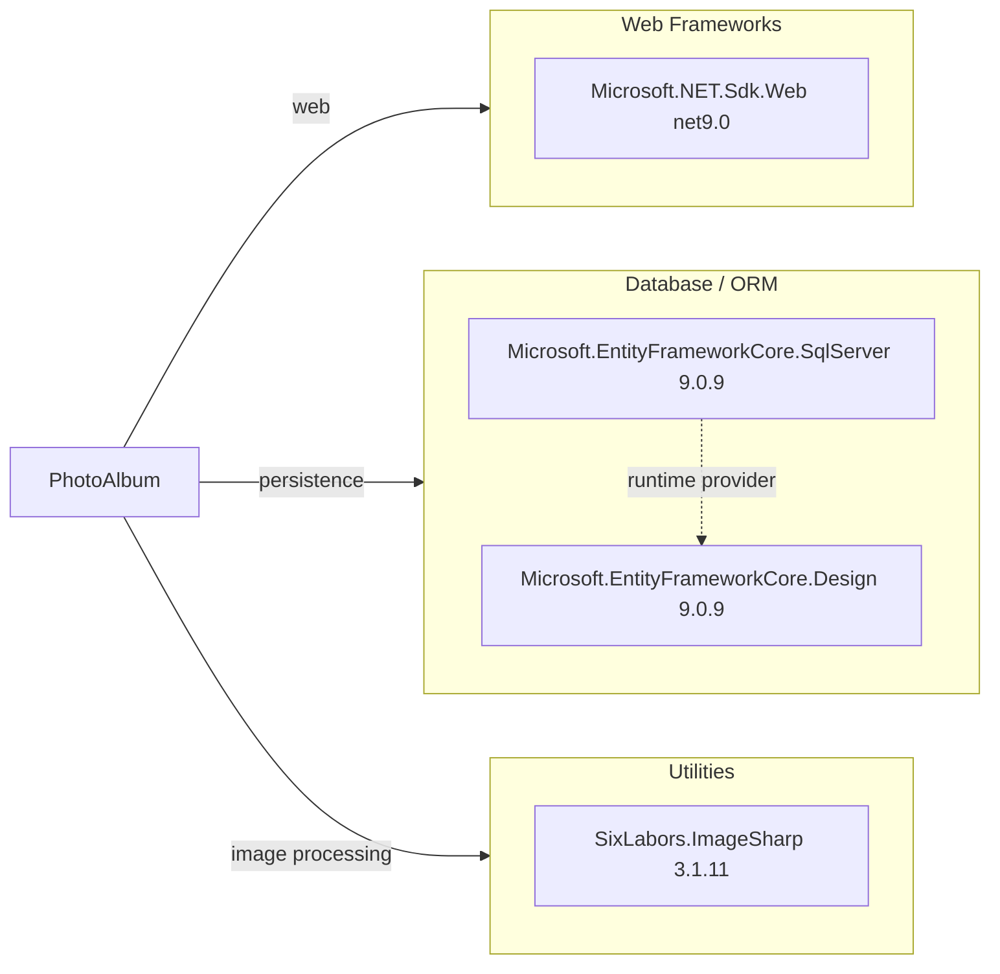

# Dependency Map

PhotoAlbum declares a focused dependency set centered on ASP.NET Core and EF Core, with 3 main runtime dependencies in the application project.

## Dependencies

### Dependency Summary

| Category | Count | Key Libraries | Notes |
|---|---:|---|---|
| Web Frameworks | 1 | Microsoft.NET.Sdk.Web | Razor Pages web host on net9.0 |
| Database / ORM | 2 | EF Core SqlServer, EF Core Design | EF Core 9 metadata and migrations tooling |
| Utilities | 1 | SixLabors.ImageSharp | Reads image dimensions on upload |

### Version & Compatibility Risks

The application targets `net9.0`, and core package references are aligned to EF Core 9.x. The main modernization opportunity is upgrading to a newer target framework (requested separately by the .NET upgrade assessment).

### Notable Observations

- Dependency footprint is intentionally small and focused.
- No explicit logging/security/observability third-party package dependencies are declared.
- `Microsoft.EntityFrameworkCore.Design` is correctly marked with `PrivateAssets=all` to avoid runtime deployment impact.

## Test Dependencies

| Framework | Version | Notes |
|---|---|---|
| xunit | 2.9.2 | Unit testing framework |
| xunit.runner.visualstudio | 2.8.2 | Test discovery/execution integration |
| Microsoft.NET.Test.Sdk | 17.12.0 | Test host infrastructure |
| Microsoft.AspNetCore.Mvc.Testing | 9.0.9 | Integration-style app host testing |
| Microsoft.EntityFrameworkCore.InMemory | 9.0.9 | In-memory DB for tests |
| coverlet.collector | 6.0.2 | Code coverage data collector |

Total test-scope dependencies: 6

The test stack is current with .NET 9 and includes both framework-level testing and in-memory persistence support.
