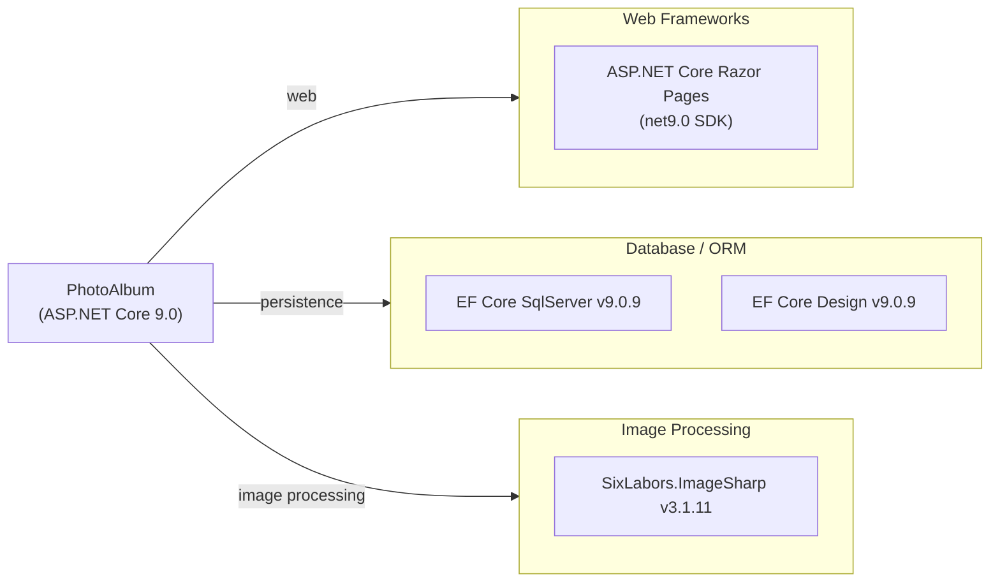

# Dependency Map

PhotoAlbum is an ASP.NET Core 9.0 Razor Pages application with 3 production dependencies and 6 test-scoped dependencies.

## Dependencies

### Dependency Summary

| Category | Count | Key Libraries | Notes |
|---|---|---|---|
| Web Frameworks | 1 | ASP.NET Core Razor Pages (net9.0) | Included via SDK, no explicit package reference needed |
| Database / ORM | 2 | EF Core SqlServer 9.0.9, EF Core Design 9.0.9 | SQL Server LocalDB; Design package is build-time only |
| Image Processing | 1 | SixLabors.ImageSharp 3.1.11 | Used for extracting image dimensions at upload time |

### Version & Compatibility Risks

All production dependencies target .NET 9.0, which is a **Standard-Term Support (STS)** release with end-of-life in May 2026. For long-term support, upgrading to .NET 10.0 (LTS) is recommended. `SixLabors.ImageSharp` 3.x introduced a non-commercial license restriction; commercial use requires a paid license. `EF Core 9.0.9` is current and stable, with a direct upgrade path to EF Core 10.

### Notable Observations

- **No caching layer**: The application has no Redis, MemoryCache, or other caching library declared — all reads hit the database directly.
- **No logging framework package**: Logging relies solely on the built-in ASP.NET Core `Microsoft.Extensions.Logging` abstractions (no Serilog, NLog, etc.).
- **No security/authentication library**: The application has no authentication or authorization packages; access is fully open.
- **ImageSharp licensing**: SixLabors.ImageSharp 3.x uses a non-commercial open-source license (Six Labors Split License). If this application is used commercially, a paid license is required.

## Test Dependencies

| Framework | Version | Notes |
|---|---|---|
| xunit | 2.9.2 | Primary test framework |
| xunit.runner.visualstudio | 2.8.2 | Visual Studio / dotnet test runner integration |
| Microsoft.NET.Test.Sdk | 17.12.0 | MSBuild test execution infrastructure |
| Microsoft.AspNetCore.Mvc.Testing | 9.0.9 | In-process integration test server for ASP.NET Core |
| Microsoft.EntityFrameworkCore.InMemory | 9.0.9 | In-memory EF Core provider for unit/integration tests |
| coverlet.collector | 6.0.2 | Code coverage data collector |

Total test-scope dependencies: 6

The test project uses xUnit 2.9.2 with `Microsoft.AspNetCore.Mvc.Testing` for integration-level tests. No contract testing, snapshot testing, or mocking library (e.g., Moq, NSubstitute) is declared; test doubles are constructed manually.
