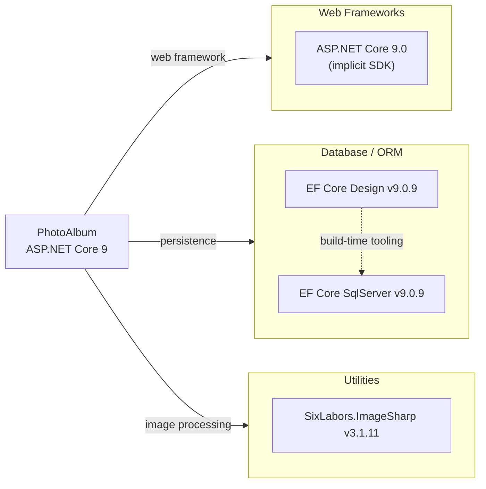

# Dependency Map

PhotoAlbum is an ASP.NET Core 9 Razor Pages application with 3 production NuGet dependencies and 6 test-scoped packages.

## Dependencies

### Dependency Summary

| Category | Count | Key Libraries | Notes |
|----------|-------|--------------|-------|
| Web Frameworks | 1 | ASP.NET Core 9.0 (SDK implicit) | Modern, LTS-adjacent release; .NET 9 is in active support |
| Database / ORM | 2 | Microsoft.EntityFrameworkCore.SqlServer 9.0.9, Microsoft.EntityFrameworkCore.Design 9.0.9 | EF Core 9 is current; Design is build-time only (PrivateAssets=all) |
| Utilities | 1 | SixLabors.ImageSharp 3.1.11 | Used for extracting image dimensions on upload |

### Version & Compatibility Risks

All production dependencies target **.NET 9**, which is the current version at the time of this assessment. `Microsoft.EntityFrameworkCore.SqlServer 9.0.9` and `SixLabors.ImageSharp 3.1.11` are recent stable releases with no known end-of-life concerns. The main forward-looking risk is the **upcoming .NET 9 → .NET 10 upgrade path**: .NET 9 is a Standard-Term Support (STS) release that reaches end-of-life in May 2026, while .NET 10 is the next Long-Term Support (LTS) release. EF Core and ImageSharp both ship .NET 10-compatible versions, so the upgrade path is straightforward.

### Notable Observations

- **Minimal dependency footprint**: Only 3 production packages are declared — a low attack surface and a simple upgrade path.
- **No explicit logging framework**: The application relies on the built-in `Microsoft.Extensions.Logging` (included in the ASP.NET Core SDK), with no Serilog, NLog, or Application Insights package referenced. Structured/cloud-native logging would require adding a provider.
- **No caching or messaging libraries**: There is no Redis, MemoryCache package, or message-broker client. If the application scales, caching photo listings and decoupled upload processing would require new dependencies.
- **EF Core Design is private**: `Microsoft.EntityFrameworkCore.Design` is correctly scoped with `PrivateAssets=all`, meaning it is only used for migration scaffolding at build time and is not shipped with the application.

## Test Dependencies

| Framework / Library | Version | Notes |
|--------------------|---------|-------|
| xunit | 2.9.2 | Primary test framework |
| xunit.runner.visualstudio | 2.8.2 | VS / dotnet test runner integration |
| Microsoft.NET.Test.Sdk | 17.12.0 | MSBuild test runner infrastructure |
| Microsoft.AspNetCore.Mvc.Testing | 9.0.9 | Integration test WebApplicationFactory support |
| Microsoft.EntityFrameworkCore.InMemory | 9.0.9 | In-memory EF Core provider for unit/integration tests |
| coverlet.collector | 6.0.2 | Code coverage data collector |

Total test-scope dependencies: 6

The test project is well-equipped with both unit-testing (xUnit) and integration-testing (Mvc.Testing + EF InMemory) capabilities. Coverage collection via Coverlet is included. No contract-testing or load-testing library is present, which is typical for an application of this size.
