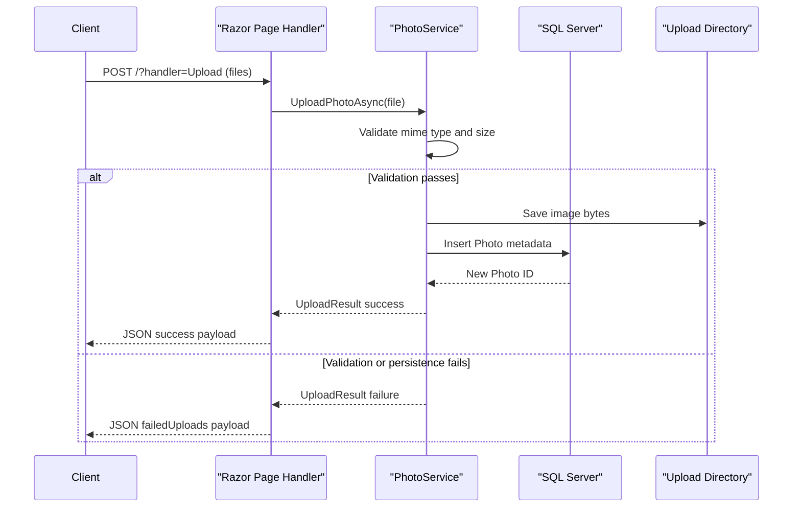

# API & Service Communication Contracts

The application exposes a small set of Razor Page endpoints for gallery browsing, upload, photo retrieval, and deletion. Communication is synchronous in-process calls from page handlers to one service and then to EF Core/database and local storage.

## Service Catalog

| Service | Port | Category | Purpose |
|---|---|---|---|
| PhotoAlbum (Razor Pages app) | 5134 (HTTP), 7055 (HTTPS) | API Layer + Business | Serves UI, handles upload/delete/view workflows |

## API Endpoints Inventory

| Service | Method | Path | Request Type | Response Type |
|---|---|---|---|---|
| PhotoAlbum | GET | `/` | Queryless page request | Razor page with `List<Photo>` model |
| PhotoAlbum | POST | `/?handler=Upload` | `List<IFormFile>` multipart body | JSON upload status and uploaded metadata |
| PhotoAlbum | GET | `/Detail?id={id}` | Query parameter `id` | Razor page with one `Photo` and navigation IDs |
| PhotoAlbum | POST | `/Detail?handler=Delete&id={id}` | Query/form `id` | Redirect to `/` |
| PhotoAlbum | GET | `/PhotoFile?id={id}` | Query parameter `id` | Binary file result (`photo.MimeType`) |
| PhotoAlbum | GET | `/Privacy` | None | Razor page |
| PhotoAlbum | GET | `/Error` | None | Razor page |

## Management & Observability Endpoints

| Service | Endpoint | Custom Metrics (if any) |
|---|---|---|
| PhotoAlbum | None explicitly configured (`MapHealthChecks`/Swagger absent) | None detected |

## DTOs & Contracts

`UploadResult` is the main service-level contract for upload operations (`Success`, `PhotoId`, `FileName`, `ErrorMessage`). `Photo` is the service-level domain entity used as response model in Razor Pages. Anonymous JSON shapes are produced in upload responses for successful and failed items. No OpenAPI specification, protobuf schema, or GraphQL schema is present.

## Communication Patterns

All calls are synchronous and local: browser requests page handlers, handlers call `IPhotoService`, and `PhotoService` persists metadata through EF Core and writes binaries to the upload directory. No async messaging, service discovery, gateway, retries, or circuit breakers are configured. Startup migration execution means API availability depends on successful database connectivity. Security posture: HTTPS redirection and authorization middleware are present, but no authentication scheme or role-based policies are configured, so endpoints are effectively publicly accessible.

## Service Technology Matrix

| Service | Web | Data Access | Discovery | Gateway | Actuator | Cache | Metrics |
|---|---|---|---|---|---|---|---|
| PhotoAlbum | Razor Pages | EF Core SQL Server | None | None | None | Static file response caching headers only | Logging only |

## Service Communication Sequence

