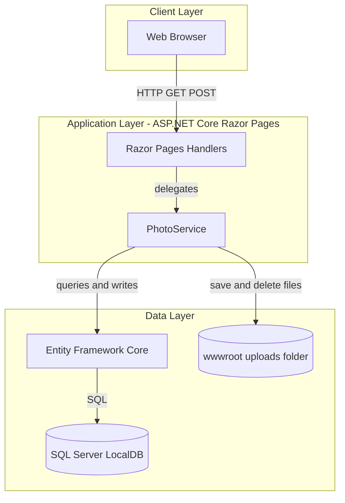
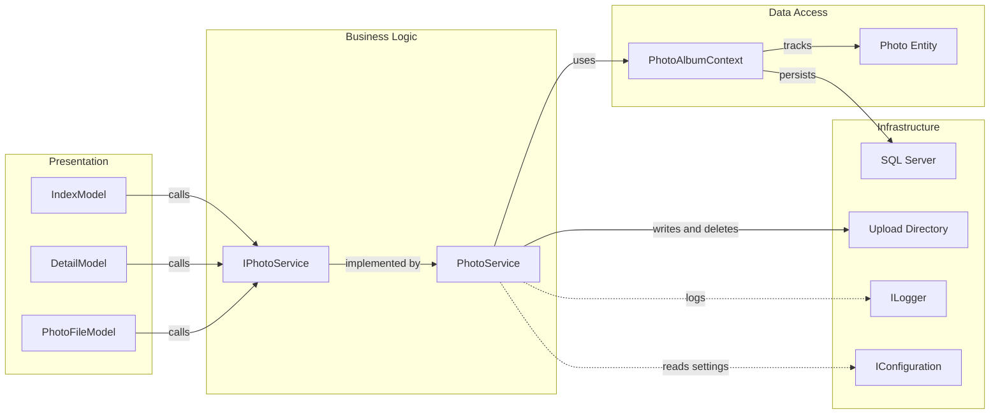

# Architecture Diagram

PhotoAlbum is a single-service ASP.NET Core Razor Pages web application that stores photo metadata in SQL Server and files on local disk. The diagrams below summarize the runtime architecture and key component interactions.

## Application Architecture

### Technology Stack Summary

| Layer | Technology | Version | Purpose |
|---|---|---|---|
| Presentation | ASP.NET Core Razor Pages | net9.0 | Server-rendered UI and page handlers |
| Business | PhotoService | In-repo service | Upload, retrieval, and delete workflows |
| Data Access | Entity Framework Core SQL Server provider | 9.0.9 | ORM and migrations |
| Image Processing | SixLabors.ImageSharp | 3.1.11 | Read image dimensions on upload |
| Persistence | SQL Server LocalDB + file system | Configured in appsettings | Metadata in DB, binaries on disk |

### Data Storage & External Services

The app uses SQL Server (LocalDB connection string by default) for `Photo` metadata and local storage under `wwwroot/uploads` for binary image files. No third-party remote service integration or message broker is configured.

### Key Architectural Decisions

- Uses a thin page-model layer with a single scoped application service for business logic.
- Uses EF Core migrations at startup to ensure schema is applied before handling traffic.
- Splits image metadata persistence (database) from image binary persistence (local file system).

## Component Relationships

### Component Inventory

| Component | Layer | Type | Responsibility |
|---|---|---|---|
| IndexModel | Presentation | Razor Page Model | Loads gallery and handles upload requests |
| DetailModel | Presentation | Razor Page Model | Displays one photo and handles deletion |
| PhotoFileModel | Presentation | Razor Page Model | Streams photo bytes to clients |
| IPhotoService | Business | Service Interface | Contract for photo operations |
| PhotoService | Business | Service | Validation, file operations, metadata persistence |
| PhotoAlbumContext | Data Access | EF Core DbContext | ORM context and entity mapping |
| Photo | Data Access | Entity | Photo metadata model |
